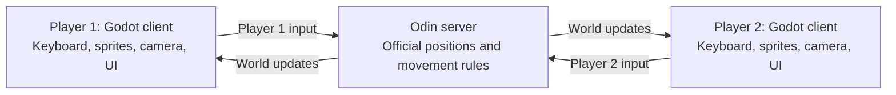
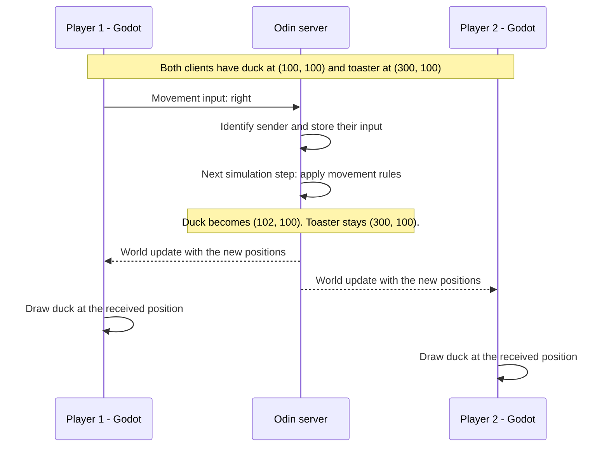

# Phase 0: How an Odin server and Godot clients work

Status: conceptual movement example. Connections and stationary player shapes with audience joining are implemented; see [Phase 2](02-shapes-and-audience.md). The character movement and combat described below remain future work.

We will build this phase by phase. This document explains one small scenario: two players join an arena, then one player moves a character. The current base uses desktop Godot clients and ENet networking.

See [Project structure](project-structure.md) for how the two programs fit inside this repository.

## Picture one referee and two screens

The **Odin server holds the official game world**. Each **Godot client draws a view of that world** and sends its player's input to the server.

Imagine a referee keeping a board with two pieces: a duck and a toaster. Each player has a screen showing the board. Player 1 asks to move the duck. The referee applies the movement rules, updates the board, and tells both screens what changed.

That is **server authority**: the server decides the accepted game state.

The lines carry small data messages. Both clients draw their own images locally.

## What actually runs

There are **three running programs**:

| Program | Its job | What you see |
| --- | --- | --- |
| One server executable compiled from Odin | Accept connections, own characters, advance the world, send updates | A terminal with server logs |
| First copy of the exported Godot game | Read Player 1's controls and display the arena | Player 1's game window |
| Second copy of the same Godot game | Read Player 2's controls and display the arena | Player 2's game window |

For local development, all three can run on your computer. Each client connects to `127.0.0.1`, meaning “this computer,” at the server's chosen port. A **port** identifies the application's network endpoint on that computer.

For Internet play, the Odin program runs on a reachable host machine, and each player runs Godot on their own computer. Both connect to the host's address. The Odin program is the game server; its proposed design runs without a game window, which is called **headless**.

## The example: a duck and a toaster

Both clients have the same small asset catalog: `duck` points to the duck image, and `toaster` points to the toaster image.

1. Player 1 connects. The server assigns a player ID and creates their duck.
2. Player 2 connects. The server assigns another player ID and creates their toaster.
3. The server sends both clients the current arena state, including both characters.
4. Each client creates the matching sprites using its local asset catalog.

The server now holds these records:

| Entity ID | Controlled by | Asset ID | Position `(x, y)` |
| --- | --- | --- | --- |
| 101 | Player 1 | `duck` | `(100, 100)` |
| 202 | Player 2 | `toaster` | `(300, 100)` |

**Both windows show both characters.** Player 1 controls character instance 101; Player 2 controls character instance 202. Entity IDs identify these individual characters, while asset IDs identify their appearance.

The server can work with IDs, positions, and collision shapes. Godot turns those records into visible characters. An asset ID in a movement update refers to an image the clients already have.

## Follow one press of D

For this example, assume an empty arena, a speed of 120 world units per second, and 60 simulation steps per second. One step moves the duck 2 units to the right. These numbers illustrate the flow; they are not a performance measurement.

The server associates the connection with Player 1, finds their duck, and applies the allowed movement speed. It also handles arena boundaries and collisions as those rules are added.

A **tick** is one simulation step. Movement advances on server ticks using the stored input, so receiving extra messages does not grant extra movement steps. While D is held, the client maintains “right” input; releasing it sends neutral input. Handling lost input updates and disconnects belongs in the networking implementation phase.

A **snapshot** is a record of the world at a particular server tick. The simple model sends entity IDs, asset IDs, positions, and a tick number. A tick number lets a client recognize an older update and avoid moving its view backward to stale state.

The diagram shows an update after one tick to make the example easy to follow. Simulation ticks, network updates, and rendered frames can run at different rates. The two clients also receive messages at different times.

## How different languages understand each other

We define a **protocol**: shared rules for what messages mean and how their fields are encoded. Odin and GDScript each read and write that agreed format.

| Message | Direction | Example meaning |
| --- | --- | --- |
| Hello | Client to server | “I want to join, using protocol version 1.” |
| Welcome | Server to client | “You are Player 1 and control character 101.” |
| Movement input | Client to server | “My movement direction is right.” |
| World snapshot | Server to clients | “At this tick, these are the characters and their positions.” |

These are explanatory message names. Their exact encoding is a later decision.

The **transport** delivers those messages. The desktop base now uses Godot's [ENet connection API over UDP](https://docs.godotengine.org/en/4.6/classes/class_enetconnection.html) with Odin's ENet bindings. Phase 1 verifies that these two endpoints work together. Its exact implemented messages are in [the protocol document](protocol.md).

Godot's built-in high-level scene/RPC protocol is intended for Godot peers. An Odin server therefore needs our explicit message protocol through a compatible lower-level connection. [Godot's protocol documentation](https://docs.godotengine.org/en/stable/classes/class_scenemultiplayer.html)

## Where responsiveness and future AI fit

This first explanation waits for the server update before drawing the movement. Across the Internet, that delay can be noticeable.

In a later phase, **prediction** will let the client show its own expected movement immediately and correct it when the server responds. **Interpolation** will smooth other characters between received positions using a short display buffer. Both improve presentation while the server retains authority. They do not remove network travel time.

The future combat AI lives in the Odin simulation. It chooses actions, and the server applies movement, cooldowns, and damage. Godot receives the visible results and plays the matching animation. An AI decision can happen entirely inside the server without waiting for either player's network connection.

## The first implementation checkpoint

**One Odin server and one Godot client exchange Hello and Welcome on the same computer.**

The visible success check is one server log showing the connection and one client label showing “Connected — Player 1.” This checkpoint is implemented; [Phase 1](01-host-connection.md) has the run commands and verification details.
