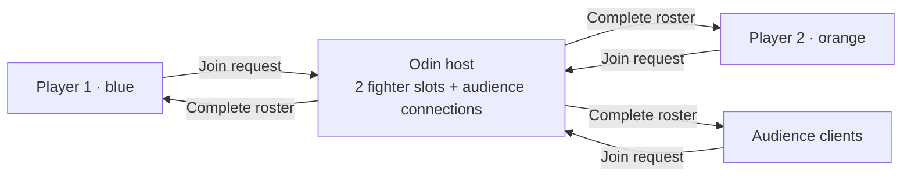

# Phase 2: Colored shapes and audience joining

This phase shows the same arena roster to two players and an audience. The shapes remain stationary; movement and fighting are subsequent phases.

## Try it

Run these from the repository root, each in a separate terminal:

```sh
make run_server
make run_client
make run_client
make run_audience
```

The first player is a **blue circle**; the second is an **orange circle**. Both clients show both shapes. A white ring identifies your own shape. Audience clients see the same shapes and the live audience count, with no owned shape.

Open more clients using either `make run_client` or `make run_audience`. Once both player slots are occupied, further clients automatically join as audience. The audience target always requests a viewer role, including when the arena is empty. You can also disconnect, toggle **Join as audience**, and reconnect in the window.

When a player leaves, everyone sees that slot become a waiting outline. Existing viewers keep their roles. To take the vacant slot, a viewer can disconnect, turn off **Join as audience**, and reconnect. The host assigns the lowest available player ID.

Address and port overrides still work: for example, `make run_audience SERVER_HOST=192.168.1.20 SERVER_PORT=7100`. See [Phase 1](01-host-connection.md) for build requirements and host binding options.

## How it works



The host owns membership and role assignment. Godot draws shapes from that roster. Audience connections are separate from the two fighter slots, and only clients that finish Hello/Welcome are counted. The updated [version 2 protocol](protocol.md) carries the join preference, assigned role, occupied slots, and audience count.

There is no two-person audience restriction. The current single ENet host has a ceiling of **4,095 total connections**, or 4,093 audience members alongside two players. This is not an unlimited or benchmarked audience capacity.

## Verification

Run `make check_connection`. It exercises real client scenes and ENet connections against an Odin host on an available local port, including:

- Audience joining before either player, without consuming a fighter slot.
- Two distinct player roles and twelve additional overflow joins: thirteen viewers total.
- Matching shape presence and audience counts on every connected client.
- Removing departed players and clearing disconnected screens.
- Reusing a vacant player slot, including a viewer reconnecting as a player.
- Stable roles after duplicate Hello, and rejection of old or malformed messages.
- Host-loss detection and retries that time out when no host is running.

Separate Godot processes also passed the root `run_client` and `run_audience` targets. The player and audience screens were rendered and inspected, and synthetic mouse clicks exercised the audience toggle and disconnect/reconnect. Screenshots and logs are under `build/verification/phase2-*` (ignored by Git).

These are local correctness checks. Internet latency, physical input acceptance, and thousands of simultaneous viewers have not been measured.
