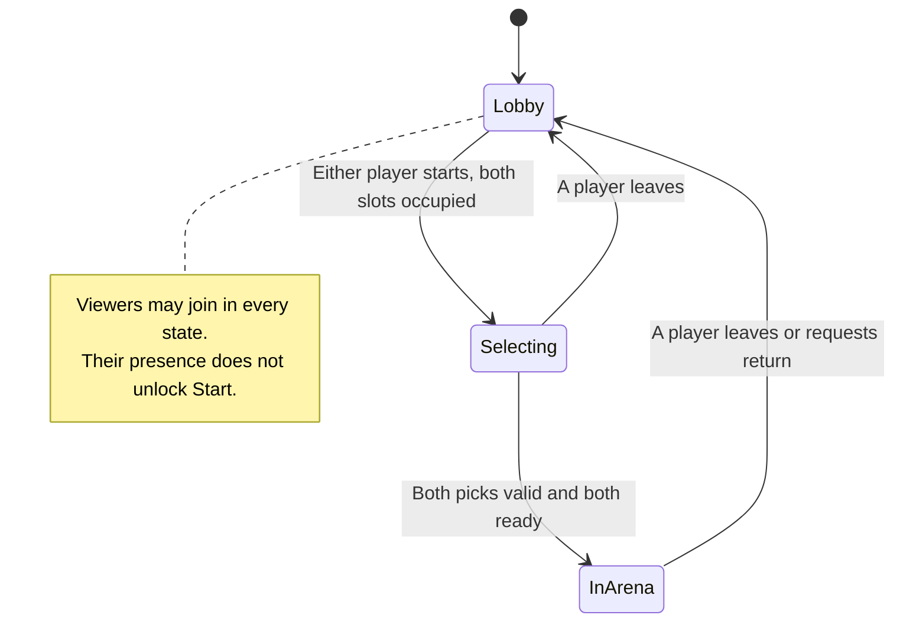

# Phase 3 plan: character selection and a top-down arena

Current status: **3A–3D are implemented**. This document preserves the original proposal; [3C](03c-arena-selection.md), [3D](03d-countdown-and-movement.md), and [protocol 5](protocol.md) describe the implemented files and behavior, including the user-requested countdown and movement extension.

[Checkpoint 3C](03c-arena-selection.md) replaced the single-map/SVG proposal with three maps, free tile assets, typed terrain, and a shared arena picker. [Checkpoint 3D](03d-countdown-and-movement.md) extends both Ready into a five-second countdown and playable arena. Attacks, damage, and AI remain later work.

The target is: **two players join → start character selection → each chooses and confirms a character → the host spawns both characters on a shared tilemap**. Audience clients follow the same screens and watch the arena.

## 1. Proposed player experience

Start with a roster of **four choices: Circle, Square, Triangle, and Diamond**, with **one character per player**. The catalog can grow beyond four without changing the two-player match limit. Both players may choose the same character. Player ownership remains blue for Player 1 and orange for Player 2; character choice changes the silhouette. The local player's character keeps its white ownership ring.

These are proposed defaults for this plan:

| Situation | Behavior |
| --- | --- |
| Fewer than two players | Lobby shows the vacant slot; Start is disabled. |
| Two players present | Either player can press **Start selection**. The server checks that both slots are occupied. |
| Selection opens | Both picks are initially empty. Each player can change only their own pick. |
| A player chooses a card | The server publishes the accepted pick to both players and the audience. |
| A player presses **Ready** | Their current pick is confirmed. Changing it clears their Ready flag. |
| Both players are ready | The server creates the arena and both character instances, then publishes the new state. |
| Audience member joins | They receive the current lobby, selection, or arena state. Selection controls are read-only. |
| A player leaves during selection or the arena | Cancel the round, remove its characters, clear both selections/readiness, and return remaining clients to the lobby. |
| A viewer leaves | Update the audience count; keep the current round. |

Ready can be withdrawn while selection is open. Once the server processes the second Ready and enters the arena, selection is closed. There is no countdown or loading barrier in this stationary milestone; add those before time-sensitive combat needs synchronized readiness.

Either player can use **Return to lobby** from the arena to test another selection. That ends the prototype round for everyone. Viewers can disconnect but cannot reset a round. Existing viewers keep their audience role; reconnecting remains the way to request an available player slot.

### Selection screen sketch

```text
                       CHOOSE YOUR CHARACTER

      PLAYER 1                                      PLAYER 2
      Blue · YOU                                    Orange
      Triangle · ready                             Diamond · choosing

                  [  ○ Circle    ]  [  □ Square   ]
                  [  △ Triangle  ]  [  ◇ Diamond  ]

                      [ Ready / Not ready ]
                       Audience: 7
```

The four cards form a two-column grid populated from the catalog. Each player panel shows a shape preview, character name, and readiness. Blue P1 and orange P2 badges mark the server-accepted picks on the cards, including both badges when players choose the same character. Card hover and focus can respond immediately on the local client. A click sends a request; the accepted pick is rendered from the server reply. A viewer sees the same cards, selection badges, and both player panels, with a “Watching selection” label instead of player controls. Switching from Circle to Triangle, for example, updates the player's preview and moves their badge on every connected screen.



## 2. Character definitions and instances

Keep three identities separate:

| Concept | Example | Meaning |
| --- | --- | --- |
| Player slot | Player 1 | Which connected player owns a choice and a character. |
| Character definition | Character 2, `square` | A reusable catalog entry describing a selectable character. |
| Character instance | Entity 101 in round 8 | The particular character spawned into this round at a world position. |

Two players choosing Square produce **two instances of the same definition**. A player's color does not become the character ID, and a character's entity ID does not become its owner's player ID.

Use **character** consistently for every selectable or spawned game character. A **character definition** describes a reusable catalog entry; a **character instance** is one spawned entity. Use `Character_Definition` and `Character` on the Odin side, `CharacterState` for decoded instance state, and `CharacterVisual` and `CharacterView` for Godot presentation. This vocabulary covers a monster, a human, or a meme asset without separate inheritance trees.

| Owner | Responsibility |
| --- | --- |
| Odin session | Player slots, audience count, phase, selection, readiness, permission checks. |
| Odin arena | Map identity, character IDs, owners, definitions, and spawn positions. |
| Shared JSON data | Character IDs and footprints; map cells and spawn points. |
| Godot connection | ENet lifecycle, request encoding, validated state decoding. |
| Godot screens | Display state and emit user intent. They never assign roles or start the authoritative match locally. |
| Godot world | Tile rendering, character visuals, camera, and ownership indicators. |

The first definition fields are `id: u16`, `key: string`, `display_name: string`, and `footprint_radius: f32`. ID 0 means no selection. The initial catalog is:

| Character ID | Key | Display name | Visual resource under `client/characters/visuals/` |
| --- | --- | --- | --- |
| 1 | `circle` | Circle | `circle.tres` |
| 2 | `square` | Square | `square.tres` |
| 3 | `triangle` | Triangle | `triangle.tres` |
| 4 | `diamond` | Diamond | `diamond.tres` |

All four start with a circular gameplay footprint of radius 12 world units. Their silhouettes are visual choices; they do not introduce separate collision systems. Character validation uses catalog membership, independently of player-role validation: character IDs 3 and 4 are valid even though player IDs are limited to 1 and 2.

The first `Character` fields are `entity_id: u32`, `owner_player_id: u8`, `character_id: u16`, and `position: [2]f32`. The server allocates entity IDs; clients index views by `(round_id, entity_id)`. Health, abilities, facing, animation state, and AI state are added when their behavior is implemented.

Adding a real character later means adding a catalog definition and its Godot visual resource/scene. The selection screen creates cards from catalog entries instead of hard-coding a button count. Gameplay code uses the definition and instance data. There is no `CirclePlayer` versus `SquarePlayer` branch throughout networking or session logic.

## 3. Shared data and packaging

Keep the initial neutral data **inside the Godot project**, where it can be packaged directly:

```text
client/content/data/characters.json
client/content/data/maps/training_ground.json
```

These files contain plain JSON, not Godot resources. Godot reads `res://content/data/`; the root Make commands pass `--content-dir=client/content/data` to Odin. A deployed server receives a copy of just this data directory and uses `--content-dir=<deployed-directory>`. It does not need Godot scenes, images, or an editor. This keeps one authored copy and avoids a synchronization generator in the first milestone.

The client loads this small data set before connecting; the server validates it before listening. Validate schema versions, unique nonzero IDs, finite positive footprints, map dimensions, row lengths, known tile symbols, two distinct walkable spawn cells, and footprint clearance from blocked cells and boundaries. Missing or invalid content gives a clear startup error.

Checkpoint 3B introduces and validates the character catalog only. Checkpoint 3C adds the map to the required data set and digest on both sides. Content loads once per process; restart both ends after editing shared data.

Hello will carry a SHA-256 digest of the shared data. Define the input identically on both sides: the active shared JSON files sorted by relative forward-slash path; for each file hash `u32le(path byte length) + UTF-8 path + u32le(file byte length) + raw file bytes`. Hash only the data directory, excluding Godot metadata and visual assets. This detects mismatched maps/catalogs without sending textures or whole maps over the network. It checks compatibility, not client trust or authentication.

When adding a Godot export preset, include these JSON files using its non-resource export filter. An exported-client smoke check must confirm they load; editor success alone is insufficient. [Godot export documentation](https://docs.godotengine.org/en/4.6/tutorials/export/exporting_projects.html)

Visual resources live separately under `client/characters/visuals/`. `CharacterVisual` is a Godot `Resource`: character ID, placeholder kind, optional portrait, and optional visual scene. The placeholder renderer supports Circle, Square, Triangle, and Diamond; a later character can supply an animated scene under the same `CharacterView`. Runtime position and ownership belong to the view instance, never the shared resource. [Godot Resource documentation](https://docs.godotengine.org/en/4.6/classes/class_resource.html)

## 4. A real top-down tilemap

Use a **20 × 14 orthogonal map with 32-unit tiles**, for a 640 × 448 world. The origin is the top-left corner; X increases rightward and Y downward. One world unit equals one pixel at camera zoom 1. The camera may scale the view to fit the window; this never changes world coordinates.

```text
####################
#..................#
#..................#
#..................#
#..................#
#..................#
#........##........#
#...1....##....2...#
#........##........#
#..................#
#..................#
#..................#
#..................#
####################
```

`#` is a blocked wall, `.` is walkable floor, and `1`/`2` illustrate spawn cells; the JSON stores those cells as floor and stores spawns separately. There is room to travel around the central obstacle once movement exists.

The map JSON contains `schema_version`, numeric `map_id` (1), `key` (`training_ground`), `width`, `height`, `tile_size`, a symbol-to-tile-ID/walkability legend, row strings, and two player spawn cells. Godot atlas coordinates are presentation data and are not stored as gameplay tile IDs.

- Player 1 spawn cell `(4, 7)` → world center `(144, 240)`.
- Player 2 spawn cell `(15, 7)` → world center `(496, 240)`.
- Conversion: `(cell + 0.5) × tile_size`; inverse: `floor(world / tile_size)`.
- Out-of-bounds cells are blocked. The server's row-major index is `y × width + x`.

Use Godot 4.6 **`TileMapLayer`** nodes with a `TileSet`: one Floor layer and one Walls layer. Floor fills the map; Walls places cells marked blocked. Create a small SVG tile atlas and a `.tres` TileSet; fill cells once when the map loads. Godot's older `TileMap` node is deprecated. [TileMapLayer documentation](https://docs.godotengine.org/en/4.6/classes/class_tilemaplayer.html)

Both layers and the Characters container use the same world origin and scale. Godot's cell-center conversion must match the server formula. A shared test fixture checks both spawn coordinates. [Godot cell-coordinate methods](https://docs.godotengine.org/en/4.6/classes/class_tilemaplayer.html#class-tilemaplayer-method-map-to-local)

Odin reads the same cell data into `Arena_Definition` and offers `arena_cell_is_blocked` and `arena_cell_center`. It does not read a `.tscn` or run Godot physics. Godot tile collision/navigation are disabled for this milestone; the server grid becomes the movement/pathfinding input later. A `CharacterView` is a `Node2D`, with a future visual child anchored at its ground position.

The arena occupies the main game view, with a `Camera2D` framing the map and a `CanvasLayer` for HUD controls. The character-selection screen uses its own screen layout. The existing `client/arena.gd` is a screen-relative grid drawing, so it will be retired when the world scene replaces it.

## 5. Proposed files, classes, and procedures

These are the files to introduce **across the checkpoints below**, not a scaffolding task to execute all at once. 3A has introduced only the types, fields, and APIs needed for current membership and connection handling; future phase/selection/character fields and procedures remain deferred. Keep all Odin files in the existing `server` package. Each named Godot class has a single responsibility; there is no global service locator or new engine framework.

### Odin host

| File | Types / main procedures | Responsibility | First checkpoint |
| --- | --- | --- | --- |
| `server/main.odin` (modify) | `Options`, `main`, `run_host` | Parse options, load data, own host/session lifetime, pump network events. | 3A |
| `server/network.odin` | `Client`, `Network_Host`; `network_poll`, `network_send`, `network_publish_session` | ENet peers, welcomed connections, disconnects, and mapping the peer to its assigned player role. Move existing transport code here. | 3A |
| `server/protocol.odin` | `Client_Command`, `Message_Kind`, `Reject_Reason`; `protocol_decode`, `protocol_encode_session` | Explicit byte encoding, length checks, version checks, and message validation. | 3A |
| `server/session.odin` | `Session`, `Player_Slot`, `Session_Phase`; `session_join`, `session_leave`, `session_apply` (reset on fighter departure) | Own membership and the match state machine; no ENet calls inside these rules. | 3A; selection in 3B |
| `server/content.odin` | `Game_Content`; `content_load`, `content_parse`, `content_character`, `content_destroy` | Load the shared JSON, validate it, compute the compatibility digest. | 3B |
| `server/characters.odin` | `Character_Definition` now; `Character` and `character_spawn` planned for 3D | Catalog lookup and live entity construction. No shape-specific networking. | 3B; spawning in 3D |
| `server/arena.odin` | `Arena_Definition`, `Arena_State`; `arena_cell_center`, `arena_cell_is_blocked`, `arena_create`, `arena_clear` | Map data, spawn validation, and the two authoritative characters. | 3C; creation in 3D |

`Session` owns `phase`, `round_id`, `revision`, two `Player_Slot` records, `audience_count`, and the current `Arena_State`. A slot stores presence, selected character ID, and readiness. `Arena_State` has the map ID and up to two `Character` records. Empty slots have character ID zero and readiness false.

The networking layer supplies the actor's role from its welcomed connection; it never trusts an owner ID supplied in a command. Joining/leaving calls session rules exactly once, including rollback if Welcome cannot be sent. Pure session tests can exercise these rules without opening sockets.

### Godot client

| File | Class / scene | Responsibility | First checkpoint |
| --- | --- | --- | --- |
| `client/main.gd`, `client/main.tscn` (modify) | `AppController : Node` | Persistent connection and content ownership; connect signals; display the screen matching server state. Preserve the current connection UX during extraction. | 3A |
| `client/network/game_connection.gd` | `GameConnection : Node` | Existing ENet lifecycle; `connect_to_host`, `disconnect_from_host`, request methods; `connection_changed`, `session_changed`, `command_rejected` signals. | 3A |
| `client/network/protocol.gd` | `GameProtocol : RefCounted` | Static packet encoders/decoders and wire enums. | 3A |
| `client/session/session_snapshot.gd` | `SessionSnapshot : RefCounted`; nested `PlayerSlotState`, `CharacterState` | A decoded server-state value; replace it after validation, rather than letting screens edit it. | 3A; extended in 3B/3D |
| `client/ui/lobby_screen.gd`, `.tscn` | `LobbyScreen : Control` | Extract current host/port, audience preference, connection controls, and roster view. Add Start selection in 3B. | 3A |
| `client/ui/character_select_screen.gd`, `.tscn` | `CharacterSelectScreen : Control` | Build cards from the catalog, show both picks, emit `character_requested` and `ready_requested`. Disable player actions for viewers. | 3B |
| `client/content/game_content.gd` | `GameContent : RefCounted`; nested `CharacterDefinition`, `MapDefinition` | Parse neutral data, validate IDs and cells, compute digest, and resolve client visual resources. | 3B; maps in 3C |
| `client/characters/character_visual.gd` | `CharacterVisual : Resource` | Definition-to-appearance data; no mutable match state. | 3B |
| `client/characters/visuals/circle.tres`, `square.tres`, `triangle.tres`, `diamond.tres` | Four `CharacterVisual` resources | Circle/Square/Triangle/Diamond placeholder kind and character ID. | 3B |
| `client/characters/character_view.gd`, `.tscn` | `CharacterView : Node2D` | `configure(visual, owner, display_radius)` now; `apply_state(character)` planned for 3D; own the visual child, player-color marker, and local-player ring. | 3B for previews; world use in 3D |
| `client/world/arena_world.gd`, `.tscn` | `ArenaWorld : Node2D` | `load_map`, `apply_session`, `clear_world`; populate tile layers and maintain character views keyed by entity ID. | 3C |
| `client/world/prototype_tileset.tres` | `TileSet` | Two atlas entries: floor and wall. | 3C |
| `client/assets/tiles/prototype_tiles.svg` | 64 × 32 tile atlas | Two simple 32 × 32 prototype tiles. | 3C |
| `client/arena.gd`, `.uid` (retire later) | Existing roster drawing | Keep through 3A/3B; remove references and files after the world view replaces it in 3D. | 3D |

`GameContent` resolves each visual by `res://characters/visuals/<key>.tres`, where catalog keys are validated lowercase letters, digits, and underscores. Each resource's character ID must match its definition. There is no hard-coded card count or player-to-shape mapping. Resources used through these dynamic paths must be included in an eventual export.

The existing main scene becomes a persistent root with the connection outside the replaceable screens. No networking Autoload is needed; separate scene instances can still support the existing integration test approach.

```text
Main (Node, AppController)
├── GameConnection (Node)
├── ArenaWorld (Node2D; present/visible only for the arena)
│   ├── Floor (TileMapLayer)
│   ├── Walls (TileMapLayer)
│   ├── Characters (Node2D; zero or two CharacterView instances)
│   └── Camera2D
└── UI (CanvasLayer)
    └── Screens (Control)
        ├── LobbyScreen
        ├── CharacterSelectScreen
        └── ArenaHUD (ordinary controls: role, audience, Return to lobby)
```

Changing screens does not destroy the ENet connection. Arena HUD controls can stay in `main.tscn` until they justify a separate script.

### Data, checks, and existing files to update

| File | Planned change |
| --- | --- |
| `client/content/data/characters.json` | Schema version and Circle/Square/Triangle/Diamond definition records; introduced in 3B. |
| `client/content/data/maps/training_ground.json` | Map legend, rows, and spawns; introduced in 3C. |
| `server/session_test.odin` | Session transitions, role restrictions, selection/readiness, stale commands, and player departures. |
| `server/content_test.odin` | Invalid content, known digest fixture, blocked cells, and exact spawn conversions. |
| `tests/connection_check.gd` (modify) | Keep existing joins/reconnects/viewers tests; access extracted connection/state rather than old root fields. |
| `tests/selection_check.gd` | Real host/client flow through all four choices, visible player/audience selection updates, both Ready, arena entry, late audience join, reset, and disconnect. Cover both different picks and both players choosing the same character. Add cases as checkpoints land. |
| `tests/content_check.gd` | Match the Odin digest/spawn fixtures; verify map rendering uses the same cell IDs and visual resources exist. |
| `Makefile` (modify) | Preserve root run targets; add `CONTENT_DIR`, `check_session`, `check_content`, `check_selection`, and an aggregate `check` as their checks appear. |
| `docs/protocol.md` | Version 3 is implemented and verified in 3B. Extend the documented contract when map/arena fields become active in 3C/3D. |
| `docs/project-structure.md` (update during implementation) | Reflect only files that actually exist. |

New script `.uid` and asset `.import` metadata remain versioned. No new dependencies are proposed. `client/export_presets.cfg` and server packaging commands are deferred until an export/deployment phase is requested; that phase must include the data files described above.

## 6. Server state and proposed protocol version 3

Keep ENet, compression disabled, and reliable ordered channel 0 for these infrequent session actions. Publish a **complete session snapshot** after accepted changes and immediately after Welcome. It replaces the small Roster message; clients should not reconcile a separate roster and selection stream. Audience join/leave updates the snapshot without resetting the round.

`revision` increases when published state changes. `round_id` increases when a selection round starts or is reset. A viewer joining does not change `round_id`. Each command includes the round ID it was issued for, so a delayed command cannot affect a later occupant or selection round. Reset cached state/revisions on a new connection.

Proposed header: the same four magic bytes `OGAA`, version byte **3**, then a message-kind byte. Integers below are unsigned and little endian; positions are finite IEEE-754 float32 values encoded explicitly. No native struct layout is sent.

| Kind | Direction | Payload after the six-byte header |
| --- | --- | --- |
| 1 Hello | Client → host | Join preference `u8`, content digest `32 bytes`. Total 39 bytes. |
| 2 Welcome | Host → client | Assigned role `u8`, preserving zero for audience. Total 7 bytes. |
| 3 SessionState | Host → clients | Round `u32`, revision `u32`, phase `u8`, player mask `u8`, audience count `u16`, map ID `u16`, two slot records (`character_id:u16`, `ready:u8`), character count `u8`, then character records. |
| 4 StartSelection | Player → host | Expected round `u32`. |
| 5 SelectCharacter | Player → host | Round `u32`, character ID `u16`. |
| 6 SetReady | Player → host | Round `u32`, selected character ID `u16`, desired Ready `u8` (0/1). |
| 7 ReturnToLobby | Player → host | Round `u32`. |
| 8 CommandRejected | Host → sender | Current round `u32`, rejected kind `u8`, reason `u8`. |

A character record is `entity_id:u32`, `owner_player_id:u8`, `character_id:u16`, `x:f32`, `y:f32`: **15 bytes**. SessionState is 27 bytes without characters and **57 bytes with two**. The existing 64-byte application packet cap still covers this proposal. Recalculate and test sizes when implementing; any later extension must explicitly revisit the cap.

Four catalog choices do not increase this snapshot size: each player selects one character ID, and the arena still contains two character instances.

Phase values are Lobby=0, Selecting=1, InArena=2. Lobby has cleared picks, no map, and zero characters. Selecting has picks/readiness but no map or characters. InArena has map ID 1, both ready slots, and two characters matching their owners' selected definitions. Clients validate these relationships, valid IDs, owner uniqueness, finite positions, and exact packet length before replacing their state.

### Command handling rules

- StartSelection requires a welcomed player, matching round, Lobby, and two occupied slots. Simultaneous Start requests create one selection round.
- SelectCharacter requires Selecting, a current player, matching round, and a catalog ID. Selecting a different character clears that player's Ready; repeating the same choice is a no-op.
- SetReady uses an explicit boolean, not a toggle. Its character ID must match the slot's current selection. The second valid Ready performs arena creation exactly once in checkpoint 3D.
- ReturnToLobby requires a current player, matching round, and InArena. Reset clears both character instances and picks while keeping remaining connections.
- A well-formed but disallowed command returns a reason such as `AudienceReadOnly`, `WrongPhase`, `StaleRound`, `UnknownCharacter`, `SelectionChanged`, or `NeedTwoPlayers`; it does not alter state or drop other clients. Invalid wire data still disconnects its sender.
- A content digest mismatch rejects the join with a separate reason and an “Update game content” message. Unwelcomed connections never occupy a fighter slot or receive session state.

A repeated valid command that is already satisfied returns the current snapshot to its sender without increasing the revision or broadcasting a new state. The 3B UI displays accepted state directly, with no optimistic selection or pending lock; rejections are shown as messages. An older revision cannot replace a newer snapshot on the same connection.

### Follow one selection

```mermaid
sequenceDiagram
    participant P1 as Player 1 Godot
    participant H as Odin host
    participant P2 as Player 2 Godot
    participant A as Audience
    P1->>H: StartSelection(expected round)
    H-->>P1: SessionState: Selecting, new round
    H-->>P2: Same state
    H-->>A: Same state, viewer controls
    P1->>H: SelectCharacter(round, Circle)
    P2->>H: SelectCharacter(round, Square)
    P1->>H: SelectCharacter(round, Triangle)
    P2->>H: SelectCharacter(round, Diamond)
    Note over H: Validate each request; publish accepted picks to everyone
    P1->>H: SetReady(round, Triangle, true)
    P2->>H: SetReady(round, Diamond, true)
    H->>H: Create two characters at map spawn centers
    H-->>P1: SessionState: InArena, map 1, both characters
    H-->>P2: Same authoritative spawn state
    H-->>A: Same authoritative spawn state
```

Maps and visual assets are preloaded locally. A late viewer receives the current SessionState and constructs the same world directly; it does not need the history of clicks or a one-time Start event.

## 7. Implementation checkpoints and acceptance

Stop after each checkpoint with its visible result and verification. Do not implement all four in one pass.

| Checkpoint | Scope | Acceptance before the next checkpoint |
| --- | --- | --- |
| **3A — Separate connection, session, and screens** | Extract existing networking/protocol code, create the server session owner and client snapshot type, move connection UI into LobbyScreen. Retain protocol 2 and current shapes. | Existing two-player/audience integration check still passes; screen, reconnect, timeout, and role assignment behave as before. No selection or new map yet. |
| **3B — Choose and confirm characters** | Add character data/visuals, digest checks, protocol 3, Start selection, catalog-driven Circle/Square/Triangle/Diamond cards, and server-owned picks/Ready. | One player cannot start; two can. Each player can cycle through all four choices; previews and card badges update for both players and viewers. Character IDs 3/4 work independently of player IDs. Both can select the same shape. Audience commands cannot modify state. Changes clear Ready, invalid/stale requests are rejected, and leaving resets selection. This checkpoint stops at “Both players ready”; arena entry is wired in 3D. |
| **3C — Build the top-down map** | Add the shared map, Odin map loader, TileSet/atlas, ArenaWorld, and map/content checks. Selection still works; validate the world scene separately before routing clients into it. | Both languages agree on digest, blocked cells, and spawn centers. Render all 280 cells and central walls. Confirm the camera fits the map at supported window sizes. This is a map/render checkpoint, not a networked match yet. |
| **3D — Enter the shared arena** | Connect both Ready to server character creation, route all clients to ArenaWorld, add Return to lobby, and retire the old roster drawing. | Two chosen shapes spawn at identical authoritative coordinates for both players and viewers. Duplicate Ready cannot double-spawn. A late viewer sees the active arena. Player departure resets everyone; a viewer departure does not. Return and reselect produce fresh instances. |

Run checks from the repository root. Extend the existing integration harness to launch its own host on an available port and clean up only its own processes. `check_session` will run Odin rule tests; `check_content` will run both content readers against known fixtures; `check_selection` will exercise the real client scenes and host. Keep malformed-packet and reconnect coverage from Phase 2.

Before accepting 3D, inspect all four silhouettes in the selection previews and arena, exercise selection/Ready/Return with synthetic input, and report physical input coverage separately. Check player and viewer screens while changing picks and when both players select the same character. Test different window sizes so camera fitting does not change received world positions. Local correctness checks do not establish Internet latency or maximum audience throughput.

## 8. Later extension points

Future movement adds input commands and fixed server simulation steps that update `Character.position`, using the map's blocked cells and definition footprint. Client prediction and interpolation belong to that movement phase; event-based reliable session messages should not become the high-frequency movement stream by default.

Future AI and combat act on Odin character instances and the same map data. Godot receives visible results. Add a loading/ready barrier and a server start tick when the match advances in time. No AI port from the other engine, ECS, navigation service, physics engine integration, matchmaking, or asset-download system is part of these four checkpoints.

Checkpoints **3A–3D are complete**. The user-requested 3D slice includes countdown and networked movement. See [the implemented 3D design](03d-countdown-and-movement.md) and [protocol 5](protocol.md) for current behavior and wire layouts.
