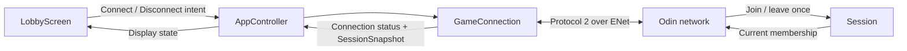

# Checkpoint 3A: connection, session, and lobby

Status: **implemented and verified locally**. This checkpoint separates responsibilities while retaining the two player shapes, audience joining, and protocol version 2. This document records the 3A checkpoint; [3B character selection](03b-character-selection.md) now extends these files and uses protocol version 3.

## What owns what

| Component | Responsibility |
| --- | --- |
| [Odin main](../server/main.odin) | Options, process lifetime, and the poll loop. |
| [Odin network](../server/network.odin) | ENet peers, Hello deadlines, sending packets, and each connection's assigned role. |
| [Odin session](../server/session.odin) | The two `Player_Slot` records and audience count; join/leave rules without networking calls. |
| [Odin protocol](../server/protocol.odin) | Decode Hello and encode version 2 Welcome/Roster bytes. |
| [AppController](../client/main.gd) | Wire the persistent connection to the lobby, apply CLI options, and start the connection. |
| [GameConnection](../client/network/game_connection.gd) | ENet lifecycle, connection status, assigned role, and the latest decoded snapshot. |
| [GameProtocol](../client/network/protocol.gd) | Encode Hello and validate/decode host packets. |
| [SessionSnapshot](../client/session/session_snapshot.gd) | The two decoded `PlayerSlotState` values and audience count. |
| [LobbyScreen](../client/ui/lobby_screen.gd) | Render connection/session state and emit Connect/Disconnect requests. |

`main.tscn` now has a `GameConnection` node alongside a `CanvasLayer` containing the lobby scene. Networking has no dependency on a visible lobby or an Autoload. `client/arena.gd` remains the existing shape renderer within the lobby until the tilemap checkpoint replaces it.



A valid joining connection registers with `Session` once. The network layer removes that membership on disconnect, rejection, or send failure; it rolls back a failed Welcome through the same cleanup path. Duplicate Hello preserves the existing role and count. Godot replaces its snapshot on each valid Roster instead of mutating a previously published snapshot. Disconnect clears it.

Only fields and APIs used in this checkpoint exist. Match phases, selection/readiness, `Character`/`CharacterState`, shared content loading, and the version 3 messages remain later steps in the [architecture plan](03-selection-and-topdown-arena-plan.md).

## Run and verify

The existing root commands are unchanged:

```sh
make run_server
make run_client
make run_audience
```

Run each program in a separate terminal. Use `make check` for the current checks, or `make check_session` and `make check_connection` individually.

Verification completed for this checkpoint:

- Four Odin checks covering slot reuse, audience separation, exact version 2 bytes (including a count above 255), invalid Hello packets, and membership cleanup called twice.
- Actual client scenes with two players and thirteen viewers, retained reconnect/rejection/host-loss coverage, and removal/rejoining of a rejected established viewer.
- Snapshot replacement without changing an earlier snapshot, plus a standalone `GameConnection` joining without a lobby or application controller.
- The pre-refactor client against the extracted host, and the extracted client against the pre-refactor host.
- A fresh client source copy launched without Godot's generated class cache. Scripts explicitly preload their dependencies.
- Separate Godot processes through the root run targets, rendered player/audience screens, and synthetic mouse interaction with the audience toggle and Disconnect/Connect controls.

Evidence is under ignored `build/verification/phase3a-*`. Physical mouse/keyboard acceptance, Internet latency, and maximum audience capacity were not measured in this refactor.

The next implementation checkpoint is **3B: Circle, Square, Triangle, and Diamond selection with both players' choices visible to the audience**.
