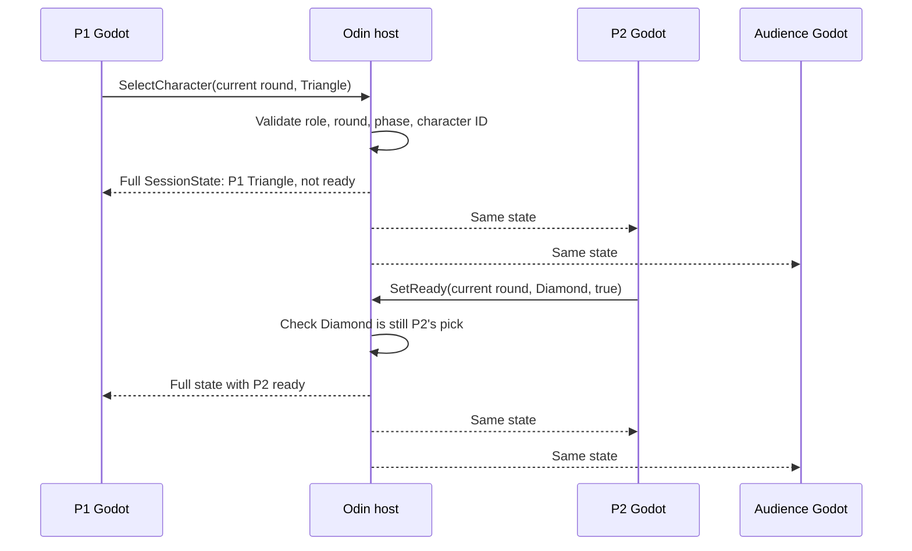

# Checkpoint 3B: choose and confirm characters

Two connected players can now start character selection, choose **Circle, Square, Triangle, or Diamond**, and confirm Ready. Players and audience see both accepted picks, character-card badges, previews, and Ready states. P1 is blue and P2 is orange, including when both choose the same character.

This document records the 3B checkpoint; [3C arena selection](03c-arena-selection.md) now extends it with maps, terrain, and protocol 4.

This checkpoint stops at **Both players ready**. The top-down tilemap is checkpoint 3C; entering it is 3D. Movement, combat, and AI remain later work.

## Try it

From the repository root, open separate terminals:

```sh
make run_server
make run_client
make run_client
make run_audience
```

Start is enabled once both player slots are occupied. Either player can press **Start character selection**. Pick a card, then press **Ready**. A different pick clears your Ready; **Unready** withdraws confirmation. Audience clients can watch but cannot select, start, or ready.

Connect another audience client during selection: it immediately displays both current choices. Disconnect a player: everyone returns to the lobby with empty picks. Reconnect that player and start again. Disconnecting a viewer only changes the audience count.

The root run commands also accept `SERVER_PORT`, `SERVER_HOST`, and `SERVER_BIND`. The host uses `CONTENT_DIR=client/content/data` by default. For a separately deployed host, copy that data directory and pass its path through `CONTENT_DIR` or `--content-dir`.

## Ownership and files



| Files | Responsibility |
| --- | --- |
| `client/content/data/characters.json` | Canonical IDs, keys, names, and gameplay footprints; read by both programs |
| `server/characters.odin` | `Character_Definition`, separate from future live instances |
| `server/content.odin` | `Game_Content`, catalog validation, lookup, SHA-256 fingerprint |
| `server/session.odin` | `Session`, `Player_Slot`, `Session_Phase`; membership, picks, Ready, and round reset rules |
| `server/protocol.odin`, `network.odin` | Version 3 codec, handshake, permission checks via session rules, full-state publication |
| `client/content/game_content.gd` | `GameContent` and `CharacterDefinition`; load catalog and resolve visual resources |
| `client/characters/character_visual.gd`, `visuals/*.tres` | `CharacterVisual` resources for all four placeholders |
| `client/characters/character_view.gd`, `.tscn` | `CharacterView` draws a reusable placeholder in its owner's color |
| `client/session/session_snapshot.gd` | `SessionSnapshot` with two `PlayerSlotState` values, phase, round, and revision |
| `client/network/game_connection.gd`, `protocol.gd` | Persistent ENet connection, commands, snapshot validation, and rejection messages |
| `client/ui/lobby_screen.gd`, `.tscn` | Connection controls, roster, and Start selection |
| `client/ui/character_select_screen.gd`, `.tscn` | Catalog-driven cards, both previews/badges/readiness, audience display |
| `client/main.gd`, `.tscn` | `AppController` owns content, connects signals, and routes between screens |

Character IDs are independent of player IDs. Adding character definitions does not add player slots. Visual resources contain presentation choices; shared JSON contains gameplay data. Future art can replace the placeholder renderer without changing selection messages.

The implementation uses a small set of direct commands: `request_start_selection`, `request_character`, and `request_set_ready`. The last name avoids Godot's existing `Node.request_ready()` lifecycle method. Screens display host-confirmed state, with no optimistic picks or pending-button lock.

The active fingerprint input is `characters.json`; map data will be added in 3C. A mismatch is rejected before membership is assigned and shown as **Update game content**. Invalid catalogs stop startup. See the exact layouts and rules in [protocol.md](protocol.md).

## Verification

Run `make check` from the repository root. It includes:

- Odin session rules, packet fixtures, content validation, and an independently calculated SHA-256 fixture.
- Godot catalog/visual validation, matching digest and packet fixtures, and invalid-state rejection.
- Existing connection regressions: two fighters plus thirteen viewers, reconnect/slot reuse, malformed packets, host loss, and timeouts.
- Actual client scenes against an isolated host: all four choices for both players, mirror picks, previews/badges, audience permissions, simultaneous starts, Ready/unready/no-ops, in-flight Ready after a changed pick, late joining, round reset, and content mismatch.

Verified locally with Odin dev-2026-03-nightly and Godot 4.6: `make check` passed all six Odin tests and all three Godot check scripts. A fresh client launched without `.godot` cache; missing/invalid host data prevented listening, and invalid client data prevented connection.

Graphical verification passed with separate Godot player/audience processes and synthetic mouse input for Start, character cards, and Ready. Screenshots confirmed distinct/mirror picks, both Ready, and the audience layout at 900×800 and 800×760. Physical mouse/keyboard play, exported clients, Internet latency, and maximum audience throughput remain unverified. Local logs and screenshots are kept under ignored `build/verification/phase3b-*`.

Next checkpoint: **3C — shared top-down tilemap**, with its own content, coordinate, and rendering checks before arena entry is connected.
