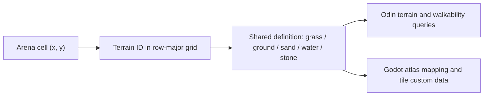

# Checkpoint 3C: arena selection and typed terrain

Historical checkpoint: current map sizes, art, terrain types, and elevation are described in [checkpoint 3G](03g-land-arenas.md).

Implemented and verified locally. This checkpoint adds three selectable top-down maps and shared terrain metadata. It does not add movement, combat, AI, or terrain effects.

## Selection flow

The existing character selection gains an **Arena** view. Either fighter may select the one shared arena; the host validates and publishes the choice to both players and every audience member. The latest accepted choice wins. A different map clears both Ready flags, so both players confirm the new setting. A default arena is chosen when selection starts. Audience can browse the shared preview and inspect tiles but cannot change the arena.

Character selection remains available through a **Characters** button. Both views show both character choices/readiness and the shared arena. A fighter leaving clears the arena and returns everyone to the lobby. This phase still stops at Both players ready; spawning and arena entry remain a separate checkpoint.

## Shared data and rendering

- `client/content/data/terrains.json`: stable numeric terrain IDs, keys, names, and walkability. Grass, ground, sand, water, and stone. No speed/damage/status modifiers yet.
- `client/content/data/arenas.json`: three maps with stable IDs, names, 20×14 row-major terrain grids, 32-unit cells, and two spawn cells. Every cell resolves to a terrain definition. Rendering never decides gameplay type from pixel color.
- Both programs validate IDs, dimensions, row lengths, known terrain types, distinct walkable spawn cells, and character footprint clearance. Their content fingerprint covers `arenas.json`, `characters.json`, and `terrains.json` in sorted path order.
- `server/arena.odin`: `Terrain_Definition`, `Arena_Definition`, cell/terrain lookup, world-to-cell conversion, spawn clearance; no renderer or simulation effects.
- `client/content/arena_catalog.gd`: `ArenaCatalog`, `TerrainDefinition`, `ArenaDefinition`, matching validation and coordinate queries.
- `client/world/arena_world.gd`, `.tscn`: a reusable top-down world rendered by `TileMapLayer`, with client visual mappings in `client/world/terrain_tileset.gd`. Godot custom tile data mirrors terrain ID/key for editor/runtime inspection. Gameplay queries use shared data.
- `client/ui/arena_select_screen.gd`, `.tscn`: map choices, shared preview, terrain legend and hover/click inspection, both player states, Ready, and return to character selection.
- `client/ui/arena_preview.gd`: fits the world to a preview area and translates pointer positions to terrain cells.

Downloaded tile art stays under `client/assets/kenney_tiny_battle/` and `client/assets/kenney_tiny_town/`, with original licenses and `SOURCE.md` provenance records. The JSON files do not contain image filenames or atlas coordinates. Godot tile physics/navigation remain disabled until authoritative movement exists.

## Network change

Protocol version 4 activates SessionState's map ID. `SelectArena` (kind 9) carries expected round and map ID. `SetReady` also includes the map ID the player saw, so a delayed Ready cannot confirm a different arena. Changing the map advances the selection round, invalidating Ready requests even if the map changes away and back before they arrive. Map changes retain both character picks.

Unknown map requests are rejected without changing state. The existing content mismatch check prevents clients with different terrain/map data from joining. Maps are loaded locally; clients send IDs, never complete grids or asset files.

## Maps and terrain IDs

| Arena | Layout |
| --- | --- |
| Meadow Crossing | Grass field, ground crossroads, sandy pond edges, stone boundary |
| Sandbar | Sandy island, water boundary, ground crossing, grass patches and stone obstacles |
| Stone Garden | Ground courtyard, stone obstacles, grass pockets and sandy pools |

Every map is 20×14 cells, with 32 world units per cell. The spawn cells `(4, 7)` and `(15, 7)` map to world centers `(144, 240)` and `(496, 240)`. The numbered circles in the preview are spawn markers, not live characters.

| Terrain ID | Key | Map symbol | Walkable metadata |
| --- | --- | --- | --- |
| 1 | `grass` | `.` | Yes |
| 2 | `ground` | `g` | Yes |
| 3 | `sand` | `s` | Yes |
| 4 | `water` | `w` | No |
| 5 | `stone` | `#` | No |

Out-of-bounds queries return terrain ID zero and are blocked. Walkability is data for future movement; no physics, speed modifiers, damage, or status effects run in this phase. Future terrain effects should look up the terrain ID/key from the authoritative grid, independently of the sprite or tint.



The runtime TileSet includes `terrain_id`, `terrain_key`, and `walkable` custom data on every tile. Terrain catalog JSON remains the source of gameplay truth. `ArenaWorld` scales the original 16px art into the shared 32-unit grid; the inspector converts the fitted preview coordinates back to that grid.

## Assets

The original atlas pixels are unchanged. [Tiny Town 1.1](https://kenney.nl/assets/tiny-town) provides grass, ground, and stone; [Tiny Battle 1.0](https://kenney.nl/assets/tiny-battle) provides water. Both are Kenney CC0 assets, downloaded from the author's OpenGameArt uploads: [Tiny Town](https://opengameart.org/content/tiny-town), [Tiny Battle](https://opengameart.org/content/tiny-battle). Sand uses a lighter Godot tint of the ground tile. Licenses, archive URLs, download date, and checksums are recorded beside each atlas.

## Try it

Run these in separate terminals from the repository root:

```sh
make run_server
make run_client
make run_client
make run_audience
```

After both players connect, start character selection. Press the **Arena: … →** button to open arena selection. Either player may choose a map; all viewers receive the same map. Hover or click its tiles to inspect terrain. Press **Characters** to return to character selection. Character picks survive map changes, while both Ready flags clear. Both Ready still stops here; entering the arena is checkpoint 3D.

`make run_client` and `make run_audience` now import Godot assets before launch, including on a fresh checkout. Restart the host and clients together because this checkpoint uses protocol 4 and a new content fingerprint. Exported builds still need JSON files included in their export preset; exports are not part of this checkpoint.

## Verification

`make check` covers Odin rules, both content readers, shared SHA-256/wire fixtures, existing connection/character regressions, and the new arena checks. The added tests validate all 840 rendered cells against the shared terrain grid, custom tile metadata, spawn clearance, world/cell conversion, map selection authority, late viewers, no-op selections, concurrent choices, and Ready invalidation.

Separate graphical player/audience processes were exercised with synthetic input. Screenshots cover all three maps, tile inspection, both Ready, character/arena navigation, and the audience layout at 900×800 and 800×760. A fresh root launch imports assets correctly; invalid terrain/arena files prevent host listening and client connection. Physical input, exported builds, Internet latency, and maximum audience throughput remain unverified. Local evidence is under ignored `build/verification/phase3c-*`.
