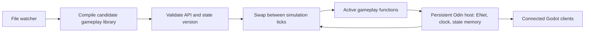

# Development workflow proposal: arena launcher and hot reload

Status: the [arena launcher and first reload checkpoint](03f-dev-workflow.md) are implemented. The original design below also describes later capabilities. Current saves hot-reload character visual resources and textures; code, scenes, and gameplay data automatically relaunch the scenario after validation. Editor synchronization, in-place gameplay-data reload, and Odin library swapping below remain proposals.

The recommendation is one repeatable development scenario, followed by increasingly capable reload support. Keep connections and authoritative state alive for supported changes. For changes that require restarting, let the development runner recreate the same scenario automatically. An automatic restart restores the test setup; it does not preserve an in-progress match.

## 1. First checkpoint: launch directly into an arena

Proposed command, run from the repository root:

```sh
make dev_arena P1=triangle P2=diamond ARENA=sandbar
```

Optional settings:

```sh
make dev_arena P1=circle P2=square ARENA=stone_garden AUDIENCE=1
make dev_arena P1=triangle P2=diamond ARENA=meadow_crossing COUNTDOWN=5
```

Default: one isolated local Odin host, two Godot player windows, development overlays enabled, no audience, no selection screens, and no countdown. `COUNTDOWN` initially accepts 0 or 5. Character and arena arguments use canonical catalog keys rather than numeric IDs. Current characters: `circle`, `square`, `triangle`, `diamond`. Current arenas: `meadow_crossing`, `sandbar`, `stone_garden`. Invalid keys should list the valid choices before launching processes.

The runner would:

1. Validate options, import Godot assets once, and build the host once.
2. Start a dedicated loopback host with a development scenario on an available port. Store logs and the scenario under an ignored `build/dev/<run>/` directory.
3. Start the P1 client and wait for its actual Welcome/role assignment before starting P2. This makes `P1=triangle` deterministic instead of depending on which process connects first.
4. The host waits for both real players to join, applies the requested character/map IDs, and enters the arena using the same spawn function as a normal match. With `COUNTDOWN=5`, it uses the normal five-second countdown first.
5. Start any requested audience windows and publish the same normal SessionState/WorldState to them.
6. On Ctrl+C or failed startup, clean up only processes owned by this run.

The scenario is configured locally at host startup and accepted only in explicit development mode. It does not introduce a client command that can force a normal host into an arbitrary match. Normal joins, fingerprints, movement, terrain collision, cameras, and spectator replication remain exercised. The shortcut applies once to the initial setup; a later replay/restart operation must explicitly reapply it.

| File | Proposed responsibility |
| --- | --- |
| `Makefile` | `dev_arena` target and readable variables |
| `tools/dev_session.py` | `DevSessionRunner`: validation, process startup/ownership, logs, and cleanup |
| `server/dev_scenario.odin` | `Dev_Scenario`: resolve keys, wait for both players, initialize a test match |
| `server/main.odin` | Explicit development/scenario startup options and activation |
| `server/session.odin` / `server/movement.odin` | Extract `session_enter_arena` so normal countdown and development setup share spawning |

No new network message is necessary for this first checkpoint. Acceptance: different choices and mirrors, every map, deterministic P1/P2, optional audience, countdown 0/5, invalid options, cleanup, and unchanged normal selection flow.

## 2. Reload policy depends on what changed

| Change | Recommended behavior | State to preserve |
| --- | --- | --- |
| Client textures, colors, visual resources | Reimport as needed, refresh resources, redraw affected views | Connections, characters, positions, and input sequencing |
| Client script methods / editor scene properties | Godot debugger live synchronization for supported edits | Existing match, subject to the edited script/scene's state requirements |
| UI scene structure | Recreate the affected presentation subtree and reconnect signals | Persistent network/controller state; repopulate UI from the current snapshot |
| Shared character/map/terrain JSON | Stage and validate on host and clients, then commit together and reset the test scenario | Windows and connections; begin a fresh round |
| Compatible Odin gameplay implementation | Build and swap a gameplay library between fixed ticks | Host process, sockets, stable match memory |
| Wire protocol, persistent memory layout, startup/network code | Rebuild and automatically relaunch the recorded scenario | Scenario choices; no promise of preserving live match state |

Failed imports, validation, or compilation should leave the last working content/code active and report an error. Debounce file saves and stage completed outputs before notifying running clients; never load a partially written library or incomplete content bundle.

## 3. Second checkpoint: Godot live development

Godot 4.6 provides **Synchronize Script Changes**, **Synchronize Scene Changes**, **Keep Debug Server Open**, and multiple-instance debugging. Use these capabilities for script/editor changes before writing a general-purpose GDScript reload framework. [Godot debugger workflow](https://docs.godotengine.org/en/4.6/tutorials/scripting/debug/overview_of_debugging_tools.html)

The current Make targets launch standalone clients. They do not attach to an editor debug server. The development runner can gain an optional debugger URI and pass `--remote-debug tcp://127.0.0.1:6007` before the `--` application-argument separator. Keep the project open in Godot with its debug server enabled; connect each development client to that editor. Verify changes reach both players and an audience as the acceptance test. [Godot command-line interface](https://docs.godotengine.org/en/4.6/tutorials/editor/command_line_tutorial.html)

For edits saved by an external editor, enable **Auto Reload Scripts on External Change** in the Godot editor. This imports external script edits into the editor; debugger synchronization then handles the running sessions. Saving a file alone does not make the current standalone Make-launched windows reload it. [External-editor integration](https://docs.godotengine.org/en/4.6/tutorials/editor/external_editor.html#automatically-reloading-your-changes)

For explicitly supported resource/scene reloads outside that editor path, a later `client/dev/reload_controller.gd` can receive development reload notifications. It must refresh resource caches and redraw or recreate the affected view. Godot's ResourceLoader supports cache replacement, including dependencies; refreshing a PackedScene resource does not reconstruct nodes already instantiated from it. Textures must finish the Godot import step before clients refresh imported resources. [ResourceLoader cache modes](https://docs.godotengine.org/en/4.6/classes/class_resourceloader.html)

Do not reload the entire `main.tscn` to refresh the HUD. `GameConnection` is a child of Main, so doing that drops the connection; the current host resets the match when a fighter leaves.

There is another existing state boundary to address before rebuilding `GameArena`: it currently owns the input sequence, held keys, pending prediction samples, and smoothing state. Recreating it with input sequence zero while the host remembers a larger sequence makes the host reject those inputs as stale. Keep input sequencing in a persistent controller (proposed `client/session/player_controller.gd`) or explicitly transfer/resynchronize it when replacing the arena view. Clear held keys and rebuild presentation from the newest accepted snapshot. Network/controller schema changes remain a relaunch case until a migration is implemented.

Start acceptance with one visual resource and one script method edit, then an affected UI subtree. Confirm no disconnect, unchanged authoritative positions, working movement after reload, no duplicate signals, and updates in every connected development window. Constructor/default-value changes and structural script changes may need reinstantiation; `_ready()` does not run again merely because a method was reloaded.

## 4. Third checkpoint: coordinated gameplay-data reload

Currently, both sides load gameplay JSON once and compare its fingerprint during Hello. A connected client does not automatically revalidate a disk edit. Independent per-client JSON watchers could therefore let the host and prediction code use different maps or footprints.

Use one coordinated operation:

```mermaid
sequenceDiagram
    participant W as Development watcher
    participant H as Odin host
    participant C as Players and audience
    W->>W: Debounce save and stage an immutable content bundle
    W->>H: Request development content reload
    H->>H: Load candidate; validate map, IDs, spawns, fingerprint
    H->>C: Prepare matching content generation
    C->>C: Load and validate candidate without replacing active content
    C->>H: Prepared with matching fingerprint, or error
    H->>H: After all required clients prepare, pause at a tick boundary
    H->>C: Commit generation and reset scenario in a new round
    C->>H: Applied generation
    H->>H: Resume after commit acknowledgments
```

Keep servicing ENet while simulation is paused. Validate into separate candidate objects: the current `GameContent.load_catalog()` clears the object it loads into, so it must not run directly on live content during preparation. If preparation fails, keep current content. A timeout must abort preparation or explicitly remove a failed client; never resume with mixed generations. Queue/revalidate joins during a reload. Old round/generation inputs and world snapshots must be ignored.

Resetting the scenario is the recommended initial behavior for map/footprint changes: it avoids preserving a character inside a newly blocked tile. Preserve the selected keys only if they remain valid. New synchronization messages/content-generation fields belong to this checkpoint, with a protocol version update and focused host/client checks.

Movement speed and collision rules currently exist in both `server/movement.odin` and `client/world/character_movement.gd`. Future tunable values should move to validated shared data. A host-only movement change would otherwise disagree with client prediction. Reload shared movement rules together or temporarily disable prediction until the client is compatible.

## 5. Fourth checkpoint: Odin gameplay code reload

For actual code changes without closing the host, split the executable into a stable host and a replaceable library:



The stable executable owns ENet, connections, tick scheduling, allocations, and persistent state. A gameplay library contains replaceable simulation functions and later AI/combat. Odin's `core:dynlib` provides loading, symbol lookup, and unloading. [Odin dynamic libraries](https://pkg.odin-lang.org/core/dynlib/)

Use a small explicit function table with API/state-layout versions. Keep persistent memory host-owned; do not retain pointers into unloaded library globals or allocator callbacks. Build to a unique temporary filename, finish compilation, load the candidate alongside the active version, and verify every required symbol/version before swapping function pointers. Do not unload the working library first. Retire the old library only when no call or callback can still use it. Future AI jobs must finish before this boundary.

The installed Odin `dynlib.initialize_symbols` helper unloads the previous handle before loading its replacement, so a loader that promises rollback should instead use `load_library`, `symbol_address`, and `unload_library` explicitly. This was checked against the installed toolchain, rather than assuming that replacing an on-disk `.so` safely updates loaded code.

Candidate files for that future split: `server/hot_reload.odin`, `server/game_api/api.odin`, and `server/gameplay/` as separate Odin packages. The release host should retain ordinary static linkage to gameplay. Changes to the API/state layout initially trigger a controlled relaunch; state migration can be added later if it becomes useful.

## Recommended implementation order

1. **Arena launcher only**: one command reliably recreates a chosen two-player scenario.
2. **Godot live updates**: use the editor/debugger first, preserve connections and input state, prove changes across all windows.
3. **Shared data reload**: coordinated content generation, validation, and scenario reset.
4. **Odin library reload**: stable host/state, replaceable gameplay, safe failure handling.

This document records the original design and future boundaries. See the [implemented workflow](03f-dev-workflow.md) for current commands, behavior, and verification.
