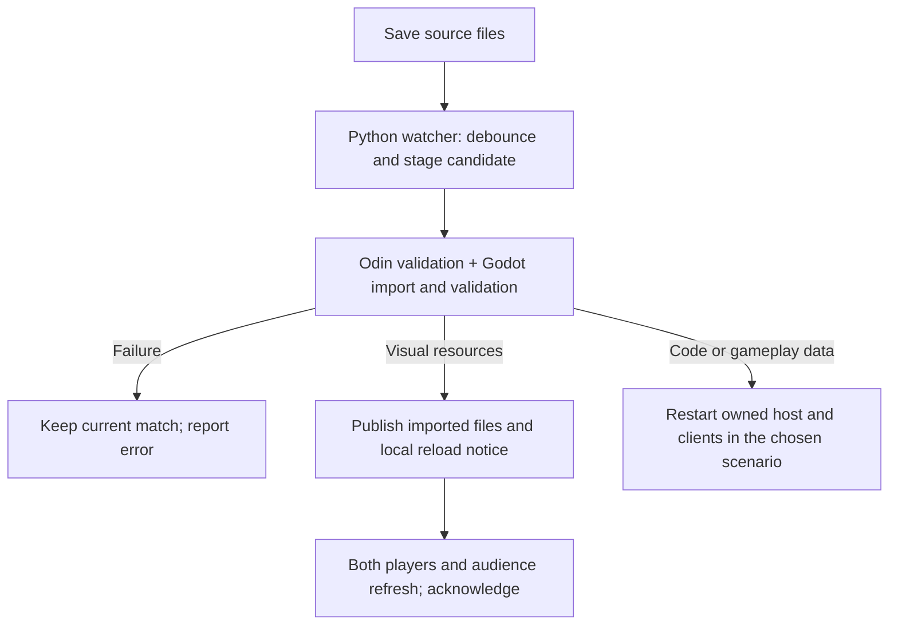

# Arena launcher and development reload

Implemented: one command starts a local Odin host, two Godot players, and optional audience windows directly in the selected arena. Game windows have the development FPS/ping overlay. Each creature runs its idle/wander AI on a dedicated native thread, with a separate Godot debugger window enabled by default. Senses, combat and learning follow later.

```sh
make dev_arena P1=triangle P2=diamond ARENA=sandbar AUDIENCE=1
```

| Variable | Default | Choices |
| --- | --- | --- |
| `P1`, `P2` | `circle`, `square` | `circle`, `square`, `triangle`, `diamond`, `archer`, `orc`; mirror matches allowed |
| `ARENA` | `meadow_crossing` | `meadow_crossing`, `sandbar`, `stone_garden`, `tiny_swords_village` |
| `AUDIENCE` | `0` | Number of extra viewer windows; constrained by local machine capacity and the host's 4095 total connection limit |
| `AUDIENCE_DELAY` | `5` | Host-enforced delay in seconds, 0–60; fractions allowed; `0` disables for local testing |
| `COUNTDOWN` | `0` | `0` skips directly to spawning; `5` shows the usual countdown |
| `WATCH` | `1` | `1` watches saves; `0` disables reload |
| `AI_DEBUG` | `1` | `1` opens one separate AI inspector per creature and records local journals; `0` disables both while retaining production AI threads |
| `HEADLESS` | `0` | `1` runs without windows for automation |
| `DEV_RUN_SECONDS` | `0` | Stop this many seconds after all clients reach the arena; `0` keeps running |

```sh
make dev_arena P1=diamond P2=diamond ARENA=stone_garden COUNTDOWN=5
make dev_arena HEADLESS=1 DEV_RUN_SECONDS=3 WATCH=0
make ai_debugger P1=archer P2=orc
make dev_arena AI_DEBUG=0
```

P1/P2 refer to the players' actual host-assigned roles. The runner waits for P1's Welcome before launching P2. Audience joins after the fighters and receives authoritative snapshots delayed by `AUDIENCE_DELAY`. The launcher allows time for the historical feed to reach the arena. Use `AUDIENCE_DELAY=0` when testing simultaneous views. The host uses an available loopback port; `SERVER_PORT`, `SERVER_BIND`, `SERVER_HOST`, `CONTENT_DIR`, and `CLIENT_ARGS` belong to the ordinary run targets and do not configure this isolated launcher. `GODOT`, `ODIN`, and `PYTHON` still choose executables.

Press **Ctrl+C** in the launcher terminal to close its host and windows. Closing a player or audience window also ends the run. Closing an AI inspector leaves the arena and other inspector running, removes it from reload waits, and keeps it closed across reloads until the next launcher run. Other running hosts/clients are left alone. To change the scenario arguments or replay after returning to Lobby, stop and rerun the command. The startup shortcut applies once per host lifetime.

The [AI debugger](06d-ai-debugger-harness.md) has its own timeline, branching trace,
event log, raw payload and spatial view. Pause and event/decision stepping inspect
recorded execution while the arena continues. The inspector is not an audience peer
and cannot submit input. It shows the current real idle/wander decisions; vision,
moods and learned memory are explicitly unavailable.

The timeline draws only visible rows and loads traces in the background. The tree
branches from top to bottom, with labeled colors for chosen, rejected, skipped and
host-confirmed nodes. **Root**, **Fit all**, zoom and pan navigate larger graphs.

For recorded-match QA, use `make replay` to open the latest recording, or
`make replay REPLAY=/absolute/path/to/match.replay.jsonl`. Pause/play, frame stepping,
seeking and speed control drive the recorded arena and both AI panels together.
This viewer does not pause the live host. See the [replay contract and limits](06e-qa-replay-and-trace-browsing.md).

## What happens on save

Continue editing the original `client/` and `server/` files. The watcher waits for a save to settle, copies the source into a private candidate, imports its assets, and validates it. Running clients use a private project snapshot so incomplete saves cannot leak into their current content.

| Saved change | Behavior |
| --- | --- |
| `client/characters/visuals/*.tres` | Refresh the existing visual resource and redraw character views in every window; positions, rounds, connections, and input sequencing continue |
| Imported PNG/JPG/JPEG/WebP/SVG textures and their `.import` settings | Import first, then refresh cached texture pixels in every window; match continues |
| Godot `.gd` scripts, scenes, other resources, project settings | Validate, close the owned session, and open the same scenario with the new code; positions reset |
| Odin `.odin` files | Compile a new executable, validate, and reopen the same scenario; positions reset |
| Shared `client/content/data/*.json` | Validate with both readers, then reopen host and clients against the same staged data; positions reset |
| Deleted resources or mixed edits | Reopen the scenario after validation |
| Compile, import, or content-validation failure | Report the error and keep the working session; save a correction to retry |

Only the first two rows are **live hot reload** in this checkpoint. Code and gameplay-data changes use **automatic relaunch**. Odin gameplay-library swapping, GDScript method reload, scene subtree replacement, and coordinated in-place gameplay-data reload remain future checkpoints in the [architecture plan](03f-dev-workflow-plan.md). No editor debugger setup is required for this implementation.

For a quick live test, open `client/characters/visuals/triangle.tres` and add this beneath `[resource]`:

```ini
tint = Color(0.4, 1, 0.4, 1)
```

Move P1, then save. Its triangle tint changes in both player windows and the audience window at the existing position. The tint multiplies the player's blue/orange color. Removing the property restores its default white tint. `placeholder_kind` also reloads; `character_id` must still match the catalog. These presentation settings do not change collision footprints.

Failed preflight validation preserves the current match. If a candidate passes validation but fails during startup, the runner attempts to reopen the last working scenario; that recovery resets the match. A client that fails to acknowledge a visual refresh triggers a relaunch of the validated scenario. Reloads do not claim to preserve state across runtime crashes or incompatible code changes.

## Ownership and files



| File / type | Responsibility |
| --- | --- |
| `tools/dev_session.py` / `DevSessionRunner` | Validate arguments, stage projects, launch in role order, watch files, publish reloads, own process cleanup |
| `server/dev_scenario.odin` / `Dev_Scenario` | Resolve canonical keys; wait for both fighters; apply choices once |
| `server/movement.odin` / `session_enter_arena` | Shared spawning for both ordinary countdown and direct development entry |
| `client/dev/reload_controller.gd` | Development-only local notifications, cached-resource refresh, redraw, and status acknowledgments |
| `client/dev/validate_project.gd` | Validate candidate client content/resources in a separate headless process |
| `server/brain_workers.odin`, `server/dev_ai_debug.odin` | Dedicated AI workers, copied trace queue and independent bounded journal writer |
| `client/dev/ai/` | Standalone observer scene, validated trace reader, tree/replay and recorded spatial data |
| `tests/ai_debugger_check.py` | Real host/two-inspector lifecycle, worker identities, replay, release gate and optional native-window checks |
| `tests/dev_workflow_check.py` | Exercise launcher, live saves, failures, movement, role assignment, and cleanup in a copied workspace |
| `tests/dev_client_driver.gd` | Test-only input and optional screenshot driver |

The host accepts scenario flags only in a debug build with `--dev` and `--bind=127.0.0.1`. Clients require a debug build, `--dev`, and the launcher's local session arguments to watch reload notices. No new network packet or protocol version is needed: the scenario uses normal session/world replication, and reload notices are local files owned by the runner.

Each run prints its `build/dev/<timestamp-pid>/` directory. `session.json` records arguments, active generation, port, and owned PIDs; per-window JSON records readiness and reload acknowledgments. Each `generation-N/` retains its snapshot, executable, import/build/validation logs, and client/host logs. These files are ignored by Git. Old run directories can be deleted after their sessions stop. Changes to launcher/test tooling itself require rerunning the launcher.

For AI inspection, `session.json` also records `ai_slots`, `ai_pids`, `closed_ai`,
`ai_run` and `ai_trace_dir`. Each host start gets a fresh trace identity, including
fallback to a previous generation. `ai1.json` / `ai2.json` beside `session.json` are
inspector readiness/status files; `ai-1.json` / `ai-2.json` inside `ai_trace_dir` are
host trace snapshots. The same trace directory holds `ai-1.jsonl` / `ai-2.jsonl` and
up to three rotated segments per creature. Open a journal from an inspector to replay it.
`replay_path` points to the independent `match.replay.jsonl` recording, capped at
128 MiB with visible capture status in each inspector. `AI_DEBUG=0` disables both
private diagnostics and QA recording. [Daily cleanup](log-cleanup.md) removes logs
and recordings older than 24 hours; put `.keep-logs` in a run directory to retain it.

Character visuals are parsed into fresh instances with Godot's [cache-ignore mode](https://docs.godotengine.org/en/4.6/classes/class_resourceloader.html), then their stored properties are copied into the existing shared resource. This also restores default values when a property is removed from a `.tres`. Imported textures explicitly reload their completed `.ctex` into the existing [CompressedTexture2D](https://docs.godotengine.org/en/4.6/classes/class_compressedtexture2d.html), keeping the texture references already bound to the TileSet. Recreating the arena would reset its local input sequence, so visual refresh leaves the scene and controllers alive.

## Verification

```sh
make check_dev
make check_ai_debugger
make check
# Also capture actual player/audience renders during the reload check:
python3 tests/dev_workflow_check.py --graphical
python3 tests/ai_debugger_check.py --graphical
```

The development check uses real ENet clients and a host, edits only a temporary copy under `build/verification/`, and verifies deterministic roles, audience snapshots, cameras, countdown/mirrors, movement before/after visual reload, retained process IDs and positions, resource defaults, imported texture dimensions, invalid saves, code/data relaunch, matching content fingerprints, and owned-process cleanup. Odin tests cover every current character/map with countdown 0/5. Graphical mode also checks the live texture's pixel hash and captures frames; Godot's headless dummy renderer does not replace its stored pixels. Input is synthesized rather than a physical keyboard test.
