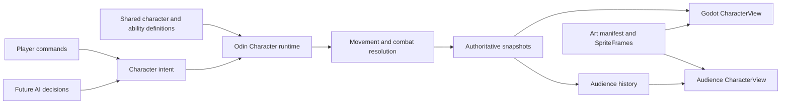
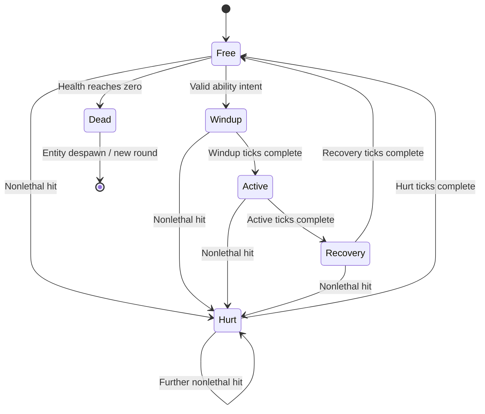

# Proposal: characters, state machines, and art

Status: **proposal, not an implemented character migration**. The current four shapes remain playable. The accompanying Tiny Swords map is a separate terrain milestone. Implement the character work one checkpoint at a time.

The goal is to add characters from unrelated art packs without letting their PNG dimensions, animation timing, or Godot scenes define game rules. Odin decides what a character is doing; Godot draws that state using a chosen visual.

Read with [asset import proposal](04a-asset-pipeline-proposal.md) and [world sizing proposal](04b-gameplay-size-proposal.md).

The refined [component and animation contract](04c-component-characters-and-animation-contract.md) and [character package migration](04d-character-packages-and-migration.md) require a custom importer/exporter for every character module, with common art/state/gameplay/AI exports. The [Basic Combat v1 harness](04e-character-harness-and-base-contract.md) gates normal selection on idle, walk, hurt, attack and death plus their shared gameplay behavior. Use these documents for the detailed current plan.

## What exists today

| Layer | Current files / types | Current responsibility |
| --- | --- | --- |
| Shared definitions | `client/content/data/characters.json`; Odin `Character_Definition`; Godot `GameContent.CharacterDefinition` | Four stable character IDs, names, footprint radius |
| Runtime simulation | `server/movement.odin` / `Character`, `session_tick`, `character_move` | Host movement, input acknowledgments, collision, fixed 60 Hz simulation |
| Visual definitions | `client/characters/character_visual.gd` / `CharacterVisual`, `visuals/*.tres` | Shape type and tint |
| Runtime presentation | `CharacterView`, `GameArena` | Draw characters, local prediction, reconciliation, remote interpolation |
| Replication | `protocol.odin`, `protocol.gd`, `SessionSnapshot` | Protocol 6: identity, owner, position, input acknowledgment and mask |
| Spectators | `server/audience.odin` / `Audience_Stream` | Whole-session value copies, normally released five seconds later |

`client/assets/Characters/` now contains Archer, Lancer, Monk, Orc and Warrior PNGs. They are source art, not registered playable characters. They stay in place during planning. The inspected Warrior idle sheet is 1536×192; Lancer idle is 3840×320; Orc idle is 600×100. Those canvas sizes are not body sizes. Frame rectangles and body/foot anchors must be reviewed during import. The [package inventory](04d-character-packages-and-migration.md#current-source-evidence) records the current files.

## Separate definition, runtime state, and presentation

An ID such as `warrior` selects a gameplay definition and a separately authored visual. Two players may use that definition simultaneously; each has a distinct entity ID, position, health, action state, and animation playback. Shared `Resource` objects hold immutable definitions, never per-instance animation state or health.

Keep the existing Odin authority and ENet transport. Do not introduce Godot `CharacterBody2D` movement alongside the existing prediction solver: both would try to move the same character. Godot scenes remain presentation objects.

## State machine: small explicit rules first

Use a compact Odin enum and transition procedures. An animation graph is not the gameplay state machine. Two orthogonal concepts avoid states such as `WalkingAttackingStunned`:

| Concept | Values | Owner |
| --- | --- | --- |
| Locomotion | Idle / Moving, derived from actual displacement | Host; locally predicted for the owning player |
| Base action | Free, Windup, Active, Recovery, Hurt, Dead | Host-owned Basic Combat v1 behavior; guard/cast/independent stun are later extensions |

Death is a global transition from **every living state**, even though the diagram shows one arrow for readability. Reset/despawn also works from every state. The host checks these higher-priority conditions before ordinary input transitions. Repeated input does not restart an action; invalid inputs do not advance its timer.

Each state defines whether movement, turning and attacks are allowed. Basic Combat v1 blocks movement/turning during attack and blocks movement/attacks during Hurt. Keep cancellation rules in an explicit table, with death first, then hurt interruption, then completion, then new intent. Animation completion signals never release a gameplay lock or apply damage. Later guard/stun policies require declared extensions.

Example attack timing, **illustrative rather than tuned**: windup 12 ticks, active 6 ticks, recovery 18 ticks at 60 Hz. The host resolves a hit during the active phase and records that the target has already been hit for this action. Clients may render a six-frame clip at 10 fps, but changing that clip cannot make the attack faster or cause a second hit.

## Proposed data and filenames

| Checkpoint | File / type | Proposed responsibility |
| --- | --- | --- |
| 4A | `server/character_metrics.odin` / `Character_Metrics`; `client/content/character_metrics.gd` | Validate `gameplay_size` and normalized collision footprint; derive identical world measurements |
| 4A | `client/presentation/asset_scale.gd` / `AssetScale` | Convert a source reference measurement to world units; the terrain milestone introduces the base helper |
| 4B | `tools/import_character_art.py` | Explicit deterministic import of reviewed character manifests |
| 4B | `client/characters/packages/<key>/importer.gd`, `exporter.gd`, private configuration | Required custom source interpretation and common state/art, gameplay and AI exports for each module |
| 4B | `client/characters/packages/<key>/generated/animations.tres` / `CharacterAnimationSet` | Generated `SpriteFrames`, role/direction bindings and durations, shared read-only |
| 4B | `client/characters/character_visual.gd` / existing `CharacterVisual` | Add sprite animation data while retaining the shape fallback |
| 4A–4D | `client/dev/character_harness.gd` / `.tscn` | Art and combat modes, grid/ruler, required-role diagnostics, geometry, versioned admission evidence |
| 4C | `client/characters/character_animation.gd` / `CharacterAnimation` | Choose clip/facing and seek playback from presented state |
| 4C | `client/characters/character_view.gd` / existing `CharacterView` | Own sprite child, foot-position anchor, owner indicator, animation controller |
| 4D | `server/character_state.odin` / `Locomotion_State`, `Action_State`, `character_state_step` | Shared state transition guards, state timers, interruption rules |
| 4D | `server/character_intent.odin` / `Character_Intent` | Common intent produced by human input or future AI |
| 4D | `server/abilities.odin` / `Ability_Definition` | Tick durations, range, hit shape, costs, allowed transitions |
| 4D | `server/combat.odin` / `combat_step` | Host hit resolution, damage, health/death, per-action hit suppression |
| 4D | `client/content/data/abilities.json` | Shared ability definitions and compatibility fingerprint input |
| 4D | Existing protocol and snapshot files | Replicate action state and timing; explicitly bump protocol when fields change |
| Later | `server/ai/` or bounded AI package | Perception/decisions producing `Character_Intent`; no sprite or animation dependencies |

Proposed `Character` additions: action state, facing, state-enter tick, action sequence, ability ID, health, and fixed-size hit bookkeeping. Keep historical snapshot data self-contained: the current `Audience_Stream` copies `Session` by value. Adding a slice/pointer to mutable AI or combat data requires a dedicated immutable snapshot representation before it can enter that buffer.

## Presentation and replication

Use `AnimatedSprite2D` with `SpriteFrames` for these authored sprite sheets. Add a small explicit `CharacterAnimation` adapter. An `AnimationTree` becomes worthwhile later if layered equipment, blending, or procedural poses require it; it does not replace host state rules. [Godot AnimatedSprite2D](https://docs.godotengine.org/en/4.6/classes/class_animatedsprite2d.html), [AnimationTree](https://docs.godotengine.org/en/4.6/tutorials/animation/animation_tree.html).

The client chooses animation from authoritative action plus locomotion. A blocked movement input should show Idle when there is no displacement. Retain the last nonzero facing on stop. A repeated snapshot of the same action must not restart the clip. `action_sequence` distinguishes two consecutive attacks with the same state; `state_enter_tick` lets late joiners start at the correct phase.

For an audience client, presented time is derived from its **delayed snapshot tick**. Never seek an attack using the live host clock or compensate away the configured five-second delay. Hit feedback, damage numbers, death, and results must be captured/released with the same history. A reconnect needs a full action snapshot, not only an event that may have happened before joining.

For the first animated movement slice, visual Idle/Run can be derived from the existing replicated motion without adding combat fields. Keep local movement prediction responsive. Attack prediction, input buffering/cancellation, rollback, and lag-compensated hit tests require a later deliberate design; they are not part of adding an animated sprite.

Directional art is capability data. Warrior's inspected filenames do not provide a complete four-direction set. Lancer has named up/down/right attack/defence variants, but its locomotion sheets still need inspection. A reviewed fallback may mirror right to left or reuse a side-on Run for north/south movement. Do not claim missing art exists or automatically rotate a humanoid sheet into a new perspective.

## Checkpoints and acceptance

| Phase | Small deliverable | Acceptance before the next phase |
| --- | --- | --- |
| 4A — Contract and harness | Versioned five-role/export contracts, measurements and art harness | Required roles fail clearly when missing; size/feet and geometry remain measurable |
| 4B — Two custom modules | Archer and Orc importer/exporters in the common workbench | Both build in isolation; different grids/names export the same roles and explicit AI capability status |
| 4C — Isolated movement | Real shared view/prediction in the harness | Cameras, owner indicators, instances and delayed movement work; no admission to normal selection yet |
| 4D — First complete base | Orc's five roles, shared melee, health, hurtboxes, Hurt/Dead and admission gate | Full Basic Combat v1 verification passes before Orc appears in selection |
| 4E — Shared projectiles | Archer's shoot ability through a reusable projectile system | Base plus projectile extension pass before admission; short-lived events remain visible on the delayed timeline |
| 4F — Remaining packages | Warrior, Lancer, Monk individually | Each passes the base plus declared extensions; heal-only behavior needs a separate support profile or a damage attack |
| Later — AI | AI produces the same intent as a player | Decisions use terrain and character gameplay data, with a measured fixed-tick budget; no dependency on art resolution |

Do not implement all rows at once. The next proposed implementation is **4A: versioned contracts and the isolated harness**, followed by custom Archer/Orc modules. Normal character selection waits for complete combat admission. See the [detailed migration sequence](04d-character-packages-and-migration.md#small-implementation-checkpoints).
