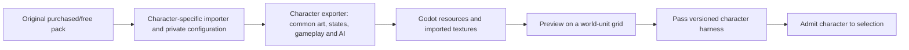

# Proposal: art asset management pipeline

Status: **proposed for characters and general asset management**. Tiny Swords terrain gets a narrow local importer now; a general character importer/editor remains future work.

Update: [checkpoint 4A.1](04g-character-asset-processing.md) implements the first character processing slice for the two reference modules: originals, inventory hashes, isolated jobs, processed artifacts, provenance and failure reports. The wider real-character/runtime pipeline below remains proposed.

The refined [component/animation contract](04c-component-characters-and-animation-contract.md) and [package layout](04d-character-packages-and-migration.md) require each character's own custom importer and exporter. A common coordinator validates their public `CharacterExports`; each module owns all private source/configuration parsing. The [versioned harness](04e-character-harness-and-base-contract.md) requires idle, walk, hurt, attack and death before normal selection.

An asset pack is an input. Each character module interprets it with its own code and private authoring configuration, then exports a common representation. The shared writer produces reusable Godot resources from that output; runtime systems do not inspect original filenames or private configuration.



## File ownership

| Data | Location / policy | Who consumes it |
| --- | --- | --- |
| Vendor originals | Keep original download outside the repo; never rewrite it | Import tools |
| Runtime image copies | `client/assets/<pack>/`; version only when redistribution terms allow it | Godot importer/rendering |
| Pack inventory/provenance | `client/assets/<pack>/SOURCE.md`, checked-in import manifest with relative paths and SHA-256 values | Developers and import validation |
| Character import/export code | Required `client/characters/packages/<key>/importer.gd`, `exporter.gd` | Custom source interpretation and shared art/state/gameplay/AI exports |
| Private character configuration | Conventionally `art.json`, `definition.json`, `ai.json` inside each package | Parsed only by that module; formats may differ |
| Generated animations | Proposed `client/characters/packages/<key>/generated/animations.tres` | `CharacterVisual` / `CharacterAnimation` |
| Normalized gameplay exports | `CharacterExports.gameplay_definition` | Deterministic admitted runtime catalog compiler |
| Runtime gameplay data | `client/content/data/characters.json`, later `abilities.json` / `projectiles.json` | Odin and Godot; fingerprinted; generated character catalog becomes authoritative runtime input |
| Temporary reports/previews | `build/verification/`, ignored | Review only |

Do not put animation source paths, palette choices, PNG dimensions, or credit text into ENet character records. Keep art identity stable by logical keys, and keep server rules separate from whichever pack currently supplies the sprite.

The user-added `client/assets/Characters/` folders are preserved during planning. Package manifests reference those paths first. Moving or consolidating them is a separate follow-up. The current [inventory includes five character types](04d-character-packages-and-migration.md#current-source-evidence).

## Manifest contract

The following is a **partial private Warrior configuration example, not ready-to-import calibration**. Warrior's own importer/exporter interprets it; no global parser requires this private format. Body metrics are illustrative; the package proposal specifies the public export contract and harness coverage checks:

```json
{
  "schema_version": 1,
  "package_key": "warrior",
  "pack_key": "tiny_swords_free",
  "source_root": "res://assets/Characters/Warrior",
  "body_reference_rect_px": [64, 48, 64, 80],
  "foot_anchor_px": [96, 128],
  "reference_span_px": 80,
  "clips": {
    "idle_body": {
      "source": "Warrior_Idle.png",
      "frame_size_px": [192, 192],
      "frames": [0, 1, 2, 3, 4, 5, 6, 7],
      "fps": 10,
      "loop": true
    }
  },
  "bindings": [
    {"role": "idle", "facing": "east", "variant": "default", "clip": "idle_body"}
  ]
}
```

`frame_size_px` describes the canvas, `body_reference_rect_px` describes the neutral body used for size comparison, and `foot_anchor_px` describes where the character touches the world. They are separate. The reviewed `reference_span_px` is the longest side of the neutral body reference, fixed across clips. Per-clip anchor overrides are allowed when packs use different canvases; a clip must still land the same feet on the same world point.

Store explicit frame rectangles for irregular sheets, and explicit duration overrides for nonuniform animation. Do not infer frame order from loose filenames at runtime. Scan dimensions/alpha as an authoring aid, but require reviewed body measurements: a sword, shadow, or attack effect must not silently become the size reference.

`idle_body` is package-private. `idle` is a shared role, with facing stored separately. Normal selection requires all five base roles, explicit directional coverage and passing gameplay verification; this partial example is not sufficient to register a character.

## Import sequence

1. Select the original pack and record its author, original URL, download/version information if known, license terms, relative files and hashes. Distinguish the current Tiny Swords Free Pack from its separately offered older CC0 version.
2. Invoke that character's required custom importer/exporter. Verify declared dependencies, source digests/dimensions, frame bounds/counts, finite positive metrics, feet anchors, common state exports, AI status and directional coverage.
3. Validate the common export contract, then write `AtlasTexture` frame regions and `SpriteFrames`. Preserve original PNG bytes. Use nearest filtering, consistent foot anchors, and reviewed animation durations.
4. Open the preview with a 32-world-unit tile ruler, visible footprint and body rectangle. Compare 16px/32px examples at size 1 and 1.5; check Idle/Run/Attack without camera auto-fit concealing size differences.
5. Publish generated artifacts only after validation. Keep the last valid generation on a bad save. Admit the character to normal selection only after the full versioned harness passes; a preview alone cannot do that.

Suggested future commands: `make import_character CHARACTER=warrior`, `make preview_character CHARACTER=warrior GAMEPLAY_SIZE=1`, and `make check_character_art`. These commands are **not implemented in this proposal**.

## Tiny Swords terrain slice being added now

`tools/import_tiny_swords.py` plus a checked-in pack manifest copies only the selected terrain/decor/building PNGs from the supplied local pack. It validates all files before replacing the local runtime copies and reports mismatched/missing assets. Its source defaults to the supplied home-folder location and can be overridden by `ASSET_SOURCE`.

The current pack permits personal/commercial game use and modifications, while restricting redistribution/repackaging of the assets. Its local PNG copies therefore stay ignored by Git; source references, checksums, import code, and map/presentation data are versioned. A fresh checkout must run the importer using its own pack copy before loading the new arena. This is a per-pack decision; existing CC0 Ninja Adventure assets retain their current handling. [Current publisher terms](https://pixelfrog-assets.itch.io/tiny-swords).

Buildings are static props with art measurements and a ground footprint. Their blocked cells are included in the authoritative terrain map, so collision does not depend on whether an image has loaded. Roof pixels may extend above their ground footprint; the presentation sorts by the prop's ground anchor.

## Reload and failure behavior

The existing launcher can refresh changed texture pixels and existing shape visual properties. GDScript, scenes, gameplay JSON, and unsupported resource edits cause a validated scenario relaunch. Character animation import should initially use that relaunch path too.

Later, live animation replacement can publish a new immutable `SpriteFrames` generation and rebind each `CharacterAnimation` at the same clip/action progress. Preserve entity IDs, network connection, world anchors, and authoritative footprint. Never mutate a shared playback cursor or rebuild `GameArena` to refresh a sprite.

Changes to `gameplay_size`, collision footprint, or abilities are gameplay changes: both content readers must agree, the fingerprint changes, and the host/clients restart together until a coordinated gameplay reload exists. Changing PNG resolution with an equivalent reviewed body reference is a presentation change.

## Preview acceptance checklist

| Check | What it catches |
| --- | --- |
| Stable feet through every clip | Canvas padding and inconsistent pivots |
| Neutral body ruler at fixed zoom | Size hidden by selection-card or camera auto-fit |
| Collision overlay independent of image bounds | Weapons/roofs accidentally blocking movement |
| Two instances of one visual | Shared-resource playback state bugs |
| Both owner indicators on multicolor art | Losing P1/P2 identity when replacing shape tint |
| Missing animation fallback | Characters freezing on unsupported directions/actions |
| Invalid import leaves previous output intact | Partial updates and broken development sessions |
| Provenance and per-file hashes | Wrong pack/version silently replacing known assets |
