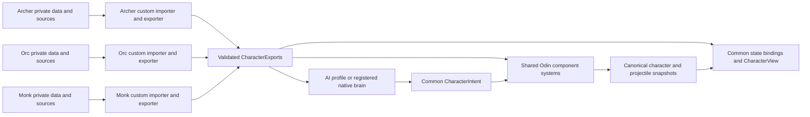
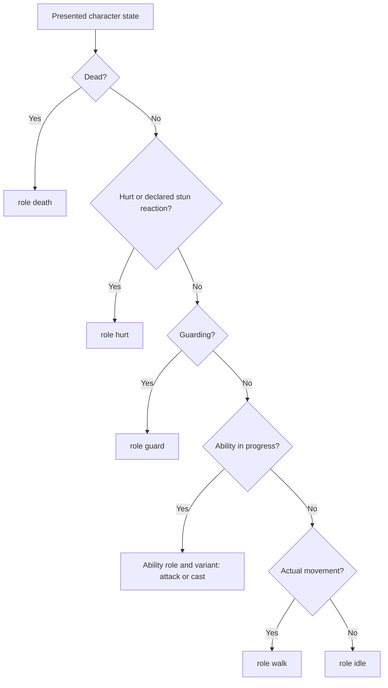

# Proposal: independent character packages, shared gameplay contracts

Status: **architecture proposal, with the art foundation and first two character modules implemented**. This document refines phase 4 around independently authored character packages. See [checkpoint 4A](04f-character-harness.md) for shared interfaces and the synthetic harness, and [checkpoint 4B](04h-archer-and-orc-modules.md) for independent Archer/Orc imports and processed previews. Shared gameplay components and admission remain proposed.

Each character owns the interpretation of its source assets. All characters expose the same runtime vocabulary and use the same gameplay systems. Archer's importer may understand `Archer_Idle.png`; Monk's may understand `Idle.png`; a future Ninja importer may understand `ninja-idle-animation.png`. All three produce the common animation role **`idle`**. The runtime never needs to recognize those filenames.

Read this first for the architecture, then [the package layout and migration checkpoints](04d-character-packages-and-migration.md) for exact files and the current asset inventory. The [Basic Combat v1 harness](04e-character-harness-and-base-contract.md) defines the required five roles and selection-admission gate. The [sizing proposal](04b-gameplay-size-proposal.md) still defines world measurements.

Each package is a **character micro-entity module**: a required custom importer and exporter, private authoring data, and explicit public exports for states/art, gameplay capabilities and AI. Shared tools consume the exports; they do not parse a character's private configuration or select its import strategy. This supersedes the earlier suggestion of an optional custom adapter.

## 1. The ownership boundary



| Owned by each character package | Shared by the game |
| --- | --- |
| Required custom importer/exporter, source parsing, clip slicing and frame order | Export coordinator, optional image/atlas utilities and public-output validation |
| Mapping source clips to common roles and directions | Animation role enum, request contract and playback controller |
| Body reference, feet anchors, visual attachments and explicit fallbacks | World-unit conversion, grounding, owner indicator and Y sorting |
| Selected components, ability loadout and authored numeric settings | Component schemas, state transitions, movement, hit resolution and damage |
| Choice of an arrow, fireball or other projectile definition and visual | Projectile simulation, ownership, lifetime, collision and hit policy |
| AI configuration and, when needed later, a custom native decision module | Read-only observations, bounded execution and the common intent interface |

“Standalone” means a package can be imported, validated, previewed and instantiated without loading another character package or modifying `GameArena`. Its public exports declare dependencies on shared contracts, definitions and source roots. The host and renderer operate on those exports. Character modules do not depend on another character's files, the lobby, a global current player, or the host's mutable world objects.

Use explicit component composition for the current two-fighter game. A new ECS framework is unnecessary for this milestone. Odin can compose typed definition/runtime structs; Godot can compose presentation nodes and resources. Introduce an optimized entity storage model later only when measured simulation load warrants it.

## 2. Separate four identities

| Identity | Example | Purpose |
| --- | --- | --- |
| Character definition | `archer`, stable numeric definition ID | Which authored character this is |
| Entity instance | Entity 104, owned by P1 | This particular character's position, health and action |
| Gameplay state | Locomotion `idle`, action `free` | What the simulation says the entity is doing |
| Animation request | Role `idle`, facing `east`, variant `default` | What the renderer should show |

Source filenames are private import data. They are neither state names nor network identities. An `ArcherIdleState` class or a global `if character == archer` filename branch would break this boundary.

A shared state definition does **not** mean shared mutable state. Two Archers may share immutable art and ability definitions while one runs and the other attacks. Health, timers, action sequences, animation cursors and predicted movement belong to each instance.

## 3. Common gameplay components

Definitions hold authored settings. Runtime components hold changing values. Shared systems operate on those types, independent of character identity.

| Component / definition | Example settings | Runtime owner / shared behavior |
| --- | --- | --- |
| `CharacterIdentity` | Stable definition ID | Entity ID, owner/team and round identity |
| `CharacterMetrics` | `gameplay_size`, normalized movement footprint | Host and prediction derive identical world dimensions |
| `Movement` | Speed and locomotion restrictions | Current ground position, accepted input, actual displacement and facing |
| `Health` | Maximum health | Current health, shared damage/heal application and death transition |
| `Hurtbox` | Normalized shape, offset, target filters | Region that can receive combat hits; independent of sprite padding |
| `ActionState` | Common transition rules | Free/windup/active/recovery/guard/stun/death and tick timing |
| `AbilityLoadout` | Slots referring to validated ability definitions | Shared command validation, cooldowns and action selection |
| Optional `Guard` | Facing arc, reduction and resource cost | Common block/break rules; add when guard gameplay is implemented |

Movement collision, hurtboxes and attack hitboxes are separate contracts:

- **Movement footprint:** where a character can stand or move relative to terrain.
- **Hurtbox:** where that character can receive a hit.
- **Attack hitbox:** where an active attack can hit a target.

They use the same world coordinate convention, but do not have to share a shape or size. An attack sprite's sword pixels do not define the hitbox. A character with no damage ability can still have movement, health and a hurtbox.

### Abilities compose shared effects

Use one `AbilityDefinition` contract: stable ID/key, allowed states, cooldown, windup/active/recovery ticks, movement/turn policy, animation role/variant and effect descriptors. Start with one effect per ability; expand to bounded lists when an actual ability needs it.

| Shared effect kind | Descriptor | System that executes it |
| --- | --- | --- |
| `melee_hitbox` | Shape, local offset, active window, hit payload and repeat-hit policy | Combat hitbox system |
| `spawn_projectile` | Projectile definition, authoritative launch offset and release tick | Projectile spawn/movement system |
| `heal` | Amount, permitted targets and range | Shared targeting and health system; later Monk checkpoint |

`ProjectileEmitter` is the shared descriptor/handler for `spawn_projectile`. It belongs to an ability's composition; do not maintain a second `can_throw_projectile` boolean that can disagree with the loadout. A projectile-capability query derives from validated ability effects. Capability does not imply that the action is currently available: cooldown, stun and other guards still apply.

```text
Warrior = Core components + AbilityLoadout(primary: sword_slash)
Archer  = Core components + AbilityLoadout(primary: arrow_shot)
Mage    = Core components + AbilityLoadout(primary: fireball_shot)  [future example]

sword_slash   -> shared melee_hitbox effect
arrow_shot    -> shared spawn_projectile effect -> arrow definition
fireball_shot -> shared spawn_projectile effect -> fireball definition
```

Arrows and fireballs can have different settings without different collision implementations. A new gameplay mechanic extends a shared effect/component contract with shared tests. Source art adapters cannot register gameplay procedures or apply damage.

### Projectile and hitbox contracts

The shared `ProjectileDefinition` contains speed in world units per second, lifetime in ticks, hit shape, terrain blocking policy, elevation policy, target filters, hit payload and pierce/re-hit policy. A `Projectile` instance contains its ID, definition ID, source character definition ID, owner/team, source action sequence, position/velocity, spawn tick and remaining lifetime. It is independent of the shooter's sprite and animation node, including after the shooter despawns.

The shared `HitShape` initially supports a circle and an oriented rectangle; offsets and dimensions use gameplay units converted to world units. Attacks use an explicit facing basis from the host. Freeze or allow turning according to the ability definition. Do not rotate collision from the direction of whichever sprite fallback happens to be displayed.

Character-attached hit geometry scales once with the attacker's `gameplay_size`; target hurtboxes scale once with the target's size. Projectile geometry uses its own definition size and is independent of the shooter's size by default. Any size inheritance is an explicit setting. All offsets originate at the ground anchor. A bow's visual socket may align the art, but cannot move the authoritative launch point.

Use swept collision for moving projectiles so a fast arrow cannot skip a wall or target between 60 Hz steps. Resolve the earliest collision, with stable tie-breaking. Start with blocked terrain stopping projectiles and same-elevation targets only; flying, arcing and high-ground shooting rules require an explicit later policy. Define owner/friendly-fire filtering, one-hit-per-action or per-projectile bookkeeping, bounded capacity, and reset cleanup before enabling combat.

## 4. Shared gameplay states and animation roles

Keep locomotion and action state separate. Proposed canonical names:

```text
LocomotionState = Idle | Moving
BaseActionState = Free | Windup | Active | Recovery | Hurt | Dead
BaseRoles       = idle | walk | hurt | attack | death
LaterExtensions = guard | cast | independent stun and other declared capabilities
Facing          = north | north_east | east | south_east |
                  south | south_west | west | north_west
```

`Windup`, `Active` and `Recovery` describe an ability action; they are not tied to a named character or to dealing damage. This refines the earlier `AttackWindup` naming so a later heal can use the same lifecycle. Death overrides every living state. Stun/interrupt rules, completion, and new intent then follow the shared priority rules.

Every Basic Combat v1 candidate must resolve all five base roles and pass the corresponding gameplay checks before normal selection. All eight logical facings must resolve through native art or explicit fallbacks. Extra roles are required only when a declared extension uses them. Incomplete imports remain accessible in the isolated workbench.



Basic Combat v1 uses an interrupting, finite Hurt state for accepted nonlethal hits. Guard, cast and independent stun in this broader diagram are future extensions. Noninterrupting damage or armor must be an explicit later policy; the package cannot privately change the v1 transition rules.

To select **all stationary characters**, query `locomotion == Idle`. To select characters actually waiting at rest, query `locomotion == Idle && action == Free`. To inspect characters displaying an idle animation in a preview, query `AnimationRole.IDLE`. Those are meaningful common queries; inspecting a filename or checking for the substring `idle` is not.

Use enums/typed IDs in runtime code and validated lowercase role strings at the JSON boundary. Do not serialize language enum ordinals implicitly: assign stable wire values when adding protocol fields. An unknown role is an import error, so `idel` cannot become a new accidental state.

## 5. Required character-owned importers and exporters

A shared **coordinator** selects the requested module and invokes its required `exporter.gd`. That exporter calls its own required `importer.gd` to interpret source assets and constructs the public output. The coordinator validates that output and writes runtime artifacts. It has no character-name switch, default global source parser or knowledge of private manifest layouts.

Archer, Orc, Monk, Warrior and Lancer each get their own custom-built importer/exporter, even when their sheets happen to use the same grid. Each module decides whether to read a private `art.json`, use explicit frame tables, decode a combined atlas or consume vendor metadata. Shared grid/region/image-sequence helpers may reduce duplicated mechanics; using them does not transfer ownership of the character's interpretation to a global importer.

```text
CharacterModuleExporter.export_character(context) -> CharacterExports
    calls its own CharacterImporter.import_assets(context) -> CharacterArtDraft

context:
    package_root, declared_source_roots, shared extraction helpers
    contract definitions and immutable shared-definition lookups

CharacterExports:
    export_api_version, module_key, contract requirements, dependencies
    gameplay_definition: common metrics, components, ability references
    state_bindings: required role/facing/variant -> normalized clip or effect
    art: NormalizedCharacterArt
    ai: CharacterAIExport

NormalizedCharacterArt:
    package_key, schema_version, source dependencies and hashes
    body measurement and anchor metadata
    clips: explicit frames, durations, loop flags and frame anchors
    optional visual attachments and projectile/effect visual bindings
```

`CharacterExports` is the public boundary. Each character owns the transformation into it. Its `state_bindings` includes directional/role fallbacks; the art payload holds frame data, avoiding two editable sources of role mappings. Private importer formats are unrestricted by other characters; the exported state keys, component types and units are strictly shared. Swapping Orc from a combined sheet to separate strips changes only Orc's module and relevant evidence.

`state_bindings` maps to the common states; it does not export a replacement base FSM. State timing parameters and supported extensions are explicit data. A character cannot rename `idle`, bypass `Hurt`, or apply damage from a source animation callback.

### AI export boundary

The [AI orchestration proposal](06-character-ai-orchestration-proposal.md) now refines this boundary for autonomous gladiators, trainer advice, observer-specific knowledge and learning. Its first idle/wander checkpoint is implemented; the existing `player_only` art export remains a placeholder until the explicit behavior-export migration.

`CharacterAIExport` explicitly declares `player_only` or an AI backend/profile with validated ability references, behavior settings and observation requirements. The initial animated-character slices use `player_only`; this exports an honest capability without claiming AI is implemented. Later, Archer may export preferred range and ranged-action preferences while Orc exports close-range preferences. Both refer to common ability IDs and observed gameplay state, never source animation names.

If a character needs custom decision logic, its module owns a future **Odin** brain implementation behind `CharacterBrain.step(observation, own_memory) -> CharacterIntent`. It is compiled and explicitly registered in the host, using a small shared contracts package; it does not import the entire server main package or run GDScript AI on a client. The character exporter declares the backend key/version; it cannot upload executable brain code over the network.

Observation is read-only normalized world information. Private AI memory belongs to one character instance. Output consists of shared move/aim/ability intents, subject to the same validation as human input. The brain cannot directly edit another entity, write health, spawn arbitrary projectiles or own its own combat clock. AI consumes actual shared states; character-specific decisions remain isolated behind this interface. Future AI/brain checks extend the harness separately.

### Isolation checks

Build and preview a module with every other character package absent. Check its dependency graph against declared source roots and shared contracts; sibling-package imports fail. Invoke the exporter repeatedly to verify deterministic normalized output and no leaked mutable globals. Exports contain data/resources and registered capability IDs, not closures pointing into import-time objects. The renderer, FSM and projectile systems never invoke a character's source importer during a match.

This is module isolation within the repository and game processes. It requires no service deployment or per-character network connection.

The generated `CharacterVisual` contains immutable animation data and metrics. A `CharacterAnimationSet` holds `SpriteFrames` plus role/direction bindings; a shared `CharacterAnimation` controller owns instance playback. `AtlasTexture` can reference subregions without rewriting source PNGs. Godot documents these resource and frame-library facilities in [AtlasTexture](https://docs.godotengine.org/en/4.6/classes/class_atlastexture.html) and [SpriteFrames](https://docs.godotengine.org/en/4.6/classes/class_spriteframes.html).

### Example normalization

| Package source | Local extraction choice | Public role | Variant |
| --- | --- | --- | --- |
| `Archer/Archer_Idle.png` | Six 192px frames | `idle` | `default` |
| `Monk/Idle.png` | Six 192px frames | `idle` | `default` |
| `Orc/Orc_Idle.png` | Six 100px frames | `idle` | `default` |
| `Orc/Orc_Walk.png` | Eight 100px frames | `walk` | `default` |
| `Archer/Archer_Run.png` | Four 192px frames | `walk` | `default` |
| `Archer/Archer_Shoot.png` | Eight 192px frames | `attack` | `primary` |
| `Warrior/Warrior_Attack1.png` | Four 192px frames | `attack` | `primary` |
| `Monk/Heal.png` | Eleven 192px frames | `cast` | `heal` |
| Future `ninja-idle-animation.png` | Whatever that package explicitly describes | `idle` | `default` |

These frame layouts are candidate mappings grounded in the current dimensions; exact facing, feet/body calibration, durations and action markers require the import preview. The Ninja row is hypothetical. A named animation alone does not enable its ability.

Each character has its own animation library, so a common name such as `idle/east/default` cannot overwrite another character's clip. The public call uses the typed role/facing/variant tuple; any internal clip IDs are private to that library. Code outside the package never asks for `Archer_Idle` or `Orc_Walk`.

## 6. Resolve facing, missing clips, and animation timing

Proposed `AnimationRequest`:

```text
role, facing, variant,
action_sequence, action_phase, phase_progress,
presented_tick, locomotion_phase
```

Resolve exact role/facing/variant first, then only declared aliases or fallbacks. Side-facing art can explicitly mirror east to west and reuse a side view for north/south if accepted in preview. Keep facing as separate data; do not create gameplay states such as `LancerDownRightAttack`.

Requirements and fallbacks:

| Situation | Policy |
| --- | --- |
| Missing any Basic Combat v1 role | Fail normal-selection admission; allow incomplete art preview only |
| Ability requests an unbound attack/cast variant | Fail validation before character selection enables that loadout |
| Missing directional art | Resolve a declared alias/mirror; cycles or unresolved mappings are errors |
| No hurt/death sheet | Explicit versioned `hurt_flash` / `death_fade` implementation must pass the full role checks; absence of the role still fails |
| Guard/attack/heal sheet present but no corresponding ability | Previewable art only; gameplay remains unavailable |
| Extra effect sheet such as Monk's `Heal_Effect.png` | Separate effect layer with its own anchor/scale, not extra body frames |

Locomotion uses actual movement, retaining facing on stop. Blocked input should not produce an endless run animation. Reconciliation corrections alone must not create a fake attack or repeatedly restart movement clips.

Ability timing comes from Odin ticks. A continuous shoot sheet may map its frame ranges to windup/active/recovery; another pack may supply three separate sheets. Both expose the same phase contract. Use half-open frame ranges and validate them explicitly. Stretch/hold the visual phase to the host duration; changing FPS or PNG frame count must not change release tick, damage or cooldown.

For example, an illustrative 12/6/18-tick ability releases a projectile on entering its active phase. Archer's adapter assigns the bow-release pose to that boundary. A different archer can use different frame counts while releasing on exactly the same gameplay tick. Specific frame markers are authoring work, not guesses derived from the filename.

`AnimatedSprite2D` provides frame/progress control for presenting a known action phase. Keep playback state on each node and seek when reconstructing an action; animation completion signals never authorize gameplay. See [AnimatedSprite2D](https://docs.godotengine.org/en/4.6/classes/class_animatedsprite2d.html). Shared art resources remain read-only because Godot can reuse loaded resources across instances; see [Resource](https://docs.godotengine.org/en/4.6/classes/class_resource.html).

## 7. Consistent size and grounded composition

Keep the agreed formula: `render_scale = gameplay_size × 32 / reference_span_px`. Use a reviewed neutral-body reference, not the entire frame. Archer's 192px canvas and Orc's 100px canvas contain very different proportions of transparent padding. At size 1 their body reference spans should both be 32 world units; at size 1.5 they should be 48.

Do not recalculate the body reference from each moving pose or include weapons/VFX. Clip-specific source-resolution conversions are allowed only as authored normalization metadata; the world body reference stays constant. Feet anchors may differ by source clip/frame, but must normalize to one ground origin.

```text
CharacterView                         [position = gameplay ground anchor; scale = 1]
├── BodyRoot                          [art scale and facing transform]
│   └── AnimatedSprite2D              [canonical body clips; normalized feet origin]
├── EffectRoot                        [optional visual layers; own authored metrics]
├── OwnerIndicator                    [P1/P2 identity in world units]
└── DebugGeometry                     [movement footprint, hurtbox, active hitbox]
```

The shared `CharacterAnimation` controller coordinates these nodes. A simple character only needs the body. Monk's heal effect can use an attachment through the same interface. Visual effects do not contribute to character measurement, and sprite mirroring must keep the feet origin fixed. Existing camera centering and building Y sorting continue to use `CharacterView.position`.

## 8. Networking and audience behavior

Odin owns movement, shared action transitions, health, hitboxes and projectile entities. Human input and future AI produce the same intent; neither controls sprites directly. Godot maps the presented state into the selected package's common visual contract.

The first idle/walk slice can reuse protocol 6 positions. Exact replicated facing/action timing, health and projectiles require a later coordinated protocol update with explicit byte fixtures. No claim is made that the current `SessionSnapshot` already contains them.

Future full snapshots need action state, facing, ability ID, action sequence, phase-enter tick, health, and active projectile records. Repeated snapshots of one action preserve playback; a new action sequence restarts it. Late joiners can reconstruct an ongoing action/projectile without receiving an earlier spawn event.

Also retain tick-stamped combat events: a projectile can spawn and hit between two 20 Hz snapshots. Snapshot-only presentation would miss that entire flight/impact. Use bounded, ordered event IDs with deduplication and reliable delivery for transient feedback. Define event/snapshot reconciliation so the same projectile or hit is not presented twice. Establish packet size/batching limits when this wire slice is implemented.

Audience clients must receive the same state/events on the existing delayed timeline. Animation seeks from the **presented historical tick**, never the live clock. A reliable combat-event channel must still go through host delay buffering for viewers; reliable transport does not make an event safe to send early. Preserve events when history samples are coalesced. Reconnect seeds current historical state without replaying old one-shot effects; reset clears action/projectile/event generations.

The current audience buffer copies `Session` by value. Component refactoring must not add pointers/slices to mutable runtime objects inside those historical copies. Introduce a dedicated immutable/value `WorldSnapshot` with bounded owned records before publishing dynamic combat entities. Projectile/event capacity and maximum configured spectator delay must fit a measured history-memory budget.

## 9. Extension rule and acceptance

A new character should require a package, its assets and one registry entry. It should not require changes to the shared playback controller, state machine, projectile integrator or hitbox solver. A new mechanic can require a shared component/effect implementation; a new filename convention cannot.

The migration proposal supplies checkpoints and tests. Its first proof is two custom character modules producing the same `idle` and `walk` requests at the same world size. Isolated movement tests precede combat. Normal selection admission waits for the full versioned five-role harness, including real combat behavior and declared AI capability status.
