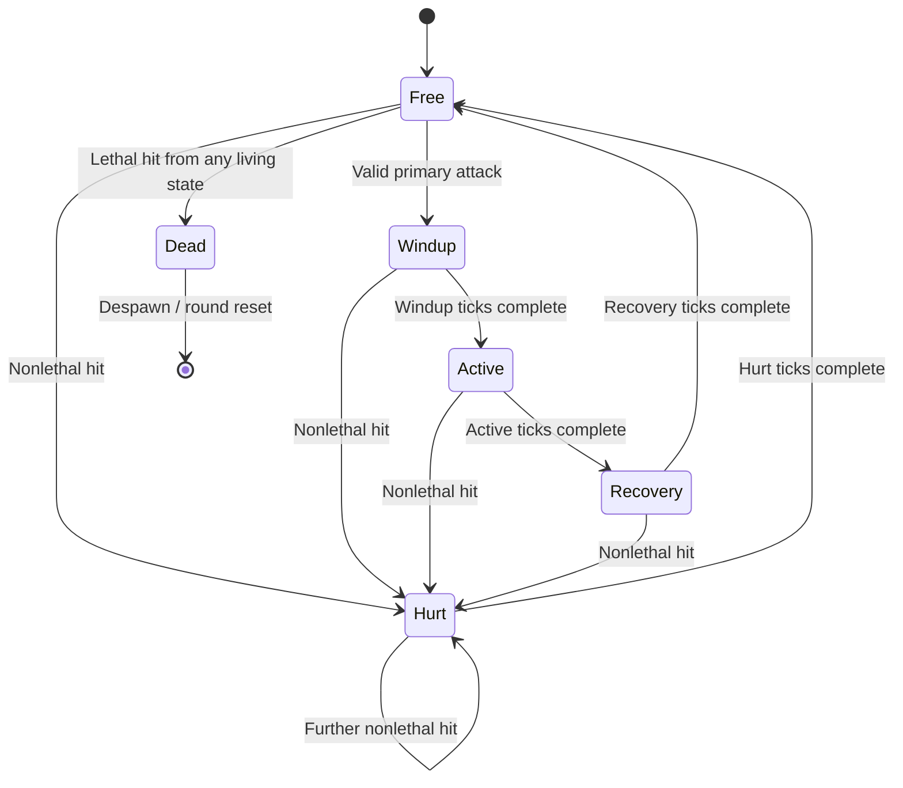
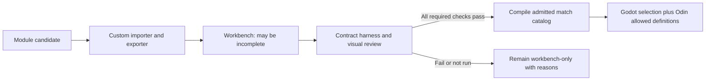

# Proposal: character harness and Basic Combat v1

Status: **full combat/admission proposal; art harness and selectable movement characters implemented**. See [4A](04f-character-harness.md) for the `1.0.0-draft.1` contract and [4B](04h-archer-and-orc-modules.md) for processed art. The user's subsequent request authorizes animation-complete characters in normal movement selection now; [4C](04i-playable-characters.md) supersedes the selection ordering below for that sandbox. Shared combat and its full certification gate remain proposed. This extends the [component architecture](04c-component-characters-and-animation-contract.md) and [package migration](04d-character-packages-and-migration.md).

A character can be imported into a development workbench while incomplete. It becomes eligible for normal character selection only after passing a versioned **Basic Combat** contract. The harness is the repeatable environment that verifies that contract using the actual shared character view and Odin gameplay systems.

Each character is an isolated micro-entity module with its own **required custom importer and exporter**. The harness invokes its `exporter.gd`, which owns the call to that character's `importer.gd`. It validates the resulting `CharacterExports` for common state/art bindings, gameplay components and AI status; it never parses private character files or substitutes a default global importer.

## 1. Required base: idle, walk, hurt, attack, death

Proposed first stable contract: **`character.basic_combat@1.0.0`**. Freeze it when the implementation and reference character pass; this document is still its design proposal.

| Required public role | Gameplay meaning | Required presentation / completion behavior |
| --- | --- | --- |
| `idle` | Alive, action free, no actual movement | Loop a neutral pose/clip; retain facing |
| `walk` | Alive, action free, actual movement | Loop locomotion art; stop when movement stops or is blocked |
| `hurt` | A nonlethal accepted hit caused a finite reaction | Play a hurt clip or declared shared hurt effect; leave the reaction on the host timer |
| `attack` | The primary damage ability is executing | Bind windup, active and recovery phases to a recognizable attack presentation; host timing controls the effect |
| `death` | Health reached zero; gameplay state is `Dead` | Play once and hold the final pose, or use a declared shared death effect; remain unable to act |

**Death is the missing essential state.** Without a terminal gameplay state, a defeated character can remain controllable or appear healthy. A separate `spawn`, `victory`, `run`, `block`, `dodge`, `cast` or `stun` animation is not required for this first contract. Reset is a lifecycle operation that creates a fresh live instance, not another required animation.

Use `walk` as the canonical locomotion role throughout the proposal. `Archer_Run.png`, `Monk/Run.png` and `Orc_Walk.png` all map to `walk`. The earlier proposed role `move` was never implemented and is replaced now; it is not a second accepted public key in v1. A future sprint mechanic can introduce an optional role through an explicit extension.

These five names are common semantic roles, independent of source filenames. The underlying simulation still separates locomotion from action:

```text
LocomotionState: Idle | Moving
Base ActionState: Free | Windup | Active | Recovery | Hurt | Dead

Dead                           -> death
Hurt                           -> hurt
Windup / Active / Recovery      -> attack, variant primary
Free + Moving                  -> walk
Free + Idle                    -> idle
```

Queries for all characters displaying idle use the canonical role; simulation queries use `locomotion == Idle && action == Free`. Attack phases are shared internal states, not three additional mandatory source PNGs.

## 2. Minimum combat behavior

Every v1 combat character supplies validated identity, gameplay size, movement speed/footprint, maximum health, a hurtbox, a primary damage ability, and a positive hurt-reaction duration in simulation ticks. The primary attack uses the shared melee or projectile effect contract. The projectile extension must also pass when selected; a heal-only ability does not satisfy a basic damage attack.

The first profile uses these common rules:

- Attack follows **Windup → Active → Recovery → Free**. It blocks movement and turning for this first profile and retains its accepted facing. A held/repeated command cannot restart the timer or duplicate an effect.
- An accepted nonlethal hit enters `Hurt` from any living state and interrupts the current action. It blocks movement/attacks for a finite host-controlled duration. A further accepted hit restarts that duration; v1 grants no automatic invulnerability.
- A lethal hit enters `Dead` immediately and takes priority over hurt or action completion. Dead entities cannot move, attack or receive further combat hits.
- Interrupting an attack removes its attached active hitbox and cancels effects not yet emitted. An already emitted projectile keeps its own lifetime/ownership rules; it does not disappear merely because its owner is hurt or dead.
- Hurt completion returns to `Free`; current accepted movement determines `idle` or `walk`. Death never returns to idle because an animation finished. Round reset clears timers, transient hitboxes/projectiles and old event generations before fresh spawning.

Durations, damage and reach remain authored shared gameplay data. The harness uses fixed reference values for reproducible checks; it does not force every character to deal identical damage or attack at the same speed. Animation FPS cannot alter these values. Super armor, noninterrupting damage reactions, guarding and independent stun effects are later explicit policy extensions; they are not hidden per-character exceptions to v1.



The single death arrow is a drawing shortcut: **every living state can transition to Dead**. Resolve simultaneous hit candidates through shared deterministic combat rules, including a defined mutual-kill result, rather than making the first character in an iteration order automatically win.

## 3. Required support does not require five separate sheets

Each required role must have a resolvable binding and the correct gameplay behavior. Its implementation is visible in the harness report:

| Binding | Allowed in v1 | What validation checks |
| --- | --- | --- |
| Authored clip | All five roles | Explicit frames/durations, loop policy, stable body/feet and facing coverage |
| Explicit frame region from a combined atlas | All five roles | Same checks; sheet organization is private to the package |
| Shared `hurt_flash` presentation recipe | `hurt` only | Declared neutral pose plus visible flash, synchronized with the same host Hurt state |
| Shared `death_fade` presentation recipe | `death` only | Declared frozen pose plus fade; gameplay remains Dead after the effect finishes |
| Missing binding or silently falling back to idle | None | Admission fails with the character key and missing role |

The hurt/death recipes are versioned shared implementations with fixed semantics, explicitly selected in the character's art manifest. They are required-state implementations, not waivers. A native death clip may finish before the next snapshot; its final pose remains terminal on late join/reconnect. Generated effects also need deterministic seek behavior from the presented state time.

For ordinary sprite packages, `idle`, `walk` and `attack` need explicitly authored clips/regions. A neutral idle may intentionally be one frame; a static idle reused as walk or attack does not qualify. Shapes can use a separately declared procedural renderer fixture when testing the harness; their existing implementation does not already satisfy this combat contract.

All eight logical facings must resolve via real art or declared directional/mirroring fallbacks. Eight unique sprite sheets are unnecessary. Distinct attack variants need explicit bindings; `primary` is mandatory, further variants are conditional on the loadout. Hit geometry always uses authoritative facing even when the visual deliberately reuses a side view.

## 4. What the harness contains

One isolated package at a time, plus shared services and test fixtures. It must not depend on the currently selected arena, another character package, or a global current-player node.

| Harness surface | Purpose |
| --- | --- |
| 32-world-unit grid and fixed camera | Judge size against tiles; compare size 1 and 1.5 without auto-fit hiding differences |
| Candidate and reference target | Exercise one real `CharacterView` against a generic shared target with known hurtbox/health |
| Idle / Walk / Attack / Hit / Kill / Reset controls | Drive canonical preview requests or real harness commands, not source clip names |
| Direction selector, pause and single-tick stepping | Inspect facing, windup/active/recovery boundaries and hurt duration |
| Body, feet, footprint, hurtbox and attack overlays | Show presentation measurements alongside authoritative collision geometry |
| Two instances of the candidate | Catch shared playback cursors, timers or health accidentally stored in a definition |
| Contract/version/result panel | List each requirement as pass, fail or not run; display native/shared-effect bindings |

Two modes share this view:

1. **Art preview:** synthetic common states allow incomplete packages to be inspected. This mode can prove visual mapping and calibration; it cannot pass gameplay tests or admit the character to selection.
2. **Combat verification:** the actual Odin state/movement/combat systems advance fixed ticks in an isolated test scenario. Godot consumes the resulting state using the real presentation interface. A separate multiplayer scenario verifies selection restrictions, player views and delayed audience behavior.

Verification compiles a temporary fixture catalog directly from candidate exports for the isolated harness runner. It does not require the candidate to be admitted first, and never overwrites the normal match catalog. Admission tests separately verify that a normal host rejects unadmitted IDs. Only after the full suite passes does the coordinator publish the admitted catalog; this avoids making certification depend on prior selection access.

The coordinator and test cases are shared; the harness dispatches to each module's own exporter/importer. It contains no Archer/Orc-specific filename knowledge. Its buttons send normal intent or clearly marked harness-only hit/kill/reset commands; debug commands are unavailable on a normal match host.

## 5. Admission checks

| Category | Must pass before normal selection |
| --- | --- |
| Contract | Exact supported contract version, all five canonical roles, known schema/component keys and required extension support |
| Module isolation | Required custom importer/exporter exists; builds with other character packages absent; only declared source/shared dependencies; deterministic public exports |
| Assets and mapping | Sources exist; regions/counts/durations valid; no duplicate bindings, unknown role spellings, unresolved aliases or fallback cycles |
| Presentation | Stable size/feet across clips and facings; owner indicator readable; no camera-dependent calibration; attack/hurt/death visibly distinct |
| Shared properties | Finite positive metrics and required durations; valid movement footprint/hurtbox; primary attack and all referenced definitions resolve |
| State lifecycle | Idle/walk switching, blocked movement, attack completion, hurt interruption/recovery, lethal hit from every state, dead input rejection and clean reset |
| Combat | Correct range/facing/filtering; one hit according to the shared action policy; misses do no damage; repeated packets do not duplicate damage |
| Timing | Same gameplay result at different render rates; no effect driven by an animation callback; stable action sequence/phase on repeated snapshots |
| Networking | Owner authority, same-character instances, reconnect/late join, shared selection eligibility, and default delayed audience states/events |
| Optional effects | Projectile/guard/heal-specific checks when the package declares those extensions; unavailable extensions fail explicitly |
| AI export | Explicit player_only or a supported versioned AI backend/profile; references only valid shared abilities/states; AI-enabled modules also pass observation/intent and per-instance memory checks |

Automatic checks produce measurements and captures. Visual calibration is recorded in a package review artifact tied to the current art-generation digest; the harness must not invent a pass for human readability from a successful parse. Existing imports can be previewed while that review or an unimplemented gameplay check remains **not run**. Not run is not pass.

## 6. Gate character selection on a verified build



Separate the **candidate registry** from the **admitted match catalog**. `GameContent` builds normal selection cards from admitted entries with matching validated visual resources. Odin reads the same admitted definition IDs and rejects manual selection requests for a candidate that is not admitted. The gate must also cover ordinary `make dev_arena` scenarios, not just hidden buttons.

The build coordinator generates the validation report, rather than trusting an author-edited `approved: true`. Its inputs include contract ID/version and digest, package/source/adapter hashes, transitive ability/projectile dependencies, generated-art digest, harness/test implementation version, gameplay implementation digest and visual-review digest. Any relevant input change requires the affected checks/review to be refreshed before a new candidate generation is admitted. Reuse unaffected evidence only when its recorded dependency digest still matches.

The report is build evidence, not a client-supplied permission token. The host trusts its own compiled catalog and compatibility checks. Store contract ID/version and required extension versions with the runtime definition; shared contract rules and admission metadata participate in the authoritative build's content fingerprint. Raw PNGs stay client-side; art review records do not make the host import images.

Pin active sessions to the last valid build. A failed edit leaves the old session/resources running and the new candidate blocked; it must not partially replace a working character or leave a stale passing result attached to new data. Missing reports, unsupported versions and stale required checks fail admission with a concrete reason.

## 7. Version policy

Keep these independently identified:

- **Contract version:** required roles, component interface and promised behavior, initially `character.basic_combat@1.0.0`.
- **Export API version:** the common `CharacterExports` art/state/gameplay/AI envelope, independently versioned from private module formats.
- **Package/art schema versions:** how manifests are encoded.
- **Package revision/digests:** which settings and source art were validated.
- **Harness implementation version/digest:** which checks actually ran.
- **Wire protocol version:** ENet message layout; the current game remains protocol 6 until implementation changes it.

Once released, a contract version is immutable. Use a major increment for incompatible requirements/semantics (such as requiring dodge from every character), a minor increment for compatible optional additions, and a patch increment for compatible corrections. These are the [Semantic Versioning rules](https://semver.org/); our additional policy is to pin the **exact** accepted contract version and revalidate explicitly when upgrading.

Do not widen acceptance automatically to every future `1.x` version. New optional components have their own declared versioned contracts, such as a future projectile extension. A package using an extension must pass its tests even when other base characters do not need it. Materially changing hurt interruption rules requires a compatible declared extension or a new base version, not a private per-character override.

The contract file is the single machine-readable source of required role keys, permitted binding kinds and required component/test IDs. Godot import validation, catalog compilation and the harness read it; Odin validates the supported contract identity/definitions, with cross-language fixtures pinning runtime state semantics. Do not maintain three independently editable required-state lists. The source contract and applicable shared gameplay catalogs must be included in the coordinated build/fingerprint contract before admission is enabled.

## 8. Proposed files and implementation order

| Proposed file / type | Responsibility |
| --- | --- |
| `client/content/contracts/character_basic_combat/1.0.0.json` | Versioned role/component/binding/test requirements; frozen after the first accepted implementation |
| `client/content/character_contract.gd` / `CharacterContract` | Read and validate contract identity and required presentation bindings |
| `client/dev/character_harness.gd` / `.tscn` / `CharacterHarness` | Workbench controls, measurements, actual shared view and result display |
| `client/dev/character_harness_driver.gd` | Synthetic art cases and real host-scenario controls kept distinct |
| `tools/check_character_contract.py` | Coordinate import, shared host checks, graphical checks and a dependency-bound report |
| `server/character_contract.odin` | Supported base/extension contracts and admission validation |
| `server/character_contract_test.odin` | Required gameplay lifecycle and invalid contract/component cases |
| `tests/character_contract_check.gd` | Canonical role coverage, instance isolation, timing/anchor cases and invalid mappings |
| `tests/character_module_isolation_check.gd` | Required custom entry points, sibling-free import, declared dependencies and normalized AI export |
| `tests/character_admission_check.gd` | Incomplete/stale/unknown-version packages absent from selection and rejected by the host |
| `build/verification/characters/<key>/report.json` | Generated pass/fail/not-run evidence and captures; not hand-authored approval |

Extend the already proposed package importer/catalog tools. Fold the proposed `character_preview.gd/.tscn` into the harness's art-preview mode rather than maintaining two separate character viewers. This table describes the full intended implementation; the [4A file table](04f-character-harness.md#files-and-ownership) identifies the subset now implemented and its actual paths.

Small checkpoints:

1. **Define the contract and build the art harness.** Required-state diagnostics, common buttons, size/feet overlays and imported-versus-admitted status. Missing hurt or death must produce a clear failure immediately.
2. **Build Archer's and Orc's custom importer/exporter modules.** Confirm each builds alone, `Run` and `Walk` resolve to `walk`, all five roles resolve or report exact gaps, and AI is explicitly player_only initially. Both remain outside normal selection while gameplay checks are pending.
3. **Verify the movement integration in an isolated harness.** Keep network/camera/audience regression coverage without granting a movement-only character admission.
4. **Implement shared simple melee, Hurt and Dead; pass Orc first.** Orc already supplies named sheets for all five roles, making it a useful first complete reference. Enable it in normal selection only after the full base checks and review pass.
5. **Admit subsequent packages individually.** Warrior can prove the declared hurt/death recipes; Archer also needs the projectile contract. Lancer's guard and Monk's heal remain later extensions. Monk needs a valid primary damage ability to qualify for this base, or a separately designed support-character profile.

The current shape sandbox remains the multiplayer regression fixture during 4A. Its existing movement-only behavior is not automatically certified as Basic Combat v1. New animated characters do not enter normal selection until the complete gate exists and they pass it.
