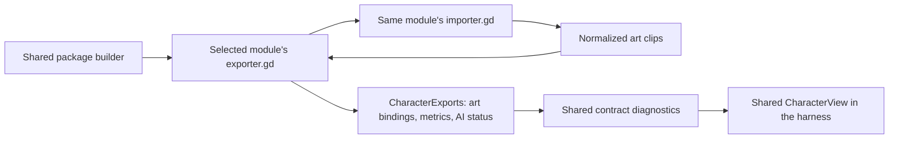

# Checkpoint 4A: character contract and art harness

Implemented: an isolated development workbench using the shared `CharacterView`, a versioned five-role contract, independent synthetic character modules, and body/feet measurements. This completes **4A** from the [migration plan](04d-character-packages-and-migration.md).

**4A.1 update:** the [raw/processed asset pipeline](04g-character-asset-processing.md) now persists original PNGs, processed frames, provenance and every processing attempt. `make character_harness` processes the selected module first; the viewer itself loads saved processed data. The original in-memory dispatch described below now happens inside the processing worker.

**4B update:** [Archer and Orc](04h-archer-and-orc-modules.md) now have independent modules in the same workbench. Use `make character_harness CHARACTER=orc` or `make character_harness CHARACTER=archer`. The launcher automatically opens a complete staged candidate when no successful generation exists. A preview-source selector distinguishes the last successful generation from the latest processed candidate, which may fail required-role checks; `CANDIDATE=1` forces candidate mode at launch.

The [4C multiplayer sandbox](04i-playable-characters.md) now adds Archer and Orc alongside the four existing shapes. This separate workbench does not register characters, connect to a host, run combat, or certify full Basic Combat eligibility.

## Run it

From the repository root:

```sh
make character_harness
make character_harness MODULE=res://dev/fixtures/characters/reference32
make check_character_contract
```

The first two commands process a module and open the same workbench with a different initial selection. No server or external asset pack installation is needed for the reference harness. Godot imports the project before launch. The scene exits in release builds. This harness has no file watcher; rerun the Make command after changing module code.

| Control | Behavior |
| --- | --- |
| Module | Switch between the reference fixtures and registered Archer/Orc candidates |
| Preview source | Load the last successful generation, or explicitly inspect the latest processed candidate |
| Idle / Walk / Hurt / Attack / Death | Request a canonical presentation role for instance A |
| Facing | Inspect eight explicit bindings, including mirrored western facings |
| Gameplay size | Change A's size; B is always 1.5 times A's size |
| Pause / Step 1/60s | Inspect the preview clock; stepping is not an Odin simulation tick |
| Reset | Return A to idle at presentation time zero |
| Demonstrate missing hurt/death | Remove these bindings from a fresh candidate export and show the failures |
| Body / feet overlays | Toggle yellow body bounds and cyan foot anchors; owner rings show the authored preview footprint |
| Save diagnostics | Write `build/verification/characters/harness/report.json` |

Instance B uses the same art resource and its own idle sample time. Changing A's role/time cannot change B's sample. A missing or invalid role hides A and displays `MISSING / INVALID`; it never substitutes idle.

The preview uses a fixed camera and a **32-world-unit grid**. Both reference modules include transparent padding and an off-center foot anchor, so resizing and mirroring exercise more than a centered square. At size 1 the authored body spans 32 world units; at 1.5 it spans 48. PNG canvas size does not determine gameplay size. At the default camera zoom of 2, those lengths occupy 64 and 96 viewport pixels before window scaling.

## Independent modules, common output



Both `importer.gd` and `exporter.gd` are mandatory and must implement their shared interfaces. The builder invokes the exporter. The exporter owns calling its own importer and composing the public result; the builder contains no private filename or sheet-layout rules.

| Public role | Reference16 private clip | Reference32 private clip |
| --- | --- | --- |
| `idle` | `rest` | `sheet_0` |
| `walk` | `stride` | `sheet_1` |
| `hurt` | `flinch` | `sheet_2` |
| `attack`, variant `primary` | `swing` | `sheet_3` |
| `death` | `fallen` | `sheet_4` |

Each fixture imports its own original synthetic PNG using its own layout and explicit mapping. They import no sibling module. These are diagnostic fixtures, not finished character animations or globally inferred naming rules. The builder/contract checks exercise the source import; the workbench consumes the persisted processed artifact.

The current public envelope contains `module_key`, exact contract/export versions, `art`, a `gameplay_definition` dictionary, and an explicit `ai = {"mode": "player_only"}`. Only gameplay size and footprint are validated from that dictionary in 4A. Health, movement settings, primary attacks, hitboxes, projectiles and AI backends remain later implementation work; their checks cannot pass here.

`CharacterAnimationSet` supplies clips made of `Texture2D` frames, positive FPS, a loop policy, and bindings keyed by `(role, facing, variant)`. All eight facings must resolve explicitly. Idle/walk loop; attack/hurt/death play once and hold their final frame. This is presentation playback only: an attack clip ending does not implement action recovery, and a death clip does not implement host death rules.

The export API currently supports one calibrated body rectangle, longest-side reference span, and foot anchor per art set. A future custom importer must normalize varying canvases into this output or evolve the versioned API. State timelines, per-frame anchors, layered effects, and attack phase synchronization are not implemented in this slice.

The view holds its own sprite and sampled frame index. It consumes normalized art without knowing source names, parsing sheets, or owning a gameplay state machine. Treat exported art as shared read-only data; instance playback is separate.

## Exact version and honest diagnostics

The implemented contract is **`character.basic_combat@1.0.0-draft.1`**, with export API **`0.1.0`**. The proposed stable `1.0.0` is reserved until the shared combat implementation and reference character pass the complete checks. Unsupported versions fail; the reader does not automatically accept other draft or stable versions.

The JSON contract is the shared source for required roles, facings, loop policy, minimum frame counts, allowed binding kinds, and future component/check IDs. Its SHA-256 digest is recorded in diagnostics. The validator checks the export envelope, finite body/footprint metrics, frame validity, authored bounds, duplicate or unknown bindings, facing coverage, minimum frames and loop policy.

The contract describes future `hurt_flash` and `death_fade` bindings. They currently fail with an explicit **not implemented** diagnostic; listing them does not supply a renderer. The harness only renders validated clip bindings.

Every saved report includes:

```json
{
  "scope": "art_preview_only",
  "art_pass": true,
  "selection_eligible": false
}
```

The example above describes a complete synthetic art export. Missing hurt/death changes `art_pass` to false. Gameplay components, state lifecycle, combat, networking, visual review and full admission-grade isolation remain `not_run` in this interactive report. The separate fixture isolation test proves only its listed reference cases. No report is an approval token, and no catalog compiler or Odin admission gate is implemented yet.

The report is a local diagnostic snapshot overwritten on save. It is not the dependency-bound certification artifact proposed for 4D. A future gate must revalidate current source, generated art, shared gameplay and test/review evidence before admitting a candidate.

## Files and ownership

| File / class | Implemented responsibility |
| --- | --- |
| `client/content/contracts/character_basic_combat/1.0.0-draft.1.json` | Draft role, export and future combat requirements |
| `client/content/character_contract.gd` / `CharacterContract` | Load exact requirements; inspect art exports; produce pass/fail/not-run diagnostics |
| `client/characters/import/character_exports.gd` / `CharacterExports` | Public module envelope |
| `client/characters/import/character_importer.gd` / `CharacterImporter` | Required custom importer interface |
| `client/characters/import/character_module_exporter.gd` / `CharacterModuleExporter` | Required custom exporter interface |
| `client/characters/import/character_package_builder.gd` / `CharacterPackageBuilder` | Locate a local module, verify entry-point interfaces, invoke its exporter and inspect the result |
| `client/characters/character_animation_set.gd` / `CharacterAnimationSet` | Normalized clips, exact bindings and stateless time sampling |
| `client/characters/character_view.gd` / `CharacterView` | Existing shapes plus normalized art presentation and body bounds |
| `client/presentation/asset_scale.gd` / `AssetScale` | Existing shared conversion from authored reference pixels to world units |
| `client/dev/character_harness.gd` / `.tscn` / `CharacterHarness` | Workbench controls, two views and diagnostics |
| `client/dev/character_harness_stage.gd` | Fixed grid and foreground body/feet overlays |
| `client/dev/fixtures/characters/reference16/{importer,exporter}.gd` | Independent 16px synthetic module |
| `client/dev/fixtures/characters/reference32/{importer,exporter}.gd` | Independent 32px synthetic module |

The workbench gives its viewport a separate `World2D`, keeping its scene presentation separate from the containing window. See [Godot's viewport world property](https://docs.godotengine.org/en/stable/classes/class_viewport.html#class-viewport-property-world-2d).

## Verification

`make check_character_contract` runs the Godot checks and both temporary-project isolation probes. `make check` includes it alongside the existing Odin and multiplayer regressions.

| Check | Evidence and limits |
| --- | --- |
| `tests/character_contract_check.gd` | Required roles, invalid versions/metrics/frames/bindings, incomplete previews, missing custom entry points, independent playback and harness control wiring |
| Same test, actual `CharacterView` | Padded 16px/32px art has matching 32/48 world-unit body bounds; feet remain fixed when facing east/west; death holds and idle loops |
| `tests/character_module_isolation_check.py` + `character_module_probe.gd` | Each fixture imports twice in a temporary Godot project containing only itself and the listed shared dependencies; mapping/frame output matches and export mutations do not affect a second export |
| Graphical run of `character_contract_check.gd` | Measures rendered alpha bounds at both sizes and mirrored facings; captures complete/missing-role UI at 900×800 and 800×760 |

To reproduce graphical measurements and captures on a machine with a display:

```sh
godot --path client --script "$PWD/tests/character_contract_check.gd"
```

Captures and the local report are under `build/verification/characters/harness/`. Headless checks skip GPU pixel measurement and screenshots. Automated control tests exercise signals and resulting views; they do not claim physical mouse/keyboard coverage or a review of real character art.

Verified on 2026-09-10 with Godot 4.6: `make check` passed, including 21 Odin tests and the multiplayer/development-workflow checks. Focused harness checks were repeated after the final preview fixes, and the graphical check passed rendered size/anchor measurements. Complete and missing-role captures were inspected at both supported window sizes. Logs are `build/verification/character-harness-full-check.log`, `character-harness-check.log` and `character-harness-render.log`.

The [4B character modules](04h-archer-and-orc-modules.md) use this interface, and [4C](04i-playable-characters.md) now makes animation-complete characters selectable in the movement sandbox. Required-state and gameplay gaps stay visible while the later shared combat implementation is built.
