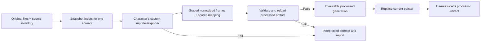

# Checkpoint 4A.1: raw and processed character assets

Status: **implemented**, initially for the two reference modules and now used by [Archer and Orc in checkpoint 4B](04h-archer-and-orc-modules.md). This checkpoint fills a gap in 4A: its synthetic importers originally created textures in memory. They did not preserve an original image, write processed artifacts, or record processing attempts.

## Commands

```sh
make process_character MODULE=res://dev/fixtures/characters/reference16
make process_character MODULE=res://dev/fixtures/characters/reference32
make character_harness MODULE=res://dev/fixtures/characters/reference16
make check_asset_pipeline
```

`process_character` prints the report path and, on success, the processed artifact path. Its exit status is nonzero on failure. `character_harness` runs processing first, then opens the workbench. On a failed attempt it still displays previous successful output when available, with the failure shown above the controls. With no successful-generation pointer, the launcher automatically previews a complete staged candidate if the attempt produced one. Without either output, the workbench shows the failure and no character. Switching the module selector loads that module's existing processed output using the selected preview mode; run processing for it first.

**4B addition:** `CHARACTER=orc` and `CHARACTER=archer` resolve modules through the workbench registry. Both now have successful generations, including Archer's added hurt/death roles. `CANDIDATE=1` forces the latest staged candidate even when successful output exists. The UI labels it **STAGED CANDIDATE**, verifies its recorded digest, and shows any failures first. This mode never publishes that candidate or changes `current.json`. If processing failed before completing an artifact, there is no candidate to display.

The **Processing report** button opens the latest attempt's `report.json`; **Processed files** opens the generation actually being displayed. The full report links the trace, worker log and staged candidate artifact. Generated output is already covered by `/build/` in `.gitignore`.

The existing **Save diagnostics** button still saves the current art-preview checks. Processing reports are separate: they are written automatically for every attempt and retained individually.

## Storage and ownership

| Location | Purpose |
| --- | --- |
| `asset_sources/characters/<key>/` | Original diagnostic fixture PNGs, outside the Godot project; never overwritten by processing |
| `client/characters/.../<key>/source_manifest.json` | Public inventory: source root, relative filenames, expected SHA-256 hashes and module key |
| Same module's `importer.gd` / `exporter.gd` | Custom parsing, layout, naming and canonical role mapping |
| `build/asset-jobs/<key>/<attempt>/` | Immutable attempt inputs, staged output, trace, Godot log and result report; retained on failure |
| `build/processed/characters/<key>/generations/<digest>/` | Complete processed preview artifact: normalized metadata, extracted PNG frames and provenance |
| `build/processed/characters/<key>/current.json` | Atomically replaced pointer to the last successful processed generation |

The user files under `client/assets/Characters/` remain original inputs in their current location. Archer and Orc declare their respective folders as source roots and process copies through isolated workers. Original files are never rewritten, resized or relocated by processing. The reference originals are synthetic fixtures with different sheet layouts.

## Processing sequence



Shared code handles source reads, bounds checks, trace recording, normalized output serialization and publication. Only the character's importer decides how to interpret its sheet; only its exporter decides the public role mapping. There is no global filename or grid heuristic.

Every extracted frame records its original source path/hash, rectangle, private clip and frame index. Processed metadata maps each generated PNG back to that record. Each attempt records input/module/shared-tool hashes, contract identity, the processing stage, error details and paths to its logs/artifacts. A build runs in its own Godot process; a crash or timeout still leaves the supervisor's failure report and the last recorded stage.

The attempt's `raw/` holds the exact source snapshot. `inputs/` holds the processing code and declared inputs; `inputs.json` records their hashes, Godot version and combined input digest. Only this selected module and the listed shared processing dependencies are installed in its worker project. Source inventory validation and source snapshot failures can occur before a worker log exists; the report and trace still identify the failing input.

Before publication, check that the live inputs/code still match the attempt's snapshot and reload the staged artifact to verify its output hashes and contract diagnostics. Publish into a new generation directory, then switch a small pointer atomically. Failure never replaces `current.json`. The harness must clearly distinguish a failed latest attempt from an older successful generation still being previewed.

These outputs are **processed preview artifacts**. They are not combat admission certificates. Full gameplay checks remain not run; incomplete role coverage stays visible in retained candidate diagnostics and blocks promotion to the current successful art generation.

## Inventory and trace examples

The shared inventory describes public input identity, not character-specific sprite rules:

```json
{
  "schema_version": 1,
  "module_key": "reference16",
  "raw_root": "asset_sources/characters/reference16",
  "files": {
    "sheet.png": "<64-character SHA-256 of the original>"
  }
}
```

Changing an original requires deliberately updating its reviewed inventory hash; an accidental replacement fails the next attempt. Inventory roots are repository-relative, and filenames are relative to that root. Reference originals are repository-authored fixtures. Archer and Orc now record exact matches to their separate local source packs in their inventories and `SOURCE.md` files.

Reference16 interprets a two-column, five-row sheet. Reference32 interprets a ten-frame horizontal strip. Their importers call `context.sources.extract_frame(source, rectangle, private_clip, frame_index)` with their own decisions. Shared extraction verifies bounds and records provenance. Exporters map private clips to the five common roles. Archer additionally performs its own resize/canvas placement for the larger hurt/death sheets, then calls `record_transform(clip, index, details)`. This adds an ordered `transforms` list to each frame's origin and a `transform_frame` event to the trace. Its version-1 `resize_canvas` record contains target dimensions, nearest-neighbor filter, canvas dimensions, offset and ground anchors. Pixel verification replays this operation from the original crop; shared processing contains no Archer layout rules.

For example, a bad crop records this event in `trace.jsonl`:

```json
{
  "stage": "extract_frame",
  "status": "fail",
  "source": "sheet.png",
  "clip": "rest",
  "frame": 0,
  "rect": [99999, 0, 32, 32],
  "message": "Frame rectangle lies outside source image"
}
```

Follow `original_root` in the report to the original input, `raw/` to the attempt's frozen copy, and `inputs/client/.../importer.gd` to the exact processing code used. For script errors, inspect the linked Godot/compiler log for the script and line. A failed extraction can leave partial trace/output; a required-role failure retains the complete staged artifact plus its failing contract diagnostics. Neither replaces `current.json`.

Each frame in `artifact.json` has a generated PNG path/hash and an `origin` containing the source/hash, crop rectangle, private clip and frame index. Its `bindings` table connects public roles to those private clips. This provides the chain **public role → processed frame → original rectangle/file**.

## Implementation ownership

| File / type | Responsibility |
| --- | --- |
| `tools/process_character_assets.py` | Per-module lock, source/code snapshots, worker supervision, input verification, attempt reports and atomic generation pointer |
| `client/dev/process_character_assets.gd` | Build one candidate, serialize its frames/metadata, reload and validate processed output |
| `client/characters/import/character_asset_sources.gd` / `CharacterAssetSources` | Declared source reads, SHA-256 checks, bounds-checked extraction and durable frame trace |
| `client/characters/import/character_package_builder.gd` | Validate entry points/inventory and pass the source context to the selected module's exporter |
| Each module's `source_manifest.json`, `importer.gd`, `exporter.gd` | Input identity, custom interpretation and canonical mappings |
| `client/characters/character_artifact.gd` / `CharacterArtifact` | Write/read version 1 processed artifacts; verify metadata/frame hashes without reading raw assets or calling importers |
| `client/dev/character_harness.gd` | Load the current generation or explicitly selected staged candidate, show latest-attempt status and open reports/output |
| `tests/character_asset_pipeline_check.py` | Disposable-repository failure and publication tests |
| `tests/character_processed_probe.gd` | Processed-only consumer with no original assets or character module code |

The output format has its own `schema_version: 1`. This addition does not change the five-role draft or the normalized `CharacterExports` envelope. Body sizing uses the authored body rectangle/reference span. Simple extractions retain native crop dimensions; transformed outputs record the conversion explicitly. Original source PNGs always retain their bytes and dimensions.

The generation digest covers the processed metadata, frame hashes and input digest. Attempt timestamps and IDs are excluded so unchanged inputs produce the same generation. A failed new attempt updates only its own report and `latest_attempt.json`; the successful pointer remains available. An existing generation is verified before reuse, and modified output is rejected instead of overwritten.

This is a local native-Godot development pipeline. [Checkpoint 4C](04i-playable-characters.md) now bundles validated art under `client/generated/characters/`, makes Archer/Orc selectable in the movement sandbox, and prepares changed character art inside staged development sessions. The standalone harness still processes only the requested module, including incomplete candidates; it does not require the runtime bundle to build successfully. Processing one module supports its own files and the explicitly listed shared dependencies; additional cross-module or tool dependencies must be declared when introduced. Full combat certification remains future work.

## Acceptance for this checkpoint

- Both reference modules process original PNGs using their own different layouts.
- Original bytes stay unchanged; processed frames reload without raw files or module code.
- Repeated input produces the same generated artifact digest.
- A failed source read, checksum, frame extraction, validation or output write identifies its stage and file.
- Failed processing retains attempt evidence and preserves the previous current generation.
- The harness opened through Make loads saved processed data and reports the latest build result.
- Existing contract, character sizing, module isolation and multiplayer checks remain valid.

## Verification recorded on 2026-09-10

`make check` passed, including 21 Odin tests, the existing multiplayer/development-workflow suite, and the new pipeline checks. Tests verified unchanged original bytes, deterministic generations, exact frame provenance, standalone processed loading, and preserved current output after malformed inventory, source hash/decode, crop, missing-role, syntax, timeout, output-write, modified-snapshot and partial-result failures. Corrupted processed PNGs were rejected by the reader.

The graphical character check also passed body/feet measurements with saved processed art; the updated workbench was inspected at 900×800 and 800×760. Logs are `build/verification/asset-pipeline-full-check.log` and `build/verification/asset-pipeline-render.log`. This 4A.1 evidence covers the reference modules and existing multiplayer regressions. See the [4B verification](04h-archer-and-orc-modules.md#verification) for subsequent real-character processing and rendering checks. Combat admission remains later work.
