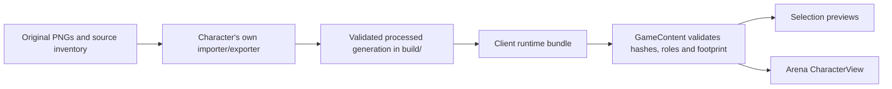

# Checkpoint 4C: selectable characters and movement animation

**Current follow-up:** [checkpoint 6A](06b-autonomous-idle-walk.md) adds autonomous idle/walk after summoning and upgrades transport to v8. The descriptions below record this earlier checkpoint.

Archer and Orc now appear in normal character selection and spawn as animated characters in the arena. Their IDs are **5** and **6**. Circle, Square, Triangle and Diamond retain IDs 1–4. Selection cards and both player previews use the same processed art as the arena.

This checkpoint follows the user's request to make complete animation modules selectable now. It supersedes the earlier proposal to keep movement integration confined to the harness until combat admission. The current sandbox validates all five animation roles before loading these characters; health, damage, authoritative combat states, projectiles and AI remain subsequent work. The art harness's `selection_eligible: false` still means that a full Basic Combat admission certificate has not been earned. It is not the movement sandbox's roster switch.

## Run

```sh
make dev_arena P1=archer P2=orc ARENA=stone_garden AUDIENCE=1
make run_client DEV=1
make run_audience DEV=1
make prepare_characters
make check_playable_characters
```

The launcher owns its host and clients. Individual client commands connect to an existing host. `dev_arena` enables development features automatically; individual clients enable them with `DEV=1`. Action text appears above both characters in development mode and is disabled in release builds. Audience delay still defaults to five seconds; use `AUDIENCE_DELAY=0` for immediate local testing.

`make run_client`, `make run_audience` and client checks prepare the runtime art before importing Godot. The development launcher prepares it inside each staged client. Running the Godot editor directly requires `make prepare_characters` once after setup or changes to character sources/configuration.

## Current asset audit

Inspected all five character folders under `client/assets/Characters/` on 2026-09-10, including the guard/defence/heal sheets.

| Character | Available semantic animations | Result |
| --- | --- | --- |
| Archer | idle, walk, hurt, attack, death | Imported and selectable, ID 5 |
| Orc | idle, walk, hurt, attack, death | Imported and selectable, ID 6 |
| Lancer | idle, walk, directional attacks, directional defence | Missing hurt and death; remains unregistered |
| Warrior | idle, walk, two attacks, guard | Missing hurt and death; remains unregistered |
| Monk | idle, walk, heal and heal effect | Missing hurt, death and a primary attack; remains unregistered |

Guard, defence and heal are not substituted for missing combat roles. Importing another character still requires its own importer/exporter and successful shared art-contract checks.

## Original → processed → runtime



`client/content/presentation/characters.json` declares which character modules supply real art. `tools/prepare_characters.py` checks source/code hashes and the Godot version, processes changed modules, then copies successful generations into `client/generated/characters/<key>/<digest>/`. An atomic `catalog.json` switches the complete bundle only after every module succeeds. Unchanged intact bundles are reused. A failed import leaves the previous bundle available; a corrupted bundle is rejected. Generated files are ignored by Git and reproducible from the originals and module code.

Runtime loading reads the bundle's normalized metadata and PNGs, verifies their hashes and all required animation roles, checks identity, and compares the exported world footprint against the host catalog. It never runs an importer or reads a raw character PNG. Tests load the client after removing raw character assets, module folders, tools and processing-job storage.

Changing character originals, package files or generated art in a watched development session takes the validated rebuild/relaunch path. PNG changes are not applied as raw texture reloads to characters whose runtime art has been normalized. The live session stays available if a replacement fails validation.

## Motion and debug text

`CharacterAnimator` owns each view's action, facing and clip clock. Continuous movement advances `walk`; a zero displacement selects `idle`. Direction is retained when stopping, and the clock resets when the action changes. Each instance has independent playback even when it shares immutable art with another view.

The locally controlled character observes displacement from the existing prediction step. Remote characters observe changes in received host positions. This makes wall-blocked input idle instead of animating a character that cannot move, and keeps reconciliation smoothing out of the local action decision. Audience views consume the same delayed snapshots used for their positions; they do not read live player input. Stale snapshot streams stop movement animation after the existing 500ms timeout.

This is movement presentation, not a gameplay combat state machine. The debug text shows the same canonical role that the view renders. Hurt, attack and death remain inspectable in the harness but have no gameplay triggers yet. Facing tracks observed movement; an idle late join starts with the default east pose until it observes movement. Exact shared combat/facing timelines need authoritative action fields in a later protocol revision. The wire protocol remains version 6 in this checkpoint.

## Files

| File | Responsibility |
| --- | --- |
| `client/content/data/characters.json` | Stable shared roster IDs, names and collision footprints |
| `client/content/presentation/characters.json` | Runtime art module declarations |
| `tools/prepare_characters.py` | Cached processing, runtime generation copies and atomic bundle publication |
| `client/content/game_content.gd` | Runtime art validation and common view configuration |
| `client/characters/character_animator.gd` | Per-instance idle/walk action, facing and clock |
| `client/characters/character_view.gd` | Normalized sprite playback and optional action label |
| `client/ui/character_select_screen.gd` / `.tscn` | Six cards, animated previews and shared selection badges |
| `client/world/game_arena.gd` | Real character spawning and predicted/received motion observations |
| `tools/dev_session.py` | Staged character preparation and validated relaunch |

## Verification

`make check_playable_characters` verifies cache reuse, failed-import retention, source-free runtime loading, corrupted-art rejection, real host selection/countdown, calibrated spawns, independent movement, direction, dev-only labels, blocked movement, delayed audience actions, late joining and reset cleanup.

`godot --path client --script "$PWD/tests/playable_characters_render.gd"` captures player/audience selection and arena idle/walk/debug-off views at 900×800 and 800×760. Captures are under `build/verification/playable-characters/`. This is automated render and input-event coverage, not a physical keyboard/mouse playtest.

Focused checks passed in `build/verification/playable-character-check.log`. The real launcher also completed an Archer/Orc scenario with an audience in `build/verification/animated-dev-arena.log`.

The full `make check` passed on 2026-09-10, including 21 Odin tests, asset/harness/runtime checks, multiplayer selection/movement, terrain, cameras, audience delay and development reload/relaunch recovery. Log: `build/verification/playable-characters-full-check.log`. Graphical captures were inspected after spacing the character art, names and selection badges at both supported window sizes; the render log is `build/verification/playable-character-render.log`.
