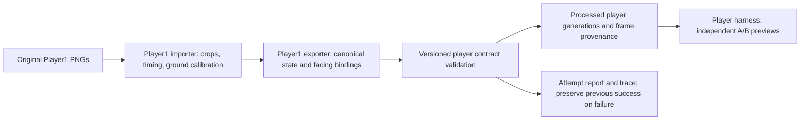

# Player trainer harness

Implemented as an isolated art checkpoint. The trainer/player now has its own
versioned contract, package registry, Player1 importer and harness. The gladiators
(Archer/Orc) keep their five-state combat contract. Player1 is a trainer choice in
the workbench; arena trainer spawning and movement are implemented in
[the trainer gameplay checkpoint](05a-trainers-and-summoning.md). Advice events,
bonds and gladiator AI remain subsequent checkpoints.

## Run

```sh
make player_harness PLAYER=player1
make process_player PLAYER=player1
make check_player_harness
```

The harness command processes the current sources before opening. It shows the
last successful generation and the latest processing status. `CANDIDATE=1` opens
the latest staged candidate explicitly. When no successful generation exists, the
launcher automatically previews an available incomplete candidate with failures.
A failed attempt never replaces the last successful generation.

Custom packages can be opened with
`make player_harness MODULE=res://players/packages/player2` once their independent
module exists. `PLAYER=player2` additionally requires a player registry entry.

## All eight states are required

The art contract is **`player.trainer@1.0.0-draft.1`**, export API `0.1.0`.
Its role list is versioned, not derived by scanning asset filenames. Future player
styles must implement the same roles. Changes to required roles or policies need
a new contract version and explicit migration support.

| Shared state | Player1 source | Frames | Playback |
| --- | --- | --- | --- |
| `idle` | `player_idle.png` | 6 | Loop, 6 FPS |
| `walk` | `player_walk.png` | 8 | Loop, 8 FPS |
| `run` | `player_run.png` | 6 | Loop, 12 FPS |
| `advise` | `player_advice.png` | 6 | Once, 7 FPS |
| `hurt` | `player_hurt.png` | 6 | Once, 8 FPS |
| `cheer` | `player_cheer.png` | 6 | Once, 8 FPS |
| `surprised` | `player_surprised.png` | 6 | Once, 8 FPS |
| `disappointed` | `player_disappointed.png` | 6 | Once, 6 FPS |

Every state requires a real clip, a `default` variant and bindings for all eight
logical facings. Idle permits one frame; the other states require at least two.
Walk playback starts at source pose 3 and cycles through `3,4,5,6,7,8,1,2` so
passing and lift precede the first foot plant. See [the gait analysis and runtime
timing](05b-player-walk-timing.md).

Player1's source layout requires eight walk poses and six per other sheet. There are no silent
idle substitutions. Missing any role fails the art check and blocks publication.

One-shot animations hold the final frame in the workbench for inspection. Replay
restarts the selected state; Reset selects idle. These are art playback policies,
not a networked gameplay state machine. An `advise` animation does not itself emit
an advice command or make a gladiator obey it.

## Ownership and data flow



| File / class | Responsibility |
| --- | --- |
| `client/content/contracts/player_trainer/1.0.0-draft.1.json` | Required player states, versions, loop policies and world ruler |
| `client/players/packages/registry.json` | Player workbench choices, separate from gladiator selection |
| `client/players/packages/player1/importer.gd` | Private Player1 sheet parsing and normalization |
| `client/players/packages/player1/exporter.gd` | Identity and canonical role/facing mapping |
| `client/players/packages/player1/art.json` | Explicit crop rectangles, ground positions, timing and calibration |
| `client/players/packages/player1/definition.json` | Identity, gameplay size and preview footprint |
| `client/players/packages/player1/source_manifest.json` | Original paths and SHA-256 inventory |
| `client/players/packages/player1/SOURCE.md` | Source layout, processing decisions and facing limitations |
| `client/dev/player_harness.gd`, `.tscn` / `PlayerHarness` | Separate trainer entry scene and player-specific workbench profile |
| `tests/player_assets_check.py` | Isolated processing, provenance replay and failed-publication recovery |
| `tests/player_harness_check.gd` | Required-state rejection, scaling, facings, playback and harness controls |

Shared infrastructure retains its existing class names: `CharacterExports`,
`CharacterImporter`, `CharacterModuleExporter`, `CharacterPackageBuilder`,
`CharacterArtifact`, `CharacterAnimationSet`, `CharacterView` and `CharacterContract`.
These provide the art transport, validation and rendering interfaces for both
families. Player1 imports no Archer/Orc code. `PlayerHarness` reuses the workbench
controls via a profile; it selects its own contract, registry and artifact namespace.
No global parser knows Player1's sheet layout.

The processing supervisor accepts an explicit `players` family. This selects the
required contract before importing, so a module cannot publish against a weaker
self-selected contract. The data-only artifact reader recognizes the supported
contract IDs and validates exact versions. Sending Player1 through the gladiator
processing path fails the export checks.
The runtime gladiator catalog also explicitly requires `character.basic_combat`;
valid trainer art cannot enter that roster merely by matching an identity key.

## Raw, processed and failed work

```text
client/assets/Characters/Player1/          Preserved original PNGs
client/players/packages/player1/          Owned processing code and configuration
build/asset-jobs/players/player1/<attempt>/
    raw/                                 Frozen source snapshot
    inputs/                              Frozen module/shared-code snapshot
    inputs.json                          Input hashes and selected contract
    trace.jsonl                          Processing stage and per-frame lineage
    report.json                          Success/failure, stage and error
    godot.log                            Worker output
    stage/                               Inspectable processed candidate
build/processed/players/player1/
    generations/<sha256>/                Immutable validated outputs
    current.json                         Last successful generation pointer
    latest_attempt.json                  Latest result, including failure
build/verification/players/harness/       Saved harness diagnostics and captures
```

Build outputs are already ignored by `.gitignore`. Original PNGs, Godot import
metadata, module source and contract files remain trackable. The harness reads
processed PNGs and metadata; it does not run importers or open original sheets.
Each normalized frame can be traced back to its exact source rectangle and replayed
through its recorded resize/canvas transform. Reports distinguish crop errors,
normalization errors, contract failures and publication failures.

## Harness controls and sizing

Choose a player module and facing, click any of the eight state buttons, pause,
step by 1/60 second or replay. A shows the selected state. B holds an independent
idle sample at 1.5 times A's gameplay size. The grid uses 32 world units, with a
yellow body-reference rectangle and cyan ground anchor. Processing report and
Processed files open the corresponding saved output. The missing-advise toggle
removes that role only from the loaded preview to demonstrate contract failure.

Player1's neutral 79px body reference maps to 32 world units at gameplay size 1,
and 48 at size 1.5. The private importer aligns poses to a common ground point while
preserving the jump in cheer. All 50 frames are available. These sheets only supply
one front/three-quarter view; west-facing mappings mirror it. Actual rear views
need additional art in the player package.

## Verification

`make check_player_harness` checks isolated Player1 import without other character
packages, stable generation hashes, all 50 frame origins, exact replay of processed
pixels, failed-state/anchor recovery, wrong-family rejection and loading with the
originals and importer removed. The Godot check removes each required role in turn,
rejects unknown contract versions, samples every frame in all facings at sizes 1
and 1.5, verifies independent playback and ground transforms, and exercises the
workbench controls.

A graphical pass additionally saves all eight state previews:

```sh
godot --path client --script "$PWD/tests/player_harness_check.gd"
```

`make check` includes the player checks and existing gladiator/network regressions.
Art success is reported as `art_pass`; gameplay/selection certification remains
false. No arena trainer or advice/AI behavior is claimed by this checkpoint.
