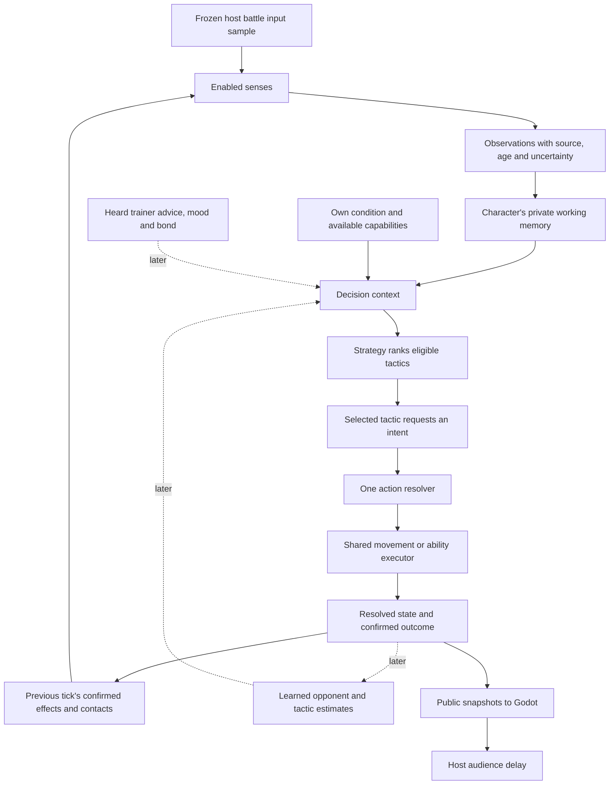

# Proposal: autonomous characters, senses, strategies and learning

Status: **6A idle/wander, 6A.1 dedicated threads/debugger and the 6B.1 focused/peripheral vision candidate are implemented; other senses, combat and learning remain later work**.
See [the implementation and commands](06b-autonomous-idle-walk.md) for the current runtime.
The [debugger checkpoint](06d-ai-debugger-harness.md) records the thread ownership,
telemetry contract, inspection controls and verification evidence.
Reviewed against this repository and the local `2dRpgGameEngine` combat strategy
sandbox on 2026-09-10. The reference repository was inspected without edits.

Checkpoint 5B has controllable trainers and automatic summoning. The first AI checkpoint is small: each summoned **character** independently alternates
between **idle** and **walk**. Keep `character` in code and contracts; “gladiator”
describes its gameplay role. A trainer is a separate entity.

Read [the first implementation slice](06a-idle-wander-implementation-plan.md) for
approved files, types, timing, protocol changes and acceptance checks. This document
explains how that slice grows into composable combat AI. [6B.1: focused and peripheral
vision](06g-focused-and-peripheral-vision.md) is implemented as a review candidate from its
[proposal](06f-focused-and-peripheral-vision-proposal.md): different precision contracts,
minimal visual memory and Observe/Face replacing random wandering. The [broader senses roadmap](06c-senses-and-ai-debug-windows-plan.md)
puts vision, olfaction, hearing and terrain sensing ahead of combat. The
[five-sense design](06j-combat-sensory-system.md) adds dedicated senses windows
and vision filters at 6B.1.1, with pain activated by real combat damage at 6C.
It keeps perceived state, memory, interpretation and decisions separate, without
an anatomy simulation. Use generic code names; MoPock is design shorthand only.
6B.1 passed [Team Lead technical re-review](06i-vision-team-lead-review.md);
physical-input QA remains outstanding. The
[MoPock research review](scratch2/planning.md) supplies the scientific background.

## 1. The model in plain language

Imagine each character carrying a notebook:

1. Its eyes, nose, ears and body report observations.
2. Its notebook records what it noticed, when, and how certain it is.
3. Its strategy uses that notebook and its own condition to choose a tactic.
4. The tactic requests an action; shared gameplay rules decide whether it can run.
5. The action produces a result. The character may later learn from that experience.

An Archer and an Orc can have different senses, preferences and memories while
using the same movement, damage, hitbox and projectile systems. Two instances of
Archer share immutable definitions and art, but have separate brains and notebooks.

An animation does not decide behavior. `walk` means the host accepted a legal walk
action, including its brief planted first step before translation; `idle` means
the character remained at rest. The [implementation record](06b-autonomous-idle-walk.md)
defines the action timing. `wander`, `keep_distance` and
`flank` describe behavior at a different level from animation states.



Solid arrows describe the intended ownership flow. The first checkpoint implements
only self/contact feedback, idle/wander decisions, action resolution, movement and
public state. Vision, smell, hearing and terrain sensing are the next family of
checkpoints; pain, opponent modeling and advice follow separately.

## 2. What exists here now

| Inspected source | Current fact and implication |
| --- | --- |
| [`server/session.odin`](../server/session.odin) | Separate `trainers` and `characters`; input belongs to trainers. Private AI is owned separately by `Simulation.battle`. |
| [`server/movement.odin`](../server/movement.odin) | 60 Hz simulation, 20 Hz snapshots, shared land/elevation collision. The trainer tick uses these mechanics; the battle tick also uses them for autonomous characters. |
| [`server/trainers.odin`](../server/trainers.odin) | Character spawn placement, 90-tick summon lock and distinct entity identities. AI must begin after that lock. |
| [`server/audience.odin`](../server/audience.odin) | History copies `Session` values. Large or pointer-backed cognitive stores must not be added to that copied record. |
| [`server/brain_workers.odin`](../server/brain_workers.odin), [`server/dev_ai_debug.odin`](../server/dev_ai_debug.odin) | Two dedicated workers receive private value copies; the host commits returned actions. A separate bounded writer journals real branches for optional inspectors. |
| [`client/world/game_arena.gd`](../client/world/game_arena.gd) | Predicts trainers and presents autonomous characters through `CharacterMotionPresenter`. |
| [`CharacterExports`](../client/characters/import/character_exports.gd) and [Archer exporter](../client/characters/packages/archer/exporter.gd) | Custom per-character imports already produce common art roles. The `ai.mode = player_only` field is an import-era placeholder; runtime wandering has an explicit game-provided binding, pending the behavior-export migration. |
| [Component contract proposal](04c-component-characters-and-animation-contract.md) | Already separates capabilities, intents, action rules and art. This proposal refines its AI section rather than replacing the asset pipeline. |

The art harness certifies required animations and sizing. It does not prove combat
mechanics, AI behavior, or learning. Keep those claims and tests separate.

## 3. What the reference sandbox teaches us

The following are live source observations, not claims that every proposed feature
already works there. Paths refer to the separate local reference repository.

| Reference source | Useful idea | How we improve the boundary here |
| --- | --- | --- |
| [`game.mk`, `run_game_dev_strategy_bridge`](../../../BurpazorTechnologies/2dRpgGameEngine/game.mk) | The strategy workbench composes the same combat-arena setup used by its checks. | Our launcher and AI harness call the production simulation, with explicit scenario settings. |
| [`creature.odin`, `creature_tick`](../../../BurpazorTechnologies/2dRpgGameEngine/game/creature.odin) | Readable stages: senses, memory, decisions, motion and outcome feedback. It still labels one stage as mixed decision/execution. | Use separate decision and execution stages from the beginning; prepare observations for all characters before moving any of them. |
| [`creature_combat_strategy.odin`](../../../BurpazorTechnologies/2dRpgGameEngine/game/creature_combat_strategy.odin) | A pure decision function consumes a context and returns intent plus reasons. | Preserve that pattern. Build context once from observations; do not give strategies world pointers. Its context builders still have access to live opponent positions, facing and defense fields, so visibility discipline rests partly on consumers. |
| [`creature_opponent_knowledge.odin`](../../../BurpazorTechnologies/2dRpgGameEngine/game/creature_opponent_knowledge.odin) | Explicit knowledge sources, confidence, ages and last-known positions. | Use typed uncertain observations. Recent pain/contact must record the event location or bearing and never follow a hidden source's new position. |
| [`creature_tactic_proposals.odin`](../../../BurpazorTechnologies/2dRpgGameEngine/game/creature_tactic_proposals.odin), [`creature_strategy_control_bridge.odin`](../../../BurpazorTechnologies/2dRpgGameEngine/game/creature_strategy_control_bridge.odin) | Proposals and one shared submit path prevent competing movement owners. Some proposal logic is a read-only model of settled combat, with a bridge to legacy decisions. | Make proposals the live decision input immediately. No parallel legacy/shadow controller or compatibility bridge is needed in this new implementation. |
| [`creature_pain_receptor.odin`](../../../BurpazorTechnologies/2dRpgGameEngine/game/creature_pain_receptor.odin) | Damage paths record bounded, time-stamped pain events. Disabling pain does not disable damage. The inspected receptor ring is a package-global read model; combat reaction uses separate combat memory. | Store behavior-relevant pain observations inside the character's private runtime. Debug views read that same record; the effect system alone owns damage. |
| [`creature_scent.odin`](../../../BurpazorTechnologies/2dRpgGameEngine/game/creature_scent.odin), [`creature_olfaction.odin`](../../../BurpazorTechnologies/2dRpgGameEngine/game/creature_olfaction.odin) | Opponent smell returns coarse bearing/strength without an exact position. Food scent already influences foraging separately. | Give olfaction a typed bearing/strength result. Do not claim scent drives the inspected combat strategy dispatcher: its context does not consume that reading. |
| [`creature_cognitive_route.odin`](../../../BurpazorTechnologies/2dRpgGameEngine/game/creature_cognitive_route.odin) | Bounded local A* reads a character's private cognitive map, with a 96-expansion cap. | Preserve knowledge-limited navigation when planning arrives. Choose our own measured budget; random walking needs no route planner. |
| [`creature_memory_disk.odin`](../../../BurpazorTechnologies/2dRpgGameEngine/game/creature_memory_disk.odin) | A versioned portable memory format separates traits/learning from future spatial persistence. | Separate stable character identity, opponent experience and map knowledge. Do not use a default shared memory file as each character's identity. |
| [`combat_strategy_lab_panel.odin`](../../../BurpazorTechnologies/2dRpgGameEngine/game/combat_strategy_lab_panel.odin) | Per-fighter strategy pins and tactic preferences are visible and inspectable. | Our eventual composition should select several eligible tactic modules with explicit arbitration. Pinning a named existing strategy is not yet that composer. |

We are borrowing lessons, not source code, constants, physiology, compile-time flags
or the reference's migration architecture. This was focused source inspection,
not a runtime acceptance test of the reference engine.

## 4. Ownership and project structure

Use typed data and explicit procedures. Checkpoint 6A.1 adds a dedicated native thread
for each creature, outside the copied simulation state. Keep the package boundary
real: AI code cannot import ENet, Godot, `Session` or an arena tilemap. No new ECS
framework, behavior graph editor or network service is needed.

```text
server/                         package main: host integration and authoritative world
  simulation.odin               Simulation { session, battle }; fixed-step composition
  battle.odin                   Battle_Runtime; identity/reset; context/intent adapter
  brain_workers.odin            dedicated threads and per-creature copied mailboxes
  dev_ai_debug.odin             bounded queue and separate journal/snapshot writer
  character_actions.odin        action eligibility, movement result, public locomotion
  ai/                           package ai: no engine/network/world dependencies
    types.odin                  Agent, Decision_Context, Intent, Action_Result
    orchestrator.odin           controller dispatch and decision records
    wander.odin                 Wander_Config / Wander_Runtime; idle-walk behavior
    random.odin                 per-agent deterministic PRNG
    trace.odin                  optional bounded branch instrumentation
    *_test.odin                 pure behavior tests
```

These first-slice files are implemented; see the checkpoint for actual procedure names. Add later files only with their features:

| Later location | Ownership |
| --- | --- |
| `server/observations/types.odin`; `server/perception/vision.odin`, `grid_visibility.odin` | Proposed separate data-only brain input contracts and privileged sensor queries. AI imports observations; only the host supplies world samples to perception. |
| `server/senses.odin` | Host adapter that samples the world once, schedules sensors and delivers personal observations. |
| `server/ai/working_memory.odin` | Later expiry, confidence and belief updates over sensory evidence. |
| `server/ai/strategies.odin`, `tactics/*.odin` | Validated strategy composition and bounded tactic state. Introduce subpackages only when they have a clean dependency boundary. |
| `server/ai/opponent_model.odin`, `learning.odin` | Observation-based experience aggregation and bounded preference updates. |
| `server/cognition_store.odin` | Durable memory adapter outside the simulation tick. |

`Simulation` owns both `Session` and `Battle_Runtime`. Network transport continues
reading the session. `Battle_Runtime` owns each agent's mutable state, keyed by
round and runtime entity ID. It must not be embedded in the audience's copied
session or added as a pointer to a historical frame. Public action/position fields
belong in the session; private memory, random state and scores stay in battle.
During a decision, each worker exclusively changes its own copied agent/context;
the host commits returned values after collection. No agent shares mutable memory
or random state with the other agent. Debug windows read exported records and never
execute an additional AI or send gameplay input.

Keep only two agent slots for now, matching the two-character roster. An audience
join creates no agents and consumes no AI random values. Growth to many characters
can replace storage without changing the decision/intent contract.

### Character definitions, instances and persistent identity

| Record | Lifetime | Example contents |
| --- | --- | --- |
| Character definition | Shared immutable content | Body size, movement limits, senses, ability references, default AI profile. |
| Runtime character / agent | One round and spawn | Entity ID, position, action, RNG, tactic progress, working memory. |
| Persistent character identity | Later, across matches | Stable ID assigned by the host; ownership, training history and saved learning. |
| Art export generation | Immutable processed output | Common animation bindings, frames, metrics and source provenance. |

Two Orcs must not share mutable beliefs because they share a definition ID.
A reconnect or new runtime entity ID must not become a new persistent identity
accidentally. Persistent identity does not exist yet and is not needed for wander.

### Preserve independently authored packages

Each character keeps its own asset importer/exporter. No sensing or strategy code
may inspect sprite names, texture pixels, PNG dimensions or private `art.json`.
The [existing gameplay-size ruler](04b-gameplay-size-proposal.md) also applies to
sense ranges and ability geometry: configure gameplay units, convert once to world
units; do not derive vision range from sprite resolution.

The first wander checkpoint uses an explicit game-provided `idle_wander` controller
for all six selectable definitions. This is a scenario/default behavior binding,
not an inference from the old art export's `player_only` placeholder. Record its
configuration source in development telemetry. Do not present this as validation of
character-authored AI exports.

The vision checkpoint first adds an explicit game-authored `senses.json` catalog,
validated and fingerprinted by host and client. Its configuration source is recorded
as `game_catalog`; the full package export migration is not a prerequisite for vision.
See the [current content and geometry proposal](06f-focused-and-peripheral-vision-proposal.md#5-geometry-sight-blocking-and-configuration).

A later content checkpoint introduces a separate versioned **behavior contract**:
`character.behavior@0.1.0` (proposed). Each package's custom exporter emits its
controller/profile reference, sense configuration, declared capability requirements
and tuning. A coordinator validates those public exports and produces a data-only
host bundle with provenance; the host never executes GDScript importers. Retire the
old `player_only` placeholder explicitly with that export/API migration. The art
contract and its raw/processed asset history remain independent.

A later custom native character decision module implements the same context-to-intent
interface and is registered at build time. It cannot mutate health, spawn a private
projectile implementation or replace common `hurt`/`death` rules. An exported module
may select shared capabilities, not bypass them.

## 5. Separate behavior, action and animation

| Level | Responsibility | Example |
| --- | --- | --- |
| Strategy | A policy for choosing tactics toward a larger objective | Preserve distance while finding safe ranged opportunities. |
| Tactic | A bounded behavior with progress, completion and cancellation | Wander briefly, retreat to space, approach a known target, flank. |
| Intent | A request for this tick or bounded action | Hold, move in a direction, use ability at an observed target. |
| Action system | Validates requests and owns execution/state transitions | Applies legal movement, starts an ability, enforces hurt/death locks. |
| Animation role | Presentation of resolved gameplay state | `idle`, `walk`, later `hurt`, `attack`, `death`. |

**Wander is a tactic.** The first controller simply alternates waiting and this one
tactic. Do not manufacture a complex strategy tree to choose between two states.
The explicit context, intent and result seam is the useful foundation.

For future combat, use utility scoring over a bounded set of eligible tactics,
with a small state machine inside a multi-step tactic. For example:

```text
Ranged control strategy:
  retreat_to_spacing   eligible when a known threat is too close
  seek_firing_lane     eligible when a target is known but the lane is unsuitable
  use_primary         eligible when a perceived opportunity and capability allow it
  hold_observe        fallback

Tactic -> same Move / Hold / UseAbility requests as every other strategy
```

Score eligible candidates from a common range, then apply bounded profile, mood,
learned and advice adjustments. Ineligible tactics cannot win with a large bonus.
Use deterministic tie-breaking, a minimum commitment window and a switch margin
(hysteresis) to prevent indecisive switching every tick. A tactic returns
`Running`, `Succeeded`, `Failed` or `Cancelled`, with a reason. New sensory evidence
or an urgent effect can interrupt within the shared action rules.

Start with a single exclusive voluntary action owner. Later abilities explicitly
declare whether movement can run concurrently. Avoid two unrelated movement and
attack controllers both assuming they own facing or locomotion.

| Precedence | Owner / effect | Rule |
| --- | --- | --- |
| 1 | Despawn, round reset, death | Clear pending intent and tactic state; no living action executes. |
| 2 | Summon lock; later hurt/stun | Reject voluntary action; return a visible reason. |
| 3 | Committed ability phase | Its interruption/movement policy applies; not a strategy override. |
| 4 | Selected eligible tactic | Produces the voluntary request. |
| 5 | Hold fallback | Safe outcome when no eligible or valid request exists. |

Only summon/reset and voluntary movement are implemented in the first slice.
Damage, forced displacement and status effects later have explicit effect owners;
they do not impersonate a voluntary tactic.

## 6. Senses and private knowledge

Senses report evidence. They do not directly choose attacks or apply damage.
The host knows the full world to enforce rules; individual AI contexts do not.

| Sense | Evidence it can provide | What it cannot infer automatically |
| --- | --- | --- |
| Vision | Focused positions/observable facing and locomotion; anonymous coarse peripheral cues; range, field of view, occlusion and sample tick. Later visible terrain and attack tells. | Hidden positions, exact peripheral coordinates, private cooldowns, enemy strategy or exact unseen health. |
| Pain / damage | Own perceived hurt/severity, event tick and optional gameplay-supported impact direction; no detailed anatomy. | Hidden attacker identity/position, attack name or the attacker's damage stat. |
| Terrain / tactile | Ground underfoot, blocked motion, contact normal/material where the collision system can establish it; later sensed ground vibration. | Geometry behind a wall or the full reachable map. |
| Olfaction | Locally sampled strength, approximate bearing, recognized scent class/signature when available. | Exact coordinates, facing, attack windup or a magical entity lookup. |
| Hearing | Sound category, estimated direction/range and uncertainty; later trainer advice if heard. | Guaranteed truth of an instruction or the speaker's current hidden position. |
| Self-condition | Own movement, fatigue, health/pain and usable abilities. | The opponent's internal state. |

Pain and damage are separate: armor can alter actual damage, and receptor settings
can alter perceived pain. A pain-disabled character can still be injured or die.
The confirmed effect emits an event once; its receptor consumes it once. Immunity
or damage reduction belongs in the effect rules, not the receptor.

Use tagged observation payloads rather than a generic record containing an always
available exact `target_position`. Common metadata: observation ID, observer,
sampled tick, source, confidence, expiry and optional recognized subject.
`VisibleTarget` may contain a position; `ScentBearing` contains bearing and strength;
`PainContact` contains impact evidence. Unknown is distinct from zero or false.

Working memory may retain a last-known position with age and uncertainty. It cannot
refresh from a live entity pointer after visibility is lost. Evidence merging must
preserve provenance: scent does not reset a visual position's age to zero. A remembered
opponent cooldown is an estimate learned from observed events, not a private timer read.

Terrain physics remains authoritative and uses the real map. Future route planning
uses only observed/remembered cells or a declared public-map rule. The first wander
slice simply tries short movement and reacts to collision; it does not secretly
consult full-map reachability. Add vision/terrain observation before knowledge-based
routing. Separate terrain flags for movement blocking, vision occlusion, projectile
blocking and scent permeability when those mechanics arrive; one `blocked` flag
cannot define all senses correctly.

## 7. Fixed ticks, latency and debugging

Prepare observations and decisions for every character from the same frozen battle
input before executing creature movement. The current `simulation_tick` advances
the session/trainers first; sample after that update and before either creature's
action. Otherwise P2 could perceive P1 after it moved
while P1 perceived the previous P2 position. Confirmed effects become next-tick
sensory input in a documented order. Shared combat execution will separately need
an explicit simultaneous-hit/order rule.

Proposed schedule, subject to measurement:

- Physics/action rules: existing **60 Hz**.
- State snapshots: existing **20 Hz**; player inputs continue at 60 Hz.
- Wander orchestrator: invoked every tick on its worker, with direction selection
  scheduled once per six ticks (**10 Hz**), retained intent and immediate cancellation
  on locks/reset or blocked execution. Every invocation has its own trace.
- Vision in 6B.1: sample each creature on its first unlocked battle tick and its
  profile interval, initially every six ticks (10 Hz); retain the original timestamp
  between queries. The [current proposal](06f-focused-and-peripheral-vision-proposal.md)
  adds private visual memory and replaces wandering with Observe/Face.
- Later senses/strategy scoring: bounded tick schedules, staggered only when needed
  and specified. Sample times and reaction latency are part of the gameplay rules.
- Confirmed damage/contact: queued during execution and processed at the next tick;
  action locks take effect through gameplay rules without waiting for slow scoring.
- Learning consolidation/disk I/O: outside the tick, bounded queues; never pause
  movement or networking while waiting for a database or model.

The production host now submits both contexts to two dedicated threads before
collecting either bounded decision. The serial path remains a test reference, and
tests compare its simulation state against the threaded path. A private seeded PRNG
keeps decisions independent of render FPS, network traffic and wall-clock time.
Cross-CPU bit-identical float simulation is not promised. Longer thoughts must become
resumable across ticks; see the [future thought protocol](06d-ai-debugger-harness.md#next-independent-thought-progress-and-sensory-causality).
Thread completion time itself must not determine gameplay reaction speed.

Record the decision when it executes: tick, controller/tactic, requested intent,
resolved locomotion, result/rejection and compact reason. Debug code reads this
record instead of reconstructing a decision after the world has changed. The implemented
[development harness](06d-ai-debugger-harness.md) opens an independent Godot AI window
per creature, with atomic history snapshots and rotating JSONL journals. It includes
branch ancestry, rejected choices, native thread IDs and confirmed host feedback.
Its step controls replay recorded decisions while the live simulation continues.
Private brain data is not part of ordinary client snapshots, and these windows do
not join as audience peers. Any debug state drawn inside an audience game window
must still use the same delayed frame as its positions and actions.

## 8. Cognitive database: prepare identity and evidence first

A character's “cognitive database” should begin as small typed in-memory stores,
not a database query or language-model call for each decision. Separate:

| Store | Examples | Retention |
| --- | --- | --- |
| Working memory | Last seen opponent, recent pain, an unfinished tactic | Bounded, ages out; reset per match. |
| Spatial knowledge | Seen passages, blocked cells, uncertain routes | Map ID + content version; reset first, persist later only intentionally. |
| Episodic experience | Observed cue → attempted tactic → confirmed outcome | Bounded ring for attribution/debugging. |
| Opponent model | Observed attacks, range habits, estimated response tendencies | Stable recognized opponent identity; conservative style prior when identity is unknown. |
| Learned preferences | Outcome estimates for tactics in a context | Versioned, bounded adjustments separate from authored defaults. |
| Trainer relationship | Bond, trust, receptivity history | Later persistent identity; independent from art/definition. |

Example: Archer observes Orc repeatedly close distance, tries retreating before a
shot, and records whether that sequence improved spacing and avoided damage. After
several supported observations, it increases the estimated value of retreating in
that context. One lost exchange is weak evidence, not proof that all Orcs behave
that way. An unobserved attack contributes no invented visual cue.

Link experience to a decision/action ID and a bounded outcome window. Distinguish
“never attempted”, “attempt blocked”, “missed”, “hit”, “interrupted” and “outcome
unknown”. Keep sample counts, confidence, recency and uncertainty. Learn from actual
results, not from an animation playing or a proposed action being selected.

Begin later with smoothed counts/values and bounded preference updates; do not add
neural training or a general strategy generator to wander. Preserve a frozen
learning-off baseline and seeded evaluation scenarios so adaptation can be measured.
Forgetting/recency weighting prevents ancient matches from overwhelming new evidence.

When cross-match persistence is implemented, use a host-owned store behind an
interface such as `load_profile`, `enqueue_checkpoint`, `flush_completed`.
SQLite is a candidate for that small local host store, not a dependency to add now.
Specify persistent character ID, schema version, behavior model version, gameplay
content hash, opponent key and map version where relevant. Load before the round,
checkpoint copied data outside the tick, and make writes idempotent and atomic.
Missing/corrupt/old data falls back explicitly to authored defaults; migrations
must not silently turn stale knowledge into current facts.

No persistent identity, database, opponent learner or actual adaptation is included
in the initial idle/walk checkpoint.

## 9. Trainer advice preserves character agency

Future advice is an event addressed to the trainer's character, validated by the
host for ownership, range/hearing, timing and rate. It changes context/preferences
through mood, bond and receptivity. A character may accept, partly follow or ignore
it, with an inspectable reason. Advice cannot bypass death, hurt, cooldowns or missing
capabilities, and it never grants exact knowledge of a hidden enemy merely because
the trainer's client renders it.

Do not turn the trainer's current summon `advise` animation into a gameplay command.
That gesture remains a summon presentation cue until the advice feature exists.

## 10. Phases and review checkpoints

| Phase | Visible result | Exit criterion |
| --- | --- | --- |
| **6A — Idle and wander (implemented)** | Each summoned character independently rests and walks on legal terrain. | Shared orchestrator/intent/action path, host state, delayed audience, stable reset and reproducible tests. |
| **6A.1 — Threads and debugger (implemented)** | Two private native workers, real decision trees, journals and separate Godot inspectors. | Serial/threaded equivalence, bounded diagnostics, replay, native windows, independent close, reload and release export gate. See [evidence](06d-ai-debugger-harness.md). |
| **6B.1 — Focused/peripheral vision** | Different precision contracts, occlusion, small private visual memory and Observe/Face replacing wandering. | Evidence-only decisions, hidden-world invariance, two inspectors and recorded replay. See the [proposal](06f-focused-and-peripheral-vision-proposal.md). |
| **6B.1.1 — Dedicated senses inspectors** | One separate native senses window per creature and vision-cone debug filters. | Correct live evidence/precision/age, separate memory, bounded logging/replay, native-window lifecycle and measured responsiveness. See [requirements](06j-combat-sensory-system.md). |
| **6B.2–6B.4 — Remaining initial senses** | Olfaction, hearing and terrain/tactile observations, one checkpoint at a time. | Approximate evidence, modality-specific limits and age are visible; no hidden-coordinate lookup. |
| **6C — First combat action and pain** | One shared melee or projectile ability, hurt/death, real pain feedback. | Ability/effect/hitbox ownership and event attribution work before strategic complexity. |
| **6D — Richer memory and composable tactics** | Expand minimal visual memory into combined sensory beliefs and competing tactics with priorities and interruptions. | One resolver, reasons visible, no rapid flip-flopping, hidden-state access or capability bypass. |
| **6E — Mood and trainer relationship** | Temperament, temporary mood and perceived trainer advice affect bounded preferences. | Explainable personal behavior; subjective trainer feedback stays distinct from combat effectiveness. |
| **6F — Learning and persistence** | A character adapts to observed opponents across controlled trials; later across matches. | Learning-on/off evidence, stable identity, bounded memory, compatible save/load. |

The **6A contract**, **6A.1 harness** and **6B.1 vision foundation** are implemented;
6B.1 passed technical re-review. The next checkpoint is **6B.1.1**: dedicated live
senses windows, building on the [implemented arena vision filters](06k-arena-sense-overlay.md),
before implementing the remaining senses.
History and decision inspection stay in the existing debugger and replay tools.
Later phase interfaces are direction, not instructions to scaffold every future
module.
