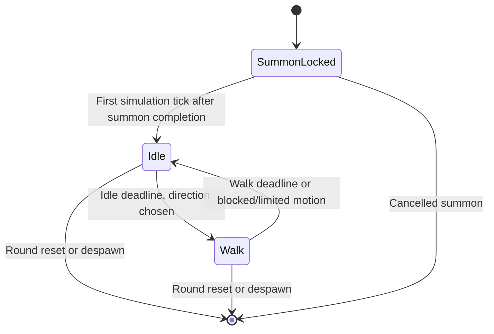

# Checkpoint 6A implementation plan: idle and random walking

Status: **approved plan, implemented**. See [current code ownership, behavior and checks](06b-autonomous-idle-walk.md).
Architecture and the inspected reference sources are in
[the AI orchestration proposal](06-character-ai-orchestration-proposal.md).

## Player-visible behavior

After the existing five-second countdown and 1.5-second summon sequence, each
character independently alternates between standing idle and taking a short walk.
The trainer remains controlled with WASD/arrows and retains the centered camera.
P1, P2 and audience render the same host-owned character actions and positions;
audience keeps its configured delay, five seconds by default.

Archer/Orc use their processed `idle` and `walk` clips. Shapes also wander and display
the same development action labels. This phase does not add attacks, opponent
tracking, following the trainer, advice, smell, vision or learning.

## 1. Concrete first settings

These are proposed initial values, not measured balance targets:

| Setting | Initial value |
| --- | --- |
| Controller | `idle_wander`, provided by the game for all six current character definitions |
| Idle duration | Seeded integer choice, 45–120 ticks (0.75–2 seconds) |
| Walk duration | Seeded integer choice, 30–90 ticks (0.5–1.5 seconds) |
| Movement speed | 64 world units/second (2 gameplay units/second) |
| Direction | One of eight normalized directions, retained for a walk interval |
| Roam radius | 128 world units (4 gameplay units), centered on the character's summon position |
| Decision cadence | Every 6 ticks; deadlines/action eligibility checked every physics tick |
| Candidate budget | At most 8 direction candidates per decision; no random-until-success loop |
| Blocked response | Return to idle; wait at least the configured idle minimum before retrying |

Keep settings in a typed `Wander_Config` with validation. One default config is
enough now; package-authored tuning belongs to 6B. The roam anchor is fixed at summon,
not secretly updated from a trainer's live position. This keeps a development demo
near its starting area without implementing following. The radius is configurable
and constrains proposed steps; it cannot teleport a character back to the anchor.

Choose from directions compatible with that radius using self position only.
Do not ask the global map which destination is reachable. Shared collision tries
each actual movement step and supplies a result. No routefinding is needed yet.
An enclosed character idles and retries at bounded intervals; it must never spin,
walk through a wall, teleport or continue walking in place after the bounded
first-step preparation described in the implementation record.

## 2. Runtime ownership and exact files

The approved file boundaries are implemented. The current procedure names and small refinements are listed in [the implementation record](06b-autonomous-idle-walk.md).

| File | Types / procedures | Responsibility |
| --- | --- | --- |
| **New** `server/ai/types.odin` | `Agent`, `Decision_Context`, `Intent`, `Intent_Kind`, `Action_Result`, `Decision_Record` | Engine-independent contracts and per-agent state. Use plain vectors/scalars, no world or client pointers. |
| **New** `server/ai/random.odin` | `Random_State`, `random_next`, `random_range` | Explicit integer PRNG; per-agent stream seeded from scenario seed, round and entity ID. |
| **New** `server/ai/wander.odin` | `Wander_Config`, `Wander_Runtime`, `Wander_Phase`, `wander_decide` | The finite idle/walk tactic, durations, direction choice and bounded retries. |
| **New** `server/ai/orchestrator.odin` | `agent_reset`, `agent_decide`, `agent_record_result` | Calls the registered controller, retains its intent, records actual result; starts with one controller. |
| **New** `server/simulation.odin` | `Simulation`, `simulation_tick` | Owns `Session` and private `Battle_Runtime`; composes existing lifecycle/trainer ticks with the character tick. |
| **New** `server/battle.odin` | `Battle_Runtime`, `battle_sync`, `battle_decide`, `battle_execute` | Binds two private agents to current character entities; prepares all contexts before executing any intent. |
| **New** `server/character_actions.odin` | `character_resolve_intent`, `character_execute_move`, `Character_Action_Result` | Sole voluntary character movement owner; checks summon/state locks, validates finite bounded input, returns displacement/block reason. |
| **Modify** `server/main.odin` | Main loop | Own `Simulation`, give network its session, and call `simulation_tick` in every real scenario. |
| **Modify** `server/movement.odin` | Existing `character_move`, shared movement helper | Extract speed-aware collision mechanics; trainer wrapper preserves 180-unit speed and current prediction behavior. |
| **Modify** `server/session.odin` | Public character locomotion fields | Publish only resolved state/facing/timing; keep all RNG, cognition and tactic memory outside `Session`. |
| **Modify** `server/protocol.odin`, `server/network.odin` | v8 encoders and buffer sizes | Encode the small public locomotion addition; preserve history routing. |
| **Modify** `client/network/protocol.gd`, `client/session/session_snapshot.gd` | Matching decoded fields and validation | Reject malformed or unsupported locomotion, facing and timing. |
| **New** `client/characters/character_motion_presenter.gd` | `CharacterMotionPresenter` | Per-character snapshot interpolation and authoritative role/facing/timing presentation; no random choices. |
| **Modify** `client/world/game_arena.gd`, `client/characters/character_view.gd` | Character presenters / view application | Integrate autonomous presentation without turning the large arena script into a brain. Keep trainer prediction separate. |
| **Modify** `client/dev/reload_controller.gd`, `tools/dev_session.py`, `Makefile` | Status, seed forwarding, checks | Report public actions; expose `SEED` for replay, rebuild nested Odin AI source changes, run AI package tests. |

Because Odin directory packages are separate, `odin test server` does not replace
`odin test server/ai`. Add both to the relevant Make check target.

### Minimal decision contract

```text
Decision_Context (read-only value):
  round/entity identity, simulation tick
  own position and resolved locomotion
  movement availability and last action result
  configured roam anchor/radius

Agent (private mutable value):
  controller ID, independent RNG state
  wait/walk phase, phase deadline, desired direction
  retained intent, next decision tick, last decision/result

Intent:
  Hold | Move(direction)

Action_Result:
  accepted/rejected, reason, actual displacement
  terrain_blocked / anchor_limit / locked / completed
```

No opponent pointer, raw arena tile array, mutable trainer state or fake empty
“cognitive database” is needed. The context can grow with typed observations in 6B.
Record an attempted blocked move separately from the resulting `idle` state.

`Battle_Runtime` is not part of spectator snapshots. `battle_sync` compares round
and entity IDs before every character tick, resets outside InArena, and initializes
newly spawned agents once. A lifecycle command may change the session between fixed
ticks; no old intent or debug record may be consumed after its identity stops
matching. Audience joins leave all agent state untouched.

## 3. Tick and state transitions



`SummonLocked` is a gameplay lifecycle constraint, not a new required character art
role. This slice adds only the public locomotion values `idle` and `walk`.

1. Capture the start-of-tick phase/lock state and synchronize agent identities.
2. Run existing session/countdown/trainer updates.
3. Synchronize new arena-entry identities, but do not execute AI while the tick
   began under a summon lock. First movement is permitted on the tick after 90.
4. Build both decision contexts from one character-position snapshot. At a scheduled
   decision, call `agent_decide`. Retain the intent between decisions.
5. Resolve every character intent against current action constraints, then execute
   legal movement through shared terrain/boundary/elevation checks.
6. Begin `walk` with a validated direction and 12 ticks of planted preparation;
   then derive continuing locomotion/facing from **actual displacement**. Keep
   the previous facing at rest. Set a state-start tick only when
   locomotion changes. Blocked movement clears the retained move request and starts
   its idle/retry interval without waiting for another decision slot.
7. Record the result for next-tick feedback. Publish normal snapshots/history.

Initially there is terrain collision, as in 5B; character/trainer body-to-body
collision is not added implicitly. Overlap is possible when paths cross. Combat
collision, avoidance and projectile sweeps get their own later rules and tests.

Deadlines use wrap-safe tick comparison, including zero-valued initial state and
long-running hosts. Rendering and connection events must not consume AI random
values. A normal Ready match and a dev scenario use the same AI tick path.

## 4. Public state, client animation and audience

Implemented protocol **v8**, preserving v7 record offsets and appending this six-byte
presentation record for each gladiator after the summon clock:

| Bytes per character | Field | Encoding |
| --- | --- | --- |
| 1 | Locomotion | Explicit wire value: 0 idle, 1 walk |
| 1 | Facing | Explicit documented eight-direction values, shared by both codecs |
| 4 | State start tick | Unsigned little endian; elapsed uses serial tick arithmetic |

Two additions cost 12 bytes: **SessionState 126 bytes in arena** (32 otherwise),
**WorldState 109 bytes**. The existing 128-byte limit still accommodates this exact
slice but has little room left. Any later combat expansion must deliberately revise
packet sizing/bounds, rather than assuming the current cap is sufficient.

Character input mask/ack fields remain zero; those belong to trainer control.
Do not overload them with AI intent bits. Validate state/facing enums, stable
identities and state-start time relative to the snapshot tick. Add paired literal
Odin/GDScript fixtures before shipping v8.

`CharacterMotionPresenter` keeps a short received snapshot pair and presents a
consistent position, role and facing on that timeline. At a state boundary, use the
new role when its start tick is reached. Late join begins from received current
state and elapsed ticks; it must not restart the summon or decide a new direction.
When the feed stalls, do not extrapolate autonomous movement indefinitely. All
clients treat AI characters as remote; only trainers use input prediction.

The action label comes from host locomotion. A snapshot correction must not make an
idle character appear to have chosen walking. If a walk interval ends against a
wall, the host publishes idle regardless of the retained visual direction.

Audience transport still reads historical `Session` values, now including these
public action fields. There is no separate live AI broadcast, spawn event or action
message that bypasses the audience delay. History never stores pointers into
`Battle_Runtime`. A debug inspector with private information is future work.

## 5. Harness and acceptance checks

Extend the existing development launcher first; do not build a strategy editor or
reuse the art-only character harness as a second simulation.

Supported commands:

```sh
make dev_arena P1=archer P2=orc ARENA=tiny_swords_village AUDIENCE=1 SEED=42
# Immediate audience for visual comparison during development:
make dev_arena P1=archer P2=orc ARENA=stone_garden AUDIENCE=1 AUDIENCE_DELAY=0 SEED=42
```

`SEED` is supported, defaults to 1, and accepts an unsigned 32-bit integer.
Keep the launcher ready condition tied to summon completion, not an arbitrary AI
phase. Validated code/data reload resets the scenario and seed; pure visual reload
must preserve current agent state.

| Verification | Required evidence |
| --- | --- |
| `server/ai/wander_test.odin` (new) | Same seed/context yields same decisions; bounded durations/directions; independent per-agent state; no reroll every frame. |
| `server/battle_test.odin` (new) | Real `simulation_tick`: both agents eventually idle/walk; no motion under summon lock; legal terrain/elevation on all maps; blocked retry stays bounded; reset/new round removes stale intent. |
| Existing trainer checks | WASD, prediction, summon timing, camera and role ownership still hold. Update stationary-gladiator expectations only after 6A is active. |
| `tests/character_ai_check.gd` (new) | Two actual clients plus audience: motion/role correspondence, delayed history, late join, mirror picks, disconnect/reset. Include shapes and Archer/Orc. |
| Codec tests | v8 literal byte fixtures, invalid enum/timing/length rejection, old-version rejection. |
| Developer workflow | Seed forwarding, nested `server/ai` edits trigger validated relaunch, art reload preserves agents, failed save preserves the running match. |
| Graphical captures | Idle/walk at land edges, both trainers present, action labels readable; audience shows the correct delayed scene. |

For isolation, compare the simulation with and without an audience connection: same
scenario seed and player inputs must produce the same AI path. For mirror picks,
assert separate state and random streams; do not require that two valid random
choices can never coincide.

Measure simulation tick time separately from rendering FPS and network ping. Record
worst-case blocked work and allocations over a bounded run; do not claim Internet
latency from local loopback tests. The implemented enclosed-world test measures 3,600 production ticks with allocators disabled. See the checkpoint for verification commands.

## 6. Implementation order

1. Add the pure AI package and its deterministic idle/wander checks.
2. Add private battle ownership and the production simulation adapter; implement
   shared movement results and prove lock/collision/reset behavior.
3. Extend v8 codecs and autonomous character presentation together; verify players
   and delayed audience in the same scenario.
4. Add seed support, update affected checks/docs, run the appropriate regression
   suite and capture the rendered result.

Stop after this visible checkpoint. Build senses, combat strategies and cognitive
persistence in their own reviewable phases from the architecture proposal.
