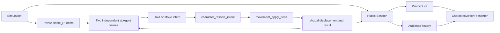

# Checkpoint 6A: autonomous idle and walk

Historical record. [Checkpoint 6B.1](06g-focused-and-peripheral-vision.md) replaced the
default `idle_wander` controller and its private RNG with the deterministic Observe tactic;
the shared Move capability, its resolver rules and presentation timing below remain in place
and tested, but no default tactic requests translation any more.

Implemented in 6A: summoned characters independently walk and idle on the Odin host.
The [architecture proposal](06-character-ai-orchestration-proposal.md) remains the
roadmap for senses, composable strategies, trainer advice and learning. Those later
features are not implemented by this checkpoint.

```sh
make dev_arena P1=archer P2=orc ARENA=tiny_swords_village AUDIENCE=1 SEED=42
# Immediate audience when comparing windows during development:
make dev_arena P1=triangle P2=diamond ARENA=stone_garden AUDIENCE=1 AUDIENCE_DELAY=0 SEED=42
```

Both normal Ready and the development launcher use the same simulation. Normal
Ready runs the five-second countdown; both paths retain the 1.5-second summon.
WASD/arrows move the trainer and its fixed camera. Characters wander around their
own summon positions. Audience cameras remain independent and audience gameplay
is delayed five seconds by default.

## Behavior and configuration

All six selectable character definitions use the game-provided `idle_wander`
controller. Defaults live in [`wander_defaults`](../server/ai/wander.odin):

| Setting | Value |
| --- | --- |
| Idle interval | 45–120 simulation ticks; direction selection on the next scheduled decision can add up to 5 ticks |
| Walk interval | 30–90 simulation ticks including first-step preparation, with immediate stop on expiry or failed execution |
| First step | 12 stationary ticks (200 ms) at the beginning of each walk action; timing owned by `server/character_actions.odin` |
| Walk speed | 64 world units/second (2 gameplay units/second) |
| Roam radius | 128 world units (4 gameplay units) from the character's fixed summon anchor |
| Decision schedule | Every 6 ticks for direction selection; locks, deadlines and execution checked every tick |
| Randomness | Independent integer PRNG per character; seed + round + entity ID |
| Direction attempts | At most eight per choice; no map reachability query |

The first private idle interval begins after the summon lock. The character never
walks during summoning. Walking uses the existing circular footprint and terrain,
boundary, stairs and elevation rules. A blocked request cancels the walk and starts
an idle interval before retrying. Partial wall sliding can move the character on
that final tick; public locomotion reports that actual displacement, then becomes
idle on the next tick.

The anchor is not attached to the trainer. This phase implements wandering, not
following, chasing or combat. Existing body-to-body collision remains deferred, so
characters can overlap trainers or each other. Raw art, importers and processed
assets are unchanged by AI.

`SEED` accepts 0–4294967295, defaults to 1, and is forwarded to the host as `--seed`.
It is supported by `make run_server` too. Repeating the same build, map, seed, round
and entity identities reproduces AI decisions. Audience joins, rendering FPS and
trainer inputs do not consume the AI stream. Cross-platform floating-point
bit-identical replay is not promised.

## Code ownership



| Source | Actual responsibility |
| --- | --- |
| [`server/simulation.odin`](../server/simulation.odin) | `Simulation` owns session and battle; `simulation_tick` composes lifecycle/trainer ticks and character AI. |
| [`server/battle.odin`](../server/battle.odin) | `Battle_Runtime`, `battle_sync`, `battle_tick`: bind agents to round/entity IDs, build all contexts, decide all intents, then execute. |
| [`server/ai/types.odin`](../server/ai/types.odin) | Value-only `Decision_Context`, `Agent`, `Intent`, `Action_Result`, `Decision_Record`. No ENet, Godot, tilemap or world references. |
| [`server/ai/orchestrator.odin`](../server/ai/orchestrator.odin) | `agent_reset`, `agent_decide`, `agent_record_result`: controller dispatch, retained requests and feedback. |
| [`server/ai/wander.odin`](../server/ai/wander.odin), [`random.odin`](../server/ai/random.odin) | The initial tactic, validated config, bounded choices, wrap-safe deadlines and private PRNG. |
| [`server/character_actions.odin`](../server/character_actions.odin) | One voluntary action resolver; separate `Character_Action_Limits`, movement validation, resolved locomotion/facing and rejection/contact result. |
| [`server/movement.odin`](../server/movement.odin) | Shared axis-separated collision helper. Trainer movement retains its 120-unit speed; trainer action timing is handled by `trainer_tick_motion`. |
| [`CharacterMotionPresenter`](../client/characters/character_motion_presenter.gd) | Snapshot interpolation and sampling host locomotion/facing/animation age. Every AI character is remote, including the local trainer's character. |
| [`CharacterView`](../client/characters/character_view.gd) | `present_locomotion` binds host state to common `idle`/`walk` art and the dev action label. Trainer prediction supplies its own clock; harness playback remains independent. |

The host prepares both character contexts before either character moves. Execution
is the only writer of character positions and public locomotion during play. The AI
package mutates only private decision state. Collision returns feedback; it never
runs a strategy. `Character_Action_Limits` does not depend on `Wander_Config`.

`Battle_Runtime` is a sibling of `Session`, not a field or pointer inside it.
Audience history therefore copies no brains, RNG state or future cognitive data.
A reset clears public entities immediately; the next fixed tick clears or rebinds
private agents before any further AI use. Identity is checked every tick, so an old
intent cannot act on a replacement character.

Each agent retains a `Decision_Record` containing the tick, decision reason,
requested intent, actual result and displacement. This is the seam for a future
inspector. The host startup log names the controller, configuration source
(`scenario_default`) and seed. Client development status files expose public
locomotion/facing/state timing only; no private brain stream bypasses spectator delay.

## Public state and animation

[Protocol v9](protocol.md) carries six bytes per entity: locomotion, facing and
state-start tick. Arena SessionState is 138 bytes; WorldState is 121 bytes. Update
host and clients together. The packet ceiling is 160 bytes; future combat data
needs an explicit packet-size design.

`idle`/`walk` describe resolved locomotion, not tactic names. `walk` includes a
short preparation phase: the host validates a legal step, faces its resolved
direction and starts the animation clock while keeping the character planted.
After 12 ticks, translation begins at the normal speed. The executor returns
`Preparing` with zero displacement during that interval; the strategy retains its
intent. A fully blocked move stays idle, and a lock or Hold cancels preparation.
Idling preserves the last facing. Both processed art and placeholder shapes show
the same development role names. Source filenames never enter the protocol.

The presenter samples received snapshots and transition times. It interpolates
position, changes role at the represented transition tick and uses host state age
for playback. First movement is blended only over its movement ticks; the last
movement finishes before the idle pose begins. An early packet retargets from the
displayed time as well as the displayed position, so it cannot skip the first step.
It freezes at the last received sample if transport stalls. A gap of
more than 30 ticks snaps to the received position; there is no unbounded AI
extrapolation. Packet loss can skip an unreceived short transition; this locomotion
slice does not introduce a reliable combat event stream.

Late viewers see their eligible historical action and position, including a summon
that is still in progress on that delayed timeline. They do not replay a completed
summon. Returning to lobby clears presenters and effects along with entity views.

### First-step timing fix

For a walk starting at tick 112, ticks 112–123 retain the starting position;
tick 124 contains the first displacement. Archer's four-frame walk runs at 8 FPS
and Orc's eight-frame walk at 10 FPS. Both reach their second pose before the
body starts translating. The original images and normalized clips remain intact.

`CHARACTER_WALK_START_TICKS` is mirrored in `GameProtocol` so the presenter can
place the movement inside a snapshot interval. The host and Godot tests use the
same literal tick-112/tick-124 fixture to catch timing drift. It is a common
action setting for the current roster, separate from private sprite importers.
New art must be checked against this timing when added; future per-character gait
tuning belongs in a shared gameplay/presentation contract.

Trainer input now has its own [Player1 first-step timing](05b-player-walk-timing.md). Audience clients render
the same preparation, direction and movement from their delayed host snapshots.

Verification for this fix: 3 pure AI tests and 27 host tests passed, including
preparation cancellation, tick wrap and every map/character combination. The
Godot check verifies processed Archer/Orc first-step poses at 30/60/120 FPS with
eight render-phase offsets, interrupted blends and stopping. Real multiplayer
checks passed with the default five-second audience delay, and the rendered
[first-step sequence](../build/verification/character-ai/walk-first-step-sequence.png)
was inspected. The sequence uses the real art and presenter with controlled host
samples; the multiplayer captures exercise the running host.

## Development and verification

Saving `server/ai/*.odin` is detected recursively and rebuilds/reopens the scenario
with the same seed. Validated live visual reload preserves host processes and AI
state. Invalid saves retain the working session.

```sh
make check_ai             # Pure decision package
make check_session        # Production simulation, terrain, protocol and session tests
make check_character_ai   # Real players + default five-second delayed audience
make check                # Full regression suite, including dev reload
# Rendered integration captures:
godot --path client --script "$PWD/tests/character_ai_check.gd" -- --server="$PWD/build/server"
```

The checks cover all current maps and picks, independent mirrored characters,
locks/reset, legal movement, bounded retries, per-instance RNG, audience/input
isolation, paired v9 codec fixtures, late joins, stalled presentation, ordinary Ready
replay, shape animation labels and both client views. The enclosed-world test runs
3,600 production ticks with both allocators disabled; it reports timing and retries
without claiming an Internet latency benchmark. Captures are saved in
`build/verification/character-ai/`.

## Initial checkpoint verification — 2026-09-10

`make check` passed: 3 pure AI tests, 26 host/session tests, asset processing and
harness checks, real multiplayer and audience checks, and the development reload
workflow. The nested `server/ai/wander.odin` edit reopened the same scenario with
seed 42; failed saves retained working sessions. The AI integration also passed
with the graphical renderer; P1/P2 walking captures were visually inspected.

A focused enclosed-world run measured 3,600 ticks in approximately 1.12 ms total,
with 81 blocked attempts and both allocators disabled during simulation. This is a
local two-agent simulation check, excluding rendering and networking; it is not an
Internet latency result. The full log is at
`build/verification/character-ai/full-check.log`.

## Next extension points

- **Senses and working memory:** add typed observations to `Decision_Context`, and
  private stores to the agent/battle side. Prepare all observations from a common
  world sample; give strategies no world pointers.
- **Strategies/tactics:** extend controller dispatch and private tactic state;
  continue producing shared intents. The executor remains authoritative over locks
  and capabilities. Do not turn source animation callbacks into effects.
- **Behavior exports:** migrate the old import-era `player_only` placeholder through
  the separate proposed behavior contract. This game's default controller is an
  explicit runtime binding, not proof of character-authored AI export support.
- **Learning:** add stable persistent character identity and evidence-based outcome
  aggregation later. There is no database or opponent learner in this checkpoint,
  and no per-tick disk/network dependency to remove later.

These boundaries implement the first useful slice of the architecture; they do
not scaffold empty versions of every future feature.
