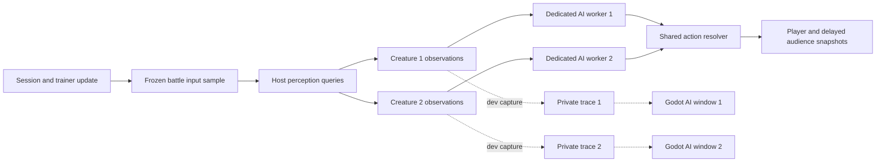

# MoPock roadmap: senses and separate AI debug windows

Status: **vision is planned; dedicated AI threads and inspector windows are implemented in [6A.1](06d-ai-debugger-harness.md)**.
Code review: **2026-09-10**, including the current development collision overlay changes.
The existing [idle/wander checkpoint](06b-autonomous-idle-walk.md) and debugger are the starting point.

The next deliverable is a creature that can report what it sees in its existing
separate Godot AI window during development. Both creatures continue using
their existing idle/wander behavior while we verify perception. Vision runs on the
Odin host in the actual game; exporting private debug data and opening inspector
windows are development features.

This is the implementation sequence for the accepted [MoPock research direction](scratch2/planning.md).
It refines the [AI architecture](06-character-ai-orchestration-proposal.md) and
supersedes its earlier ordering that put some senses after combat. Keep `character`
in existing code; MoPock is the creature's design name.

## 1. Roadmap and the first stopping point

| Checkpoint | Deliverable | Evidence needed before advancing |
| --- | --- | --- |
| **6A — Idle/wander: implemented** | Private runtime per creature; decisions request actions through the host resolver. | Existing deterministic movement, locks, reset and audience checks. |
| **6A.1 — Debugger: implemented** | Dedicated threads, real branch traces, bounded logs, recorded stepping and two independent native Godot windows. | [Verified harness and evidence](06d-ai-debugger-harness.md). Vision/mood/learning are explicitly unavailable in current traces. |
| **6B.1 — Vision in the AI windows: next** | Shared sensing contracts, configurable vision, terrain occlusion and per-observer visualization. | Cone/range/occlusion checks; personal observations; actual rendered cones; debug on/off leaves simulation results identical. |
| **6B.2 — Olfaction** | Local scent samples with strength, estimated bearing and sample age. | A source behind a wall can produce a scent only according to the scent model; readings never supply its hidden current coordinates. |
| **6B.3 — Hearing** | Host sound events sampled with attenuation, range and bearing uncertainty. | Audible and inaudible events differ correctly; an old sound does not track its emitter. |
| **6B.4 — Terrain/tactile sensing** | Material underfoot and confirmed contact/footing observations, with a bounded sensing footprint. | A creature knows touched ground or sensed vibration without receiving the entire terrain map. |
| **6C — First combat ability and pain** | One shared ability, legal phases, effects and outcomes; pain as its own observation. | Hit/miss/interruption attribution works and no tactic owns a competing damage system. |
| **6D — Memory and composable tactics** | Ageing sensory memory, two competing tactics, one intent resolver and inspectable selection reasons. | Hidden targets remain last-known estimates; switching, interruption and capability constraints work. |
| **6E — Mood and trainer relationship** | Persistent temperament, changing mood and perceived trainer advice influence bounded tactic preferences. | The same perceived situation can yield explainable personal choices; mood cannot create knowledge or bypass action rules. |
| **6F — Learning and persistence** | Private opponent estimates and response values update from observed results; stable pet identity saves them across matches. | Controlled learning-on/off comparisons and save/load isolation between two pets using the same character definition. |
| **Later research experiment** | Shared neural predictor or skill selector with personal memory/parameters, if needed. | It improves a measured weakness of the simpler learner on held-out opponents and remains within the same observation/intent interfaces. |

**Stop the next sensing implementation at 6B.1.** Do not scaffold empty combat, mood,
database or training subsystems. The four initial senses share a contract and debug
surface, but only vision produces observations in this checkpoint.

The longer-term learning API has three distinct layers: authored abilities define
what can execute; observed pattern estimates describe what a creature has learned
about an opponent; composable tactics decide how to respond. Encountering an enemy
may unlock a pattern entry, but a response becomes *learned* when outcomes change
its estimated usefulness. This preserves the distinction between progression and
adaptation in the research document.

The research anchors remain [partial observation and beliefs](https://www.sciencedirect.com/science/article/pii/S000437029800023X),
[temporally extended skills](https://ics.uci.edu/~dechter/courses/ics-295/winter-2018/papers/Sutton-Precup-Singh-AIJ99.pdf),
and [modular robot controllers with online skill selection](https://arxiv.org/html/2408.03906v1).
Applying those ideas here is our design choice; the papers do not establish this
game's performance or require neural training for its first senses.

## 2. What the code review found

| Live source | Current behavior | Required preparation |
| --- | --- | --- |
| [Simulation](../server/simulation.odin), [battle adapter](../server/battle.odin) | `session_tick` advances trainers before `battle_tick`. Battle builds both decision contexts before executing either creature's action. | Freeze one perception sample at the start of the battle phase, after the trainer/session update and before any creature action. Use it for both observers. |
| [AI contracts](../server/ai/types.odin), [orchestrator](../server/ai/orchestrator.odin) | Context has self position, anchor and movement eligibility. Each agent owns its RNG, wander state, intent and last result. | Add bounded typed observations to the private runtime/context. Keep world queries outside the decision package. |
| [Action resolver](../server/character_actions.odin) | Owns movement legality and eight-way facing, including the planted walk preparation. | Use authoritative facing and position for vision. Keep this as the sole movement owner. |
| [Terrain and collision](../server/arena.odin), [terrain catalog](../client/content/data/terrains.json) | Terrain has `walkable`, but no sight-blocking property. Elevation and stairs affect movement. | Add independent `blocks_vision`; specify planar sight rules explicitly. Water must not become opaque merely because it blocks walking. |
| [Host content loader](../server/content.odin), [Godot content loader](../client/content/game_content.gd), [arena catalog](../client/content/arena_catalog.gd) | Both fingerprint three shared data files; validators enforce existing schemas. Character definitions have no sense profiles. | Add a validated sense catalog and update both file lists, schema readers, fingerprints and fixtures together. |
| [Session](../server/session.odin), [audience history](../server/audience.odin) | Public session state and private battle state are already separate. Audience history copies the session. | Preserve this boundary; perception remains in battle state. |
| [Network](../server/network.odin), [protocol](protocol.md), [telemetry](../server/dev_ai_debug.odin) | Connections participate as players or audience. Private diagnostics use a separate bounded writer, per-creature JSON snapshots and journals. | Extend the existing trace contract with sensory evidence; keep it out of player/audience packets. |
| [Game arena](../client/world/game_arena.gd), [AI inspector](../client/dev/ai/ai_debug_window.gd) | The playable arena owns network/input/presentation; the independent inspector displays traced input/branches/outcomes and self geometry. | Extend the inspector with actual vision evidence and cone geometry, without instantiating a second playable arena. |
| [Collision overlay](../client/dev/collision_overlay.gd), [geometry helper](../client/dev/collision_geometry.gd) | Development geometry is drawn against the client-presented frame. | Preserve this useful collision view. Vision evidence must come from the host sample, not predicted/interpolated positions. |
| [Development runner](../tools/dev_session.py) | Stages projects and launches optional AI processes with separate readiness. Closing one keeps the arena running and stays closed across reloads. | Preserve the verified lifecycle while extending frames for senses. |
| [Reload controller](../client/dev/reload_controller.gd), [project validator](../client/dev/validate_project.gd) | The AI scene is validated separately and acknowledges visual reloads. Its current view draws trace geometry only. | Add resource refresh for any new static-map/art view; do not give it `AppController` dependencies. |
| [Brain workers](../server/brain_workers.odin) | Each creature's dedicated thread gets copied state/context. Both are submitted before collection; no AI worker accesses the live world. | Supply private observations by value. If sensor queries run in workers, also supply copied candidate poses and immutable terrain; never query a mutating `Session`. |
| [Battle checks](../server/battle_test.odin) | One test compares complete battle records even when one scenario moves its trainers. Tests also enforce allocation-free simulation ticks. | Separate wander determinism from perception equality: a visible trainer moving should change observations. Keep sensor sampling bounded and allocations outside the tick. |

Reuse the existing two dedicated workers and fixed creature slots. No ECS conversion,
replacement networking stack or rewrite of the wander/action split is needed. Stable
player-owned pet identity is required for 6F; current windows bind to owner/round/entity.

## 3. Production perception boundary



The sample boundary is specifically **after `session_tick`, before creature actions**.
It is not a claim that trainers and creatures currently advance simultaneously.
Copy dynamic candidate poses once; share immutable terrain data through a read-only
view. Never construct P2's sample after resolving P1's movement.

Proposed ownership and files, added only as their functionality is implemented:

| Location | Responsibility |
| --- | --- |
| `server/perception/types.odin` | Engine-independent sense kinds/status, vision profile, sample inputs and typed observation records. |
| `server/perception/vision.odin` | Pure range/cone/line-of-sight queries over supplied data. No `Session`, network or Godot imports. |
| `server/perception/grid_visibility.odin` | Bounded tile traversal for entity sight tests and development ray clipping. |
| `server/senses.odin` | Adapter from host content/session to the immutable perception sample; schedules queries and records results for each creature. |
| `server/ai/types.odin` | Per-agent observation storage and a read-only observation view in `Decision_Context`; imports perception data types. |
| `server/battle.odin`, `server/simulation.odin` | Reset, sampling and decision/action order. |
| Existing `server/dev_ai_debug.odin` and `server/ai/trace.odin` | Extend bounded telemetry with sensor evidence/provenance and branch links; retain the independent writer. |

Dependency direction is `main -> ai/perception`, and `ai -> perception` for data
contracts. `perception` never imports `ai` or host `main`. The decision interface
receives observations, not a sensor object capable of looking up arbitrary enemies.

The initial frame needs:

- Observer round/entity ID and sample tick; self position/facing captured at that tick.
- Status per sense: unsupported, disabled, waiting for summon, or sampled.
- A bounded vision list: subject runtime ID, subject kind (creature/trainer),
  observed position/facing and visible presentation identity, with sample provenance.
- The actual vision parameters and configuration source for inspection.

Only `Vision` has an observation payload initially. Reserve `Olfaction`, `Hearing`
and `Terrain` kinds/statuses, without inventing empty implementations or fields
that imply an exact hidden target position. Runtime IDs identify visible subjects;
they do not grant access to a live subject record.

Initially sample vision on the first unlocked battle tick, then every **six simulation
ticks (10 Hz)** per creature. Keep separate sensor deadlines even when initial profiles
have equal cadence. Keep the existing 60 Hz physics and 20 Hz public
snapshots. Between samples, consumers receive the last sample with its original
tick, not refreshed evidence. Loss of sight removes the target at the next sample;
working memory that retains it deliberately is a later checkpoint.
Different cones can detect an opponent on different ticks. Later profile-specific
cadence and multi-tick thoughts must retain source/delivery/ready timestamps, using
the [planned causal trace](06d-ai-debugger-harness.md#next-independent-thought-progress-and-sensory-causality).

Use bounded arrays for the present roster: two observers, and at most the other
creature plus both trainers as each observer's entity candidates. Preserve stable
candidate ordering and avoid random calls in vision. Reset observations and sensor
deadlines on round/entity changes. During summoning, show the waiting status and
produce no active sightings; use the existing unlock boundary rather than a new timer.

## 4. Sense profiles and sight-blocking content

Add a game-authored `client/content/data/senses.json`, schema version 1. This is
shared gameplay configuration, independent of imported art. A compact proposed shape:

```json
{
  "schema_version": 1,
  "profiles": [
    {
      "key": "starter_vision",
      "vision": {"enabled": true, "range_units": 8.0, "fov_degrees": 90.0}
    }
  ],
  "characters": {
    "circle": "starter_vision",
    "square": "starter_vision",
    "triangle": "starter_vision",
    "diamond": "starter_vision",
    "archer": "starter_vision",
    "orc": "starter_vision"
  }
}
```

These are initial tuning choices, not biologically established values. Validate
unique profile keys, exactly one binding for every selectable definition, no unknown
bindings, required booleans, finite positive range and `0 < fov_degrees <= 180` for
this first implementation. The converted world range must also fit a finite `f32`.
Disabled vision reports `disabled`, not an enabled empty
reading. Unimplemented modalities report `unsupported` in the runtime status.

Use the [gameplay ruler](04b-gameplay-size-proposal.md): **1 gameplay unit = 32 world
units**. Convert range once when loading; the example becomes 256 world units.
Do not scale a sense by sprite dimensions, import crop, camera zoom or window size.
Both same-species creatures may share an immutable profile while keeping separate
observations and deadlines. Individual sensory traits can later derive an instance
profile from that definition.

Required compatibility changes:

1. Add `senses.json` to both sorted fingerprint lists:
   `arenas.json`, `characters.json`, `senses.json`, `terrains.json`.
   Update the host's fixed three-file buffers/digest signature and parse indexes.
2. Add strict parsing/binding in both loaders and record
   `configuration_source = game_catalog` in debug data.
3. Advance the terrain catalog to schema version 2 with required `blocks_vision`.
   Update the host's schema gate and Godot's terrain validator together. Migrate
   checked-in fixtures; reject missing opacity instead of deriving it from walkability.
4. Verify catalog producer scripts, fixture-copy helpers and fingerprint equality.
   The content fingerprint carries this compatibility change; the public packet
   layout remains version 9 because no message fields change in this slice.

Initial authored opacity policy:

| Terrain | Blocks walking today | Proposed `blocks_vision` |
| --- | --- | --- |
| Grass, ground, sand, stairs, tall grass | No | `false` |
| Water | Yes | `false` |
| Stone, cliff, forest, building | Yes | `true` |

Treat these as explicit game rules. Tall-grass concealment, height-aware sight,
transparent obstacles and individual foliage density can extend them later.
For 6B.1, sight is planar: elevation differences alone do not occlude a ray, while
opaque cells block at every elevation. Buildings use the existing baked terrain
footprint; roof artwork does not redefine their sight boundary.

Defer the full package-authored `character.behavior@0.1.0` export migration.
The game catalog establishes a usable source of sense configuration now. Later
package exports can produce the same validated profile data with provenance. Keep
that migration separate from the existing art contract and its `player_only`
placeholder; do not claim that placeholder supplies runtime sensing.

## 5. Vision behavior and cone geometry

Vision's output is determined by **range, facing, field of view and terrain
occlusion together**. A cone drawing alone is not a working sensor.

For each candidate from the frozen sample:

1. Exclude the observer itself. Include the other creature and both trainers,
   tagged by kind; selection eligibility does not imply hostility.
2. Use ground-plane positions. The eye origin is the creature's authoritative
   position in this slice, independent of sprite pivots or animation frames.
3. Convert the existing eight-way facing to a normalized forward vector.
   In the current Y-down world, North is `(0, -1)`, East is `(1, 0)`.
   Idle keeps the last facing; walk preparation can turn sight before translation.
4. Let `d = target_position - eye_position`. Require distance at most the configured
   range, and `dot(normalize(d), forward) >= cos(fov / 2)`. Boundary points count
   as inside. Handle coincident positions explicitly without normalizing zero.
5. Trace from eye to target using tile traversal. Any opaque cell or out-of-bounds
   space blocks the ray. A sample originating in an opaque cell yields no sightings.
   At a grid corner, test both touched side cells, so diagonally touching blockers
   cannot create an accidental sight gap. Rays exactly along a tile edge test cells
   on both sides; cover this conservative boundary rule with fixtures.
6. Record a sighting only after all checks pass. Do not place rejected candidates'
   coordinates in the creature's observation frame.

The first detector checks the **target's center point**. A body partially visible
around a corner may therefore remain undetected. This is an explicit approximation;
silhouette/footprint sampling is a later refinement with its own tests and budget.
Trainers and creatures do not occlude one another in this first terrain-only model.

The AI window draws a faint nominal cone outline and an occlusion-clipped fill,
plus markers for the recorded visible subjects. For the fill, the host can clip a
bounded fan of at most 65 rays using the same grid query and the copied observer
pose. Generate this development geometry outside the production simulation tick.
The fan approximates the display boundary; exact per-candidate rays decide detection.
Godot must not implement a competing visibility test.

The sampled observer pose, visible positions and cone must share a sample tick.
Do not anchor a recorded cone to the player's newer interpolated sprite. The
inspector initially renders sampled poses without prediction; it labels sample
age so its 10 Hz updates are clear.

## 6. One separate Godot window per creature

Launch **one additional Godot process per creature**, using the same staged project
with a dedicated root scene. For today's two-creature match, that means P1 client,
P2 client, any audience clients, plus **two AI windows total**. Two Orcs still get
two windows because the binding is to an instance, not to the Orc definition.

Godot 4.6 supports launching a chosen scene through its
[command-line interface](https://docs.godotengine.org/en/4.6/tutorials/editor/command_line_tutorial.html).
An alternative is native child `Window` nodes, which require the appropriate
[subwindow embedding configuration](https://docs.godotengine.org/en/4.6/classes/class_window.html).
Choose separate processes here because the existing runner already manages isolated
Godot clients; each inspector then has its own root window and lifecycle. The cost
is extra development memory/processes, which we will measure. No second Godot
project or editor plugin is needed.

Existing scene/files, to extend for vision:

```text
client/dev/ai/
  ai_debug_window.tscn       dedicated root scene
  ai_debug_window.gd         instance binding, timeline/tree, replay and controls
  trace_reader.gd            bounded snapshot/journal parsing and freshness checks
  spatial_trace.gd           current self/intent/result geometry; add vision view
```

Reuse [ArenaWorld](../client/world/arena_world.gd) for a dim static reference map and
existing character/trainer presentation resources where useful. Label the full
static map as developer reference, not discovered creature knowledge. Draw other
entities only from this observer's recorded sightings in the initial view.

Do not instantiate `main.tscn`, `GameConnection` or `GameArena` in this scene.
Inspector pan/zoom changes only its camera and never sends trainer input. Its panels
will add profile, sense status, sample tick/age, range, FOV and visible subjects to
the existing owner/round/entity and decision panels. Vision becomes active only when
its checkpoint passes; Olfaction, Hearing and Terrain remain “Not implemented”.

Bind windows initially to creature owner slots 1 and 2, then resolve the current
round/runtime entity from each frame. Clear old drawings when that identity changes.
Persistent pet IDs are added with persistence; the window must not treat a reused
owner slot as proof that the previous creature's observations remain valid.

### Development transport and lifecycle

Reuse the [implemented local trace transport](06d-ai-debugger-harness.md#logging-and-resource-limits).
It adds no ENet role or private data to public snapshots. Remote inspection would
need its own transport design if it becomes a requirement.

- The runner supplies `--dev-ai-dir` and `--dev-ai-run`. A separate writer publishes
  `ai-1.json` and `ai-2.json` atomically and retains rotating `ai-1.jsonl` /
  `ai-2.jsonl` journals. Each window validates and reads only its observer's stream.
- Existing records include schema/run/content identity, sequence, owner/entity/round,
  tick, input, branch ancestry and confirmed outcome. Add the observer's actual
  observations, sensor source/delivery ticks and profile; version schema/readers
  together when changing the contract.
- Windows update independently. Compare records by their source sample tick, not
  the moment the UI refreshes; do not imply that two currently selected records
  describe the same instant. The host sample boundary provides consistency.
- Keep copying/enqueueing bounded, with serialization and disk work on the existing
  writer thread. Preserve per-invocation journals, sequence gaps, truncation flags and
  overflow counters; do not coalesce away unexplained sensory/decision transitions.
- Extend byte/count limits and finite-value validation for observations and clipped
  rays. Measure the resulting frame size and publication cost before increasing
  retention. Bad data displays an error and cannot control the host.
- Keep source tick/age visible, and retain the current 0.5-second stale threshold for
  the live stream. Clear sightings on reset, show waiting status during summon, and
  never advance sampled positions locally.

Debug activation must be explicit at both ends:

| Component | Gate |
| --- | --- |
| Odin exporter | `ODIN_DEBUG`, `--dev`, loopback development scenario and explicit runner-owned output directory. Reuse the existing [dev scenario](../server/dev_scenario.odin) validation pattern. |
| Godot AI scene | `OS.is_debug_build()`, `--dev`, explicit AI-debug arguments and a valid local session binding. Otherwise exit before creating the inspector UI. |
| Development runner | Existing `AI_DEBUG=1` default for `make dev_arena`; `AI_DEBUG=0` disables AI windows and telemetry. Normal `run_client` does not create companion windows itself. |
| Headless automation | Same reader/scene may run with `--headless`; this verifies parsing and lifecycle, not visible native windows. |

`OS.is_debug_build()` is true in the editor and debug exports, so the explicit
development opt-in is also required. See the
[Godot OS documentation](https://docs.godotengine.org/en/4.6/classes/class_os.html#class-os-method-is-debug-build).
Release builds execute production AI without exporting traces. Once implemented,
vision must follow that same boundary. Keep the existing release-host gate and
Godot debug/explicit-session gate when extending the feature.

The runner already separates process roles: required host/game clients and optional
AI inspectors. AI readiness means scene/content/frame binding, not a network Welcome
or arena audience count. A closed/crashed AI window should be reported and removed
from its active reload-wait set, leaving the game running; an initial AI launch
failure must be reported as an incomplete debug launch. Do not silently reopen a
window the developer deliberately closed. Preserve that choice across reloads in
the same runner session; a new `dev_arena` run opens the configured windows again.

Visual reload waits for acknowledgments from currently active inspectors as well
as clients. Separate a small resource-refresh helper from the network-dependent
reload controller if needed; do not make the standalone scene impersonate
`AppController`. Code/content relaunches and failed-candidate fallback must carry
fresh generation binding and clean up all owned AI children. Ctrl+C stops all owned
processes without affecting unrelated Godot instances.

## 7. Implementation order for 6B.1

Each step is a reviewable change with a concrete result. Vision tasks are pending;
6A.1 already supplies the dedicated workers, trace writer, inspector and lifecycle.

| Step | Files/area | Result and verification |
| --- | --- | --- |
| **1. Content contracts** | New `senses.json`; host content/character/terrain records; Godot content and arena loaders; catalog fixtures. | Both languages resolve the same profiles and opacity rules and compute identical fingerprints. Invalid/missing bindings and non-finite tuning fail validation. |
| **2. Pure vision query** | New `server/perception/` types, cone and grid queries, focused tests. | Known geometry produces expected visible sets for range, all facings, cone edges, water and walls. No host-world access from a decision. |
| **3. Host integration** | New `server/senses.odin`; `battle.odin`, `simulation.odin`, `ai/types.odin`, battle tests. | Both creatures receive independent observations from the same sample boundary; wander/action outputs stay stable; reset/summon and zero-allocation tick checks pass. |
| **4. Sensory trace extension** | Existing `server/dev_ai_debug.odin` and `server/ai/trace.odin`; schema and reader checks. | Exact sightings/provenance link to decisions, fit bounded storage, and preserve replay and telemetry-off equivalence. |
| **5. Vision inspector panels** | Existing `client/dev/ai/` scene/scripts; resource refresh for any new map/art view. | Render the recorded cone, observations, visibility tests and sample age without network/input or private live-world queries. |
| **6. Lifecycle regression** | Existing runner/Make/workflow checks; add vision fixtures to `check_ai_debugger`. | Current two-window close/reload/relaunch/fallback behavior still works with sensory payloads. |
| **7. Review and documentation** | New verification commands/tests; [dev workflow](03f-dev-workflow.md), [project structure](project-structure.md), [roadmap](plan.md). | Headless checks plus actual native-window evidence demonstrate the full acceptance list below. Mark 6B.1 implemented only after this review. |

Update shared fixture directories `tests/fixtures/content/` and
`tests/fixtures/movement/`, plus [content check](../tests/content_check.gd) helpers
that currently copy only the three known data files. Extend
[arena-content validation](../tests/arena_content_check.gd) for terrain opacity.
Preserve the current collision-overlay work while adding the separate inspector.

The Make variable already passes runner option `--ai-debug=0|1`; only that runner
spawns companion scenes. Include the new perception package's tests
in the normal verification dependency chain, since testing `server/ai` alone does
not execute tests in a separate imported package.

The existing trainer-input isolation test needs two cases: with identical world
inputs, audience/debug attachment must leave observations and AI state identical;
with different trainer movement, observations may differ while the unchanged wander
controller's RNG, intent sequence and resulting creature paths remain equal. Do not
assert equality of every private battle field across intentionally different worlds.

## 8. Acceptance checks

### Automated correctness

- [ ] Cone inclusion/exclusion for all eight facings, exactly on and just beyond
  range/FOV edges, coincident positions, disabled vision, and invalid profiles.
- [ ] Clear sight, wall occlusion, transparent water, building footprint, map bounds,
  tile-edge/corner cases and the documented elevation policy.
- [ ] Same-species instances hold different observations when positioned differently;
  neither sees through the other's senses. Own entity is excluded; trainers are tagged.
- [ ] Both sensors read one battle sample before either creature acts. Reordering
  observer evaluation does not change results.
- [ ] At the next scheduled sample, a hidden target disappears; old coordinates never
  refresh from a live pointer. Sample timing and reset behavior cover tick wrap.
- [ ] Summoning produces waiting status, and round/reset/relaunch clears prior facts.
- [ ] Host/Godot catalog validation and fingerprints agree, including all fixtures.
- [ ] Sampling is allocation-free in the production tick. Record ray/candidate counts
  and sampling costs on all existing arenas; performance is measured, not assumed.
- [ ] Toggling telemetry or attaching/closing readers leaves production observations,
  decisions, RNG and movement identical for the same build/seed/inputs. Run production
  vision checks in an optimized host build too; bitwise cross-build equality is not promised.
- [ ] Debug-only options cannot produce telemetry/UI in release. Private frames are
  absent from ordinary player and delayed-audience network messages.
- [ ] Frame readers handle incomplete/malformed/stale data, wrong content/generation,
  and oversized arrays/files without treating them as current observations.
- [ ] Runner startup, active-window visual reload, code/data relaunch, failed-candidate
  fallback, optional inspector exit and final cleanup pass workflow checks.

### Visible development review

- [ ] Launch two creatures, including a same-species case, and show **two separate
  native Godot AI windows** alongside the existing game clients. Headless success
  alone does not satisfy this.
- [ ] Each title/panel identifies its owner and current creature instance; each has
  independent focus, camera controls and the appropriate vision cone.
- [ ] Move a trainer in front, behind, outside range and behind a wall. Only appropriate
  sightings appear, and the cone/subject markers align with the displayed sample tick.
- [ ] Close one AI window while both clients continue playing and the other AI view
  continues updating. Reload resources afterward without waiting for the closed window.
- [ ] Normal game startup opens no AI windows; disabling AI debugging in the dev runner
  keeps the existing clients and normal audience delay working.

Commands for the existing harness and the planned vision checkpoint:

```sh
make dev_arena P1=archer P2=orc ARENA=tiny_swords_village AI_DEBUG=1
make dev_arena P1=orc P2=orc AI_DEBUG=1
make dev_arena AI_DEBUG=0
make check_session
make check_vision       # Planned; add with the perception package.
make check_ai_debugger  # Implemented; extend its fixtures for vision.
make check_dev
```

`AI_DEBUG` and `check_ai_debugger` are implemented; only `check_vision` remains a
proposed target. Existing content/client/workflow checks retain their own boundaries.

The [6A.1 acceptance record](06d-ai-debugger-harness.md#acceptance-and-proof-status)
contains the current 5 AI / 31 server test results and actual native-window/render
evidence. This proves the debugger foundation, not the vision acceptance list above.

## 9. How the remaining senses and learning build on this base

Olfaction adds a host scent field with bounded deposition/decay and obstacle
permeability, then a local sampling receptor. Begin with a simple deterministic
field; wind and turbulent plumes are optional later models. It returns strength,
bearing and uncertainty rather than looking up an emitter's current position.
Its window panel visualizes the creature's local samples; a full field, if shown,
must be a separately labelled developer reference.

Hearing adds timestamped gameplay sound events with emission position, category and
loudness. The sensor returns what reached this creature, with coarse direction/range
and provenance. Emission-time location must not follow an emitter after it moves.
Start with a specified distance/obstacle attenuation rule; renderer audio is not the
host's source of sensory truth. Hearing is the later delivery path for trainer advice.

Terrain sensing begins with material/elevation under the body and contact evidence
already known to movement resolution. Enrich collision feedback with contact geometry
only when the terrain checkpoint needs it. A creature with vibration sensing can
later receive attenuated ground events; it does not inherit a full-map pathfinder.

All four senses feed a later private working-memory layer. Keep observation, belief
and learned knowledge distinct: a visible location is sampled evidence, a hidden
last-known location is an ageing belief, and a learned attack response is an estimate
supported by past outcomes. Each new modality gets its own payload rather than
filling an always-available exact target-position field.

Composable combat follows the existing intent boundary: shared ability descriptors
define windup/active/recovery phases and legal targeting; tactics implement initiation,
progress and completion/cancellation; one selector ranks eligible tactics. Learned
pattern APIs expose recognized cues and uncertain predictions. They do not expose
an opponent's private cooldowns or select a counter directly from a hidden ability ID.

Mood changes bounded preferences or commitment, with explicit causes and decay.
Temperament, temporary mood, physiological capability and learned habits remain
separate. Trainer feedback is recorded separately from actual combat effectiveness.
These choices make a MoPock personal without letting mood bypass perception or action legality.

The first learner updates conditional opponent counts and response values from
`observed cue -> chosen tactic -> confirmed outcome`, with decision IDs, confidence,
bounded exploration and retention. Add stable host-owned pet/owner IDs and a versioned
persistence adapter before claiming learning survives matches. A learned dodge
preference still requires an implemented legal dodge ability; unlocking an attack
entry does not itself train a new motor skill.

Evaluate against frozen authored behavior across varied seeds/opponents, measuring
adaptation within a battle, retention, generalization and individual differences.
Neural prediction or recurrent skill selection remains a later replacement behind
the same contracts if these measurements reveal a useful target. The first vision
checkpoint supplies trustworthy observations and a way to inspect them; it does not
claim that the creatures already learn.
