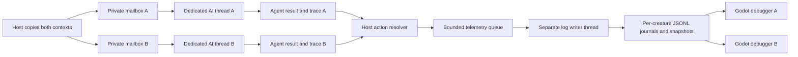

# MoPock debugger: dedicated threads, telemetry and decision traces

Status: **6A.1 implemented and verified, 2026-09-10**. The telemetry contract below
was written before implementation. [Checkpoint 6B.1](06g-focused-and-peripheral-vision.md)
extends this harness with trace schema 2: consumed eye samples, private memory, attention,
evidence references and a separately labelled host audit. Search added schema 3 and
[olfaction](06n-olfactory-trails.md) schema 4: the consumed nose sample, private scent
memory, scent evidence and a separate host olfaction audit.

**Planned next:** [6B.1.1 dedicated senses inspectors](06j-combat-sensory-system.md)
adds one native senses window per creature alongside these decision windows,
plus live vision evidence. [Arena vision filters](06k-arena-sense-overlay.md) are
now implemented as the first part of that checkpoint. The current Vision tab is
part of the decision debugger; it does not fulfill the new separate-window
requirement. The senses inspector shows received observations; this debugger
shows the branches that interpreted them. Shared references and recorded timing
must keep both views consistent without rerunning a brain.
The dedicated senses window is for current detections only. Event logs, stack
traces, decision trees, memory inspection and history controls stay in this
decision debugger or the QA replay tool, rather than appearing in that window.

```sh
make ai_debugger P1=archer P2=orc ARENA=tiny_swords_village
make dev_arena AI_DEBUG=0  # Run the same threaded AI without inspectors or telemetry.
```

The first command opens the two ordinary player clients and two additional native
Godot debugger windows. `AUDIENCE=1` adds a delayed game viewer. Close an inspector
independently; Ctrl+C in the launcher closes all of that run's remaining processes.

## Contract before implementation

Each of today's two MoPocks gets a dedicated, long-lived native Odin thread. A
thread receives a copied decision context and private agent state through its own
mailbox, runs the production AI, and returns copied state and intent. Both mailboxes
are submitted before the host collects either result. No creature receives another
creature's memory/RNG, and no AI worker can mutate the session, network or world.
The host retains committed agent snapshots, applies the shared action rules and
records confirmed feedback. Locks protect message exchange only; thinking happens
outside those locks. Thread creation and joining happen outside simulation ticks.

The current wander decision has bounded work. This first harness joins both short
decision steps before resolving world actions, preserving existing simulation order.
It does not yet implement reasoning that spans ticks or different cognitive speeds.
Later, each worker advances a resumable private thought by a bounded quantum; a
creature may return `Thinking` while another returns an intent. Native thread CPU
timings remain diagnostic and never become an accidental gameplay reaction timer.
Two runnable threads permit concurrent execution; the OS schedules their CPU time.
A dedicated thread does not reserve a physical core or guarantee a deadline.



Use native [Odin threads](https://pkg.odin-lang.org/core/thread/), not an AI worker
pool, for this requirement. Shared executable code and immutable rules are fine;
mutable brains and branch progress stay separate. This supersedes earlier advice
that a per-creature thread was unnecessary for the initial development foundation.

## What one trace must prove

Every recorded decision has run identity, content fingerprint, owner slot, runtime
entity, round, simulation tick and a monotonically increasing per-creature sequence.
Capture the actual input, previous wander state/RNG, evaluated branches, requested
intent, updated state and confirmed action result. No generated explanation replaces
instrumentation at the actual branch. A selected movement direction and executed
displacement are separate fields: collision or a summon lock can reject a request.

Each branch event has a local node ID, parent ID, stage, status, human-readable label,
optional numeric comparison/direction, emitting native thread ID and elapsed
microseconds. Parents precede children. Preserve rejected candidates and explicit
unavailable/skipped stages. Ordering within a trace comes from node sequence, not
cross-thread wall-clock races. Worker submission/start/finish timestamps use a
shared monotonic origin; simulation tick identifies the gameplay sample.

Stages: input received -> available state -> controller -> evaluated conditions and
candidate branches -> intent selected -> host execution outcome. Today the input
is self position, anchor and movement eligibility. Vision, smell, hearing, terrain
receptors, mood and learned memory are explicitly unavailable. Existing wander state
and action feedback are real and inspectable. The harness must remain useful before
new senses exist.

For future senses, append typed observation nodes with observation ID, source tick,
delivery tick and uncertainty. For future memory, include retrieved evidence IDs,
candidate values and stopping reasons. A thought spanning ticks also needs a thought
ID and revision/cancellation events. Do not manufacture those subsystems now.

## Logging and resource limits

- Record every current decision invocation and its action outcome; do not silently
  sample away intermediate branches. A bounded per-decision node buffer reports
  truncation explicitly if exceeded.
- Host/AI code performs no JSON serialization or file writes in the simulation
  tick. Copy records into a bounded queue for a dedicated telemetry writer.
- Queue overflow drops telemetry with an explicit cumulative count. It cannot
  stall a creature or change RNG/actions. Sequence gaps remain visible.
- Write separate `ai-1.jsonl` / `ai-2.jsonl` journals, rotating at bounded size and
  retaining a fixed number of segments. Include identity in each record for replay.
- Publish bounded recent histories as `ai-1.json` / `ai-2.json` through temporary
  file + atomic rename. Readers only see complete snapshots.
- Expose writer errors, dropped records, truncated nodes and publication cost.
  A stopped writer must not make a stale UI claim it is live.
- Restrict exporting to a debug host, explicit `--dev`, loopback development
  scenario, and an absolute runner-owned output directory. Ordinary network
  messages and delayed audience history contain no private traces.

Implemented limits are 48 nodes per decision, 256 queued telemetry messages across
both creatures and world captures, 128 recent decisions per creature snapshot, and 2,048 retained
decisions per live inspector. Publish roughly every 250 ms on the writer thread.
Each creature retains its current journal plus three older segments, each at most
8 MiB for today's bounded records. The reader limits snapshot input to 4 MiB and
journal input to 9 MiB. The snapshot's overwritten count describes recent-history
eviction; it does not mean the journal lost that decision. Sequence gaps and the
host queue-drop count distinguish missed live records from normal retention.

`session.json` supplies `ai_trace_dir` and `ai_run`; journals live under
`build/dev/<run>/generation-N/ai-traces-<attempt>/`. Graceful shutdown drains the
queue and publishes final snapshots. This is a rotating development journal, not a
crash-durable save system: a forced termination may leave an incomplete final line.
Offline replay reports and ignores that line; it rejects corruption in the middle.

## Two independent debugger windows

Launch one dedicated Godot scene/process per creature alongside the usual game
clients. It has no `GameConnection`, trainer controls or duplicated AI. It reads only
its bound creature's local trace stream. Both windows open by default in `dev_arena`
when AI debugging is enabled; normal game startup opens neither.

The UI has a scrollable decision timeline, filter/search, branching decision tree,
raw payload/event log, and a spatial view of the sampled self position, anchor,
candidate directions, requested movement and confirmed displacement. Display native
thread ID and queue/compute timings, sample age, identity, retention and data loss.
Do not draw a fictional vision cone before the vision sensor exists.

Pause freezes trace playback while the battle continues. Previous/next decision and
previous/next event reveal the recorded branches step by step; future events remain
unrevealed until advanced. Resume returns to live history. Preserve the selected
record if the rolling buffer advances. A pause entered before the first decision exists
(a click on the empty history) pins the first decision when it arrives instead of
leaving the inspector empty; the integration check drives this path for P2. Load a saved JSONL segment for offline
inspection; playback is never presented as a resumed simulation or a live breakpoint.
Native worker breakpoints and mutation of brain state are future debugger features.

To inspect one choice, filter for `Choosing_Direction`, select a decision, then
press **Replay decision** and **Event ▶**. Select a revealed tree node to see its
input, comparison operands or outcome. **Decision ▶** advances to the next recorded
invocation; **Live** follows the current stream again. **Open journal…** reads a
saved segment for the bound creature and compatible content. The Recorded payload
tab deliberately shows the whole completed decision, including its eventual result.

The current graph uses `decision_graph.gd` to place the root above its children,
with shared status colors/words from `trace_palette.gd` and highlighted chosen paths.
The timeline draws only visible rows, and `trace_loader.gd` parses files on a separate
worker. Selecting an existing record does not rebuild the timeline. Missing, invalid,
oversized or mismatched snapshots show a clear status. No new sequence within
0.5 seconds marks live data stale. [Checkpoint 6A.2](06e-qa-replay-and-trace-browsing.md)
records the measured performance change and adds synchronized match playback.

The runner distinguishes required host/game children from optional inspectors.
Closing either inspector leaves the arena and other inspector running. Remove it
from reload acknowledgment waits and preserve that closed state across code reloads
in the same runner session. All active windows follow validated reload generations;
failed candidate fallback starts a fresh trace identity. Ctrl+C cleans up only the
runner's own children.

## Implementation sequence

1. Instrument current pure AI branches using an optional bounded trace sink. Prove
   tracing leaves decisions, state and RNG identical.
2. Add two dedicated worker mailboxes and submit both before joining. Compare the
   production threaded simulation against the serial reference and verify distinct
   native thread IDs, reset and clean shutdown.
3. Add bounded asynchronous log writing, rotation, identity and debug gates. Verify
   queue overflow, journal/snapshot consistency and telemetry-off equivalence.
4. Build the standalone Godot timeline/tree/payload/spatial inspector and recorded
   step navigation. Verify malformed input, filtering, pause/resume and replay.
5. Integrate launch/reload/optional close and add a reproducible verification target.
   Run real host/client/inspector processes and inspect actual native windows.
6. Update roadmap and document implemented scope and evidence. Vision integration
   follows this harness and supplies real sensor nodes through the same trace contract.

## Acceptance and proof status

Implemented files:

| Area | Source |
| --- | --- |
| Real decision instrumentation | [`trace.odin`](../server/ai/trace.odin), [`orchestrator.odin`](../server/ai/orchestrator.odin), [`observe.odin`](../server/ai/observe.odin) (replaces the original wander controller in 6B.1) |
| Dedicated workers and host commit | [`brain_workers.odin`](../server/brain_workers.odin), [`battle.odin`](../server/battle.odin), [`main.odin`](../server/main.odin) |
| Bounded asynchronous telemetry and world recording | [`dev_ai_debug.odin`](../server/dev_ai_debug.odin), [`dev_replay.odin`](../server/dev_replay.odin) |
| Inspector, input validation and spatial view | [`ai_debug_window.gd`](../client/dev/ai/ai_debug_window.gd), [`trace_reader.gd`](../client/dev/ai/trace_reader.gd), [`spatial_trace.gd`](../client/dev/ai/spatial_trace.gd) |
| Process and reload ownership | [`dev_session.py`](../tools/dev_session.py) |
| Real-process acceptance harness | [`ai_debugger_check.py`](../tests/ai_debugger_check.py), [`ai_debugger_driver.gd`](../tests/ai_debugger_driver.gd), [`ai_trace_check.gd`](../tests/ai_trace_check.gd) |

```sh
make check_ai_debugger
# Also prove native windows and capture actual rendered panels:
python3 tests/ai_debugger_check.py --graphical
```

Verified on local Odin dev-2026-03-nightly and Godot 4.6:

The evidence below describes the original harness acceptance. The latest graph,
performance and world-replay checks are recorded in [6A.2](06e-qa-replay-and-trace-browsing.md#acceptance).

- `make check_ai_debugger` passed its unit suites and real-process acceptance test.
  After tightening initial inspector-failure reporting, the integration suite passed
  again with a deliberately failed P2 inspector: launch incompleteness was visible,
  the game and P1 inspector continued, and cleanup left no owned processes behind.
  Latest headless evidence: `build/verification/ai-debugger-20260910-130414-357324/`.
- `make check_session`: 5 pure AI tests and 31 server tests passed. The server suite
  also passed with `-debug`, activating the real writer/export tests. Tracing preserves
  intent/state/RNG over 2,400 ticks; threaded and serial simulation agree across
  all four arenas with trainer movement and reset. Worker IDs differ from each
  other and the host; either worker can be collected first.
- Writer tests exercise queue overflow, bounded node truncation, log rotation and
  draining on shutdown. Reader checks reject wrong identity, malformed ancestry,
  invalid timings, non-finite values and oversized input; interrupted final journal
  lines produce an explicit replay warning.
- The graphical integration ran two same-species Archer instances, two native AI
  windows, two game clients and one delayed audience. It exercised event stepping,
  frozen selection while the live stream advanced, filtering, journal replay,
  native window close, visual reload after close, code relaunch with a fresh run
  identity, telemetry disabled, release-host rejection of debug export, and cleanup.
  The closed inspector stayed closed and audience membership/delay stayed intact.
- `make check_character_ai check_dev` passed against the completed harness:
  existing networked character movement and the full save/reload/failure/cleanup
  workflow remain intact. Workflow artifacts are in
  `build/verification/dev-check-20260910-125919-350992/`.

Graphical evidence is under
[`build/verification/ai-debugger-20260910-125542-347634/`](../build/verification/ai-debugger-20260910-125542-347634/).
The run contains `native-windows.txt`, logs, journals, driver assertions, and
[`ai1-tree.png`](../build/verification/ai-debugger-20260910-125542-347634/build/dev/20260910-125542-347671/ai1-tree.png)
and [`ai2-spatial.png`](../build/verification/ai-debugger-20260910-125542-347634/build/dev/20260910-125542-347671/ai2-spatial.png).
Both renders were visually inspected. These generated artifacts are local and ignored
by Git; the verification command regenerates equivalent evidence. Controls were
driven through their actual handlers, rather than a physical mouse/keyboard test.
The release Odin gate was exercised; an exported release Godot binary was not built.

The inspected graphical run reported zero host queue drops. Its displayed previous
publication cost was about 36 ms for both complete history snapshots, on the separate
writer thread. This is a two-creature development measurement, not a scalability
claim. CPU microseconds shown for decisions are diagnostics, not simulated reflexes.

## Next: independent thought progress and sensory causality

Keep the next feature bounded: vision feeds this existing harness. Before adding
long deliberation, extend it with a resumable per-creature thought and trace these
events in production order:

1. **Observation created/delivered:** observation ID, sense, source tick, delivery
   tick, profile, confidence and the exact evidence supplied to that creature.
2. **Thought advanced:** thought ID, parent observation IDs, current branch, retrieved
   memory IDs, alternatives evaluated, logical work spent and remaining work budget.
3. **Thought stopped or revised:** confidence/urgency threshold, exhausted budget,
   newer evidence, interruption or round/entity cancellation. Retain the cause.
4. **Intent ready/applied:** ready tick, intended execution tick, source thought and
   confirmed outcome. Reject obsolete identity/version results before execution.

Each worker keeps its own thought cursor and evidence inbox. One bounded work quantum
per tick may return `Thinking` while the other returns `IntentReady`; the host can
then resolve B's action while A's thought continues next tick. Preserve a documented
previous intent or safe idle while thinking, and apply action locks immediately.
Full thoughts must not hold the tick barrier. Over-budget worker failures need an
explicit host policy and deadline diagnostics; silently converting OS scheduling
delay into creature temperament would make behavior machine-dependent.

For example, A receives a visual observation at tick 100 and examines eight options,
finishing at tick 107. B receives its own observation at tick 102, examines two
options and finishes at tick 103. Those are proposed logical costs, not current
timings. This produces the requested later-detection/earlier-reaction case without
tying it to CPU load. Memory count alone should not force slower decisions: retrieved
alternatives and deliberation policy determine work; a learned shortcut may reduce it.

Acceptance for that future checkpoint must deliberately delay one thought, verify
the other can act, trace revisions and stale-result rejection, and replay identical
logical choices under different worker completion orders. Live breakpoints require
a separate pause/step protocol; the current buttons inspect completed records.
