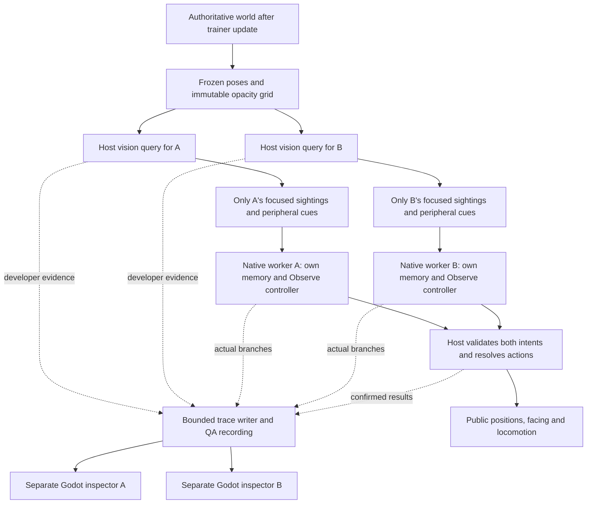

# Proposal: focused vision, peripheral cues and private visual memory

Status: **design proposal; implemented as a review candidate on 2026-09-11**. The
[implementation record](06g-focused-and-peripheral-vision.md) documents the delivered
behavior, ownership, geometry rules, QA setup and verification, including where the
implementation departs from the options sketched below.
Reviewed: **2026-09-10**, against repository revision `c74e638` and selected sensing
and foraging sources in the local `2dRpgGameEngine` prototype.

This is the new **6B.1** contract. It supersedes the parts of the
[earlier senses plan](06c-senses-and-ai-debug-windows-plan.md) that retain random
wandering, use one undifferentiated cone, or defer all working memory until 6D.
The [dedicated workers and debugger](06d-ai-debugger-harness.md) and
[recorded QA playback](06e-qa-replay-and-trace-browsing.md) remain the foundation.

## 1. What the creature should experience

A MoPock notices an indistinct shape off to its right. It turns toward that cue.
At its next eye sample, the shape enters focused vision, supplying a position and
observable appearance. If the shape disappears behind a building, the MoPock can
look toward where it last saw it. Its memory does not follow the hidden creature.
Eventually that memory expires and the MoPock resumes looking around.

The first implementation should deliver:

- A narrow **focused region** inside a wider **peripheral field** for every creature.
- Different data contracts for those regions, enforced before the brain receives input.
- A small private visual memory, with original observation times and explicit expiry.
- An **Observe** controller replacing the automatic random idle/walk controller:
  scan, orient to evidence, observe, briefly try to reacquire, then resume scanning.
- The actual observations, memory changes and decisions in each existing AI window
  and in recorded playback, with root-at-top decision graphs.

This checkpoint establishes perception and attention. It does not introduce attacks,
pursuit, learned strategies, mood, smell, hearing, tactile sensing or saved pet memory.
An empty field of view is a valid state; it does not justify an opponent lookup.

## 2. What the code and prototype show

| Inspected source | Finding | Change needed for this checkpoint |
| --- | --- | --- |
| [battle.odin](../server/battle.odin), [simulation.odin](../server/simulation.odin) | Both contexts are prepared after the session/trainer update, before either creature action. | Insert one frozen world sample here and derive each observer's filtered input from it. |
| [brain_workers.odin](../server/brain_workers.odin) | Two native threads receive copied agents and contexts, but requests explicitly require `Wander_Config`. | Preserve the private mailboxes; replace the wander-specific request/configuration contract. |
| [ai/types.odin](../server/ai/types.odin), [ai/orchestrator.odin](../server/ai/orchestrator.odin) | Only `Idle_Wander` exists. Context contains self position, anchor and movement eligibility; memory and senses are absent. | Add self facing, typed observations and private visual memory. Dispatch the new Observe controller. |
| [character_actions.odin](../server/character_actions.odin) | Facing changes through collision-resolved movement; movement has a 12-tick planted first step. | Add a legal turn-in-place intent. Turning must not fake a walk or depend on whether translation is blocked. |
| [arena.odin](../server/arena.odin), [terrains.json](../client/content/data/terrains.json) | Terrain defines walkability, not opacity. | Add independent sight blocking and an explicit planar occlusion rule. |
| [content.odin](../server/content.odin), [game_content.gd](../client/content/game_content.gd) | Both fingerprint three files; no sense catalog exists. | Introduce validated sense profiles and migrate the shared fingerprint/fixtures together. |
| [dev_ai_debug.odin](../server/dev_ai_debug.odin), [trace_reader.gd](../client/dev/ai/trace_reader.gd), [spatial_trace.gd](../client/dev/ai/spatial_trace.gd) | Trace schema 1 and spatial drawing assume wander state, RNG and a roam anchor. | Version the trace and replace those assumptions with perception, attention and memory views. |
| [dev_replay.odin](../server/dev_replay.odin), [replay_reader.gd](../client/dev/ai/replay_reader.gd) | World packets and matching AI records are captured together, after action resolution. | Preserve the distinction between an earlier eye sample, this decision's input, and the post-action world frame. |
| [battle_test.odin](../server/battle_test.odin), [character_ai_check.gd](../tests/character_ai_check.gd), [replay_check.gd](../tests/replay_check.gd) | Several checks require wandering, different RNG streams or creature translation. | Replace behavior-specific assertions with the new contract; preserve direct movement/presentation tests and general replay coverage. |

The reference prototype is useful for its ordering and limited-knowledge model:

| Reference source, inspected read-only | Lesson to carry over |
| --- | --- |
| [creature_sense.odin](../../../BurpazorTechnologies/2dRpgGameEngine/game/creature_sense.odin), `vision_scan_food` | Range, angular field and line of sight filter a food candidate before its position becomes a visual observation. |
| [creature_perception.odin](../../../BurpazorTechnologies/2dRpgGameEngine/game/creature_perception.odin) | Central and side rays already have different roles in wall/hazard interpretation. This is not yet the focused/peripheral entity payload contract proposed here. |
| [creature.odin](../../../BurpazorTechnologies/2dRpgGameEngine/game/creature.odin) | Senses precede memory ingestion and decisions; look direction can be separate from body direction. |
| [creature_cognitive_route.odin](../../../BurpazorTechnologies/2dRpgGameEngine/game/creature_cognitive_route.odin) | Its bounded local planner reads personally sensed map knowledge. World-aware navigation is not a prerequisite for adding eyes here. |

These are source findings, not a claim that every path in the prototype has been
audited for hidden knowledge. We will use our own geometry and contracts; we are
not porting its foraging policy, ray-step constants or global `Game` access.

## 3. The information boundary



The host needs full state to model what light can reach an observer and to enforce
game rules. The **decision worker receives only the resulting evidence**, its own
condition/configuration and its own memory. It receives no `Session`, world entity
array, tilemap, opponent profile, candidate list, visibility rejection list, or
callback that can retrieve a hidden entity by ID.

Use a small data-only `server/observations/` package for the shared input contract.
`server/ai` imports that contract; `server/perception` owns the privileged query
inputs and geometry. The host imports both. This refines the earlier suggestion
that AI and world-query types share the same perception package.

No brain receives the other brain's memory. Two Orcs may share an immutable authored
profile, but every mailbox, observation history, attention state and memory entry
belongs to one runtime creature. Scope all identifiers to run/round/observer; a
reused owner slot does not inherit knowledge.

Developer diagnostics may explain why a candidate failed a visibility test. Keep
that data in a separate host-only `sensor_audit`, outside `Decision_Context` and
`Agent`. The creature cannot know that an unseen opponent was rejected because it
was behind a particular wall. Attaching, pausing or closing an inspector must not
change the data available to a brain.

## 4. Focus and periphery have different payloads

Proposed starting geometry: **60° focused field inside a 160° overall field**, both
with an **8-gameplay-unit radius**. One gameplay unit is 32 world units, so the
starting radius is 256 world units. Angles are full widths, not half angles.
These are game tuning choices, not claims about animal physiology or final balance.

| Evidence | Included data | Deliberately unavailable |
| --- | --- | --- |
| `Focused_Sighting` | Observation ID, original sample identity/time, observed ground position, observed kind (creature/trainer), appearance key, facing and visible locomotion; an opaque subject handle after detection. | Private health/cooldowns, brain state, mood, experience, skill loadout, intent, future trajectory or another creature's sensory profile. |
| `Peripheral_Cue` | Observation ID, original sample identity/time, a coarse bearing sector and coarse range band. | Exact position/distance, subject handle, owner/team, species, facing, attack tell or private state. |
| `Visual_Memory` | Previously received focused data or a previously received coarse cue, original evidence reference/time, current age and expiry. | A new hidden position or an unobserved death/despawn notification. |

Implement separate typed payloads, rather than returning an exact target position
with a lower confidence number for peripheral vision. A future controller should
be unable to read a precision field that the receptor never supplied.
Build each output from cleared storage; omit inactive variants and unused array
slots from serialized views. Removed focused data must not linger in a peripheral
payload or an unused mailbox slot as an accidental second memory store.

Rules for the first model:

1. Classify a detected subject as **Focus** or **Peripheral**, never both. The
   focused boundary belongs to Focus; the outer field/range boundary is included.
2. Peripheral bearing uses the existing eight-direction sectors: nearest 45°
   bearing, interpreted relative to the **sampled** observer facing. Preserve the
   sector interval, not the exact angle. Range has two bands: `[0, R/2]` and
   `(R/2, R]`. No midpoint is presented as a measured position.
3. Merge peripheral detections in the same sector/range band into one cue. Do not
   expose a hidden object count or stable identity through cue ordering or IDs.
   Sort delivered cues by their quantized fields; number observations after filtering.
4. Focused sightings describe the subject at the sample time. In v1, the opaque
   handle permits perfect reidentification of a previously focused runtime subject
   within a round. This is an explicit game approximation, not learned recognition.
   It supplies no world lookup API and is absent from peripheral cues.
5. Moving from Focus into Peripheral removes **current focused detail** at the next
   sample. A prior precise position survives only as old memory. An anonymous
   peripheral cue does not refresh or automatically identify that remembered subject.
6. Both regions use the same occlusion test. Peripheral vision does not see through
   walls. Detection initially works for stationary subjects too; it is not a
   motion-only detector and does not expose hidden velocity.
7. Focus describes all subjects inside its region, up to the current roster bound.
   Selecting one subject to attend to is a controller decision, separate from the
   receptor. Future attention/recognition mechanics can build on these distinct facts.

Current bounds are small: three candidate subjects per observer (the other MoPock
and both trainers), at most three delivered sightings/cues combined, and at most
three entries in each corresponding private memory store. Self is excluded.
Future projectiles, larger rosters or body-part observations require explicit new
capacity/selection rules; a sensor must not silently truncate by global entity order.

## 5. Geometry, sight blocking and configuration

Use the authoritative ground position as the initial eye origin and the existing
eight-way facing as the cone axis. Idle retains facing. A new Face action can
change it while stationary. Sprite pivots, screen visibility and interpolated client
positions do not affect sight. A continuous independent head/gaze angle is later
work; keep `eye_origin` and `view_forward` explicit so that extension is possible.

For a candidate center, calculate `d = candidate_position - eye_origin` and test:

```text
distance(d) <= range
dot(normalize(d), forward) >= cos(overall_fov / 2)
unobstructed segment from eye to candidate center

then classify Focus if dot(normalize(d), forward) >= cos(focused_fov / 2)
otherwise classify Peripheral and quantize before delivery
```

Reject self first. A coincident non-self center uses an explicit Focus case after
validating the origin cell; do not normalize zero. Use squared-distance rejection,
precomputed cosine thresholds and a documented, tiny numerical boundary tolerance.
NaN, infinity or invalid input cannot become a sighting.

Use bounded grid traversal for line of sight, including every touched cell at
corners and both sides of a ray on a tile edge. An opaque origin/target cell,
opaque intervening cell or out-of-bounds segment blocks sight. This conservative
corner rule prevents diagonal cracks; the tests must define exact edge behavior.
Candidate detection uses the actual segment, not a low-resolution debug ray fan.

V1 detects the **center point**, not a partly exposed silhouette. Other creatures
and trainers do not occlude one another yet. Height alone does not change visibility:
opaque cells block at every elevation. These limits must be visible in the docs and
QA expectations, particularly around building art and cliffs.

Advance `terrains.json` to schema 2 with a required `blocks_vision` boolean:

| Terrain | `blocks_vision` |
| --- | --- |
| Grass, ground, sand, stairs, tall grass, water | `false` |
| Stone, cliff, forest, building | `true` |

Walkability stays independent. Building sight boundaries use the baked ground
footprint; roof overhang and transparent water do not invent new collision rules.
Concealment in tall grass, eye height and foliage density remain later mechanics.

Add `client/content/data/senses.json`, schema 1, with this proposed profile shape:

```json
{
  "key": "starter_vision",
  "vision": {
    "enabled": true,
    "range_units": 8.0,
    "focused_fov_degrees": 60.0,
    "overall_fov_degrees": 160.0,
    "sample_interval_ticks": 6
  }
}
```

The catalog contains a `profiles` array and an explicit binding for every selectable
character key. Start all six definitions with this profile; do not invent species
advantages before tuning them. Each instance resolves its own binding and owns its
sampling deadline. Later behavior exports can produce the same validated data.

Both Odin and Godot must reject missing/duplicate/unknown bindings, wrong types,
nonfinite values and invalid bounds. Initial bounds: `0 < range_units <= 64`,
`45 <= focused_fov_degrees < overall_fov_degrees <= 180`, and integer sample interval
`1..60`. The 45° minimum ensures an eight-way turn can bring any bearing into focus;
narrower focus requires finer gaze control. A disabled profile still validates its
configuration and produces Disabled status, not an apparently valid empty sample.

Add `senses.json` to the sorted fingerprint list in both languages. Replace fixed
three-file parse buffers/digest signatures, migrate both fixture catalogs and their
copy helpers, and validate `blocks_vision` in both terrain readers. One-unit conversion
must agree in both loaders. Do not derive range from sprite size or map tile size.
Controller memory/scan tuning is separate from receptor tuning and belongs in the
versioned Observe configuration, not the art importer's `player_only` placeholder.

## 6. Sampling, parallel decisions and private memory

Keep physics at 60 Hz and public snapshots at 20 Hz. Sample each eye on its first
unlocked battle tick, then at its profile interval: initially every six ticks,
or 10 Hz. Reuse the existing summon unlock boundary; do not shift it by a tick.

For each battle tick:

1. Advance the session/trainers as today; bind/reset creature runtimes as needed.
2. Freeze candidate poses and observer self poses before either creature acts.
3. For each due receptor, produce its bounded observations from that same world
   sample. A non-due receptor retains its last sample with its **original** pose/time.
4. Submit both copied requests before collecting either. Each worker ingests only
   its own new sample, ages its own memory, chooses attention, and returns an intent.
5. The host collects both results, validates identity/tick, and resolves actions.
   Facing changed by this decision can affect sight only on a subsequent sample.
6. Capture the confirmed results and the post-action world for logging/replay.

For two creatures, the bounded sensor queries can run on the host before dispatch.
The **brains still execute on their two dedicated threads**. They never share
mutable memory or receive an unfiltered world just to parallelize sensing. If
profiling later justifies parallel sensor jobs, those remain privileged jobs over
the same immutable sample; their output boundary stays identical.

The current worker completion barrier remains. This proposal does not introduce
long-running thoughts spanning ticks. CPU microseconds are diagnostic measurements;
sample cadence and turn limits are simulation rules. More memory does not make a
creature slower merely because its PC/thread happened to run slower. Future
deliberation uses the [planned logical thought budgets](06d-ai-debugger-harness.md#next-independent-thought-progress-and-sensory-causality).

Each vision sample carries `sample_id`, observer/round identity, `sample_tick`,
`delivered_tick`, sampled pose, profile values, status, and bounded typed observations.
Use a per-round sample counter, not the lossy debug journal sequence. Preserve the
source time between queries; reading the same sample six times is one observation.
Represent Unsupported, Disabled, WaitingForSummon and Sampled distinctly; a sampled
empty list is meaningful evidence, not a disabled sensor. Track whether a sample is
new independently from these statuses.

Minimal working memory rules:

- Ingest each new sample once on the owning worker. A focused sighting updates its
  subject's last-observed data; peripheral cues retain only their coarse evidence.
- Starting retention: focused memory **180 ticks / 3 seconds**, peripheral memory
  **30 ticks / 0.5 seconds**. These are tunable controller defaults. Age starts at
  `sample_tick`, not delivery, log publication or the current decision tick.
- A fresh sample without a formerly focused subject marks it **not observed in
  that sample**, without claiming a reason. It may be behind an obstacle, outside
  the cone, farther away or absent; the brain is not told which.
- Between samples, evidence remains labelled “observed at tick T”; it is not proof
  of current visibility after the creature or target has moved.
- Last-known positions do not move, refresh, extrapolate, or become exact new
  peripheral positions. Reacquisition requires new focused evidence.
- Evict expired entries, then the oldest original evidence with deterministic ties.
  Duplicate sample ingestion never prolongs retention. Tick comparisons cover wrap.
- Clear stores and deadlines on the observer's round/entity reset and incompatible
  content relaunch. Unobserved target changes do not clear another creature's memory.

This is short-term working memory, not learning. Episodic history, opponent models,
spatial maps and persistence remain 6D–6F work. Future senses keep their own source
types and timestamps: a smell must not rejuvenate an old visual position.

## 7. Replacing random idle/walk

The proposed **Observe** controller is a small perception-driven tactic, not a
combat strategy. It uses two atomic actions, Hold and Face, and owns attention
selection/deadlines. The receptor reports evidence; it does not turn the creature.
The shared host action resolver owns whether a requested turn actually happens.

| Priority | Situation | Proposed choice |
| --- | --- | --- |
| 1 | Summon/action lock or runtime reset | Hold; clear active attention as appropriate; no voluntary turn. |
| 2 | Current sample supplies focused sightings | Keep the currently attended subject if still focused; otherwise prefer a visibly identified MoPock, then nearest observed subject, with stable ties. Face its observed position or Hold if already aligned. |
| 3 | A current peripheral cue is available | Face the cue's quantized bearing, using its sampled reference frame. Prefer nearer band, then smaller turn, with a fixed tie rule. Do not aim at a hidden exact position. |
| 4 | The attended subject/cue is gone but its memory is unexpired | Face the remembered position or remembered coarse bearing; label this Reacquire, not current tracking. |
| 5 | No usable evidence or memory | Deliberately scan: rotate one 45° step clockwise every 30 ticks. No random translation. |

Trainers are real visual subjects and can attract inspection. “Prefer a MoPock”
requires its kind to have been seen in Focus; an anonymous peripheral cue does not
reveal friend/enemy identity. This simple attention policy may watch a nearby trainer
while an opponent is unknown. Battle target priorities and distractions are later
strategy decisions, not reasons to bypass the sensor boundary now.

The state transitions are explicit:

| Attention state | Enter | Owns while active | Exit |
| --- | --- | --- | --- |
| Scan | No usable observation/memory | Next scan deadline and desired facing | New evidence or action lock |
| Orient / Observe | A selected delivered cue or focused sighting | Evidence reference and desired facing; translation remains zero | Fresh sample loses the subject/cue, better eligible evidence, or lock |
| Reacquire | Selected evidence lost, memory still valid | Last-known aim and expiry; no hidden prediction | Fresh detection, expiry, or lock |

Do not refresh turn or scan deadlines every frame. Starting motor limit: at most
one 45° facing step every six simulation ticks; tie-breaking at 180° is fixed.
The first legal turn is immediate, subsequent steps respect that limit. Scan uses
its slower 30-tick interval. This makes peripheral orientation observable and bounded.

Add `Intent_Kind.Face`, a validated desired facing, and a confirmed turn result.
The resolver owns a private per-creature turn deadline outside the worker's state.
Expose its legal readiness as self feedback. A turn keeps position and locomotion
Idle, cancels any pending walk preparation, and leaves the idle animation clock
unchanged unless locomotion actually transitioned. Invalid or locked turns cannot
change facing. Preserve Move as a shared capability and its direct resolver tests.

Replace the default wander controller and its RNG/deadline machinery; do not keep a
second automatic controller competing for actions. Move shared direction helpers
out of `wander.odin`. Separate shared movement limits and any explicit scenario
leash from controller configuration. `Brain_Request`, `Battle_Runtime` and traces
must no longer require `Wander_Config`. Historical v1 trace decoding may retain
legacy field names without keeping the legacy controller alive in new matches.

The existing public packet already carries eight-way facing and Idle/Walk, so this
design needs **no public protocol layout change**; protocol 9 can remain. Private
Face intents and turn cooldowns stay outside public session/history data. Existing
art can use its Idle directional bindings; the inspector's facing arrow proves
direction even where a sprite only supports mirrored side views.

## 8. Telemetry, visual inspection and replay before behavior rollout

Extend the existing harness before switching the default controller. Keep background
parsing, the virtual timeline, immutable selected records and the downward graph.

Each new trace must explain:

```text
Received context: decision tick 120, eye sample 118, sample age 2
  Read own focused sightings / peripheral cues
  Ingest new sample? No -> retain original evidence times
  Age private memory
  Action unlocked? Yes
  Focused subject available? No
  Peripheral cue available? Yes: right sector, near band
    Select Orient, evidence observation 17
  Submit Face
  Host result: turned one step / turn interval pending / locked
```

Branches reference observation/sample IDs and memory entries. Record memory before
and after ingestion, chosen attention state, considered alternatives, requested
facing, and confirmed facing/result. Use meaningful reason codes; no branch should
say that the brain inspected a hidden candidate that never entered its input.

Host sensing audit is a separate inspectable attachment: sampled observer/profile,
range/cone/occlusion pass or fail, actual query counts, and the evidence delivered.
It may show hidden candidates only under a clearly marked **Host diagnostics** view.
Clicking an input evidence reference opens that recorded audit; do not present a
host query as a computation performed on the creature's worker thread. Keep host
sample time, worker queue/compute times and logical decision time distinct.

The default spatial view is **Creature knowledge**:

| Visual | Meaning |
| --- | --- |
| Cyan inner field and solid sighting markers | Focused region and data actually delivered from it |
| Amber side field and sector/range wedges | Peripheral region and coarse cues, without named sprites or exact dots |
| Dashed, fading last-seen marker with age | Remembered focused position, never a live hidden entity |
| Dashed coarse wedge with age | Remembered peripheral cue |
| Blank unknown space | No supplied evidence; not necessarily empty or traversable |

Always include text labels as well as color. Geometry and markers use the same
sampled pose/tick. Show decision tick and sample age separately, and optionally a
distinct current-self marker; never drag an old cone onto a newer pose. Switching
to Host diagnostics can show a dim reference map and failed candidates, labelled
as developer knowledge. It cannot feed back into the worker.

Draw nominal field boundaries and a clipped diagnostic fill. The host's shared
occlusion routine produces a bounded fan (at most 65 rays including central-field
edges) for display; per-subject exact segments still decide detection. Generate
the fan on the writer from an immutable, writer-owned opacity copy and recorded
pose/profile. Prepare that copy outside the simulation tick and release it after
writer shutdown. Cache the fan by content/round/observer/sample identity so retained
samples do not repeat the ray queries on every decision. The fan is a display
approximation, not a discovered terrain map.
The brain's v1 input contains entity sightings/cues, not a full navigation grid.

Advance private trace/snapshot schema to **2**, with an explicit version dispatcher
in the reader. Preserve schema-1 decoding as historical wander recordings; never
fabricate eyes or memory for them. New replay headers should explicitly identify
trace schema 2 (version the replay envelope to 2); retain version-1 replay decoding
and content fingerprint checks. The shared renderer receives a normalized view.
Old playback still requires compatible content/staged resources, as it does today.

Replay must record the **consumed** vision sample and memory state, not recalculate
vision against the selected world's post-action positions. P1/P2 selection, pause,
play, seek and event stepping must show the corresponding recorded evidence; missing
records remain missing. A step before an observation/memory update cannot reveal its
later result. Retain the existing gap, partial-file, end-of-file and size-limit behavior.
This remains recorded-state QA playback, not deterministic re-simulation.

Keep the resource bounds explicit: 48 decision nodes, 256 queued debug messages,
128 snapshot records per observer, 2,048 browsable records, rotating 8 MiB journals
and a 128 MiB match recording. Proposed v2 per-record ceiling is 24 KiB, keeping
128 records below the existing 4 MiB snapshot cap and two traces below the 128 KiB
replay-line cap. Verify actual worst-case serialization, including envelopes and
the ray fan, before adopting it. Oversize diagnostics report a dropped record and
a replay gap; they cannot block gameplay or silently discard selected outcomes.

Measure production sampling, worker time, queue depth/drops, serialized size,
recording duration and timeline selection cost with the new payloads. Keep these
counters out of decision inputs. Do not solve larger observations by restoring
synchronous parsing or rebuilding thousands of UI rows. Existing Git ignores and
the [daily purge job](log-cleanup.md) already cover these recordings.

## 9. Implementation sequence and file ownership

Implement these in order; complete the observation boundary and telemetry before
enabling behavior driven by the new data. Temporary intermediate builds may still
run the old controller, but the delivered 6B.1 default must replace wandering.

| Step | Files / ownership | Completion evidence |
| --- | --- | --- |
| 1. Data contracts and content | New `server/observations/types.odin`; `server/content.odin`, `characters.odin`, `arena.odin`; new `senses.json`; Godot content/arena loaders; fixture catalogs/helpers | Matching validated profiles, opacity and fingerprints; clear permitted vs privileged types |
| 2. Pure detection | New `server/perception/vision.odin`, `grid_visibility.odin` and focused package tests | Focus/periphery/range/occlusion and precision-boundary fixtures pass |
| 3. Sampling adapter | New `server/senses.odin`; private `Battle_Runtime` receptor state; sample-before-actions integration | Both observers share a frozen sampling boundary, with independent deadlines and no world data in worker requests |
| 4. Harness schema and views | Existing trace/writer/reader; focused `server/dev_vision_debug.odin` if needed; new reusable `client/dev/ai/vision_view.gd`; inspector and replay panels | Actual evidence, old memory, host diagnostics, causality and recorded stepping are inspectable before enabling Observe |
| 5. Memory and attention | New `server/ai/visual_memory.odin`, `observe.odin`; orchestrator/contracts/worker requests | Private bounded ingestion/ageing and evidence-only decisions; reset and duplicate-input behavior pass |
| 6. Turn action and default switch | `character_actions.odin`, private action runtime, `battle.odin`; remove default wander implementation and relocate common helpers | Scan/orient/observe/reacquire produce only legal Face/Hold; no random movement or competing action owner |
| 7. Full QA and current docs | `Makefile`, host/AI/inspector/replay tests, dev fixture staging, workflow/structure docs | Current launcher, real native windows, delayed audience, reload/close, release gates and recorded playback all pass with vision |

The normal test chain must invoke the new perception package explicitly; testing
`server/ai` does not automatically execute imported-package tests. Keep the shared
Move capability checks even though default Observe does not translate. Rewrite the
network AI test around facing/attention and retain movement interpolation checks
with explicit movement fixtures. Replace `Choosing_Direction` selections in the
debugger driver with a real new attention branch. Replay integration should prove
facing changes and sensory/memory transitions instead of requiring default wandering.

Do not require identical brains after deliberately moving a **visible** trainer:
that is now a valid causal input. Keep audience/debug attachment invariance under
identical world input, and add the hidden-world invariance checks below.

## 10. QA scenarios and acceptance

All four current arenas have trainer spawns 35 gameplay units apart, and creatures
summon nearby. With an 8-unit radius and no wandering, normal spawn placement does
not promise that the two MoPocks will meet or see each other. Do not enlarge vision
to the whole arena, secretly seed an opponent location, or add hidden pursuit to
make a demonstration look active.

Add a **staged development QA catalog** with close spawns, a clear lane, a wall and
transparent water. Proposed `make dev_vision` launches it through the existing dev
runner with the same sensors, workers, action resolver and two inspectors. Staging
must validate/fingerprint the fixture in both languages, preserve it for replay,
and leave authored normal maps untouched. Trainers can move through the field using
ordinary input; MoPock placements are explicit initial conditions, not live AI hints.
The normal `make dev_arena P1=archer P2=orc ARENA=tiny_swords_village` still opens the
two inspectors and uses normal production vision.

| Test | Required result |
| --- | --- |
| Field geometry | All eight facings; exactly on and just outside focused/outer/range boundaries; zero displacement; invalid/disabled profiles; narrowest supported focus |
| Occlusion | Clear lane, water, wall/building footprint, opaque origin/target, world edge, diagonal corner, edge-aligned segment and the stated height rule |
| Precision contract | Focus reveals only allowed visual fields; periphery has no exact coordinates/identity; cues deduplicate; focus-to-periphery removes current precise data |
| Memory | Once-only sample ingestion; last-known coordinates stay fixed after loss; age/expiry advances through retained samples and tick wrap; unrelated cues never refresh a focused memory |
| Hidden-world invariance | Run two worlds with identical self state and delivered evidence, but different unseen opponent poses, facing, private attributes or hidden terrain. Observations, memory, attention and intents remain identical until those changes affect a legitimate sensed or physical result |
| Peripheral precision invariance | Move a subject within the same peripheral sector/range band while preserving visibility. Delivered cue and resulting decision remain identical; a precise hidden position cannot influence a turn |
| Causal counterexample | Move a subject into Focus: new permitted detail can now change attention. Change terrain so it actually blocks a visible ray: observations may now differ |
| Private ownership | Two same-definition creatures perceive independently; resetting or mutating one memory has no effect on the other; no shared mutable worker payloads |
| Scheduling | First unlocked sample, independent intervals, original source times, no stale sample reinsertion; swap sensor evaluation/worker collection order and compare outputs |
| Actions | Turn in place without translation/walk startup; per-step limit and fixed ties; locks/invalid intents preserve facing; old Move rules remain covered |
| Parallel equivalence | Threaded and serial reference paths produce the same simulation/private knowledge for the same inputs, excluding diagnostic timing/thread IDs |
| Bounded work | Production tick and workers allocate no per-tick heap data; candidate/ray/memory/node caps hold; instrumentation on/off and writer overflow leave decisions identical |
| Readers and replay | v1/v2 compatibility, invalid tagged payloads, wrong observer/run/content, oversized data, stale stream, source-time mismatch, gaps and partial recordings handled explicitly |
| Visual QA | Two native windows show cyan Focus, amber peripheral wedges, aged ghosts and chosen branches at matching sample times; selected event steps do not reveal future evidence |
| Lifecycle | Same-species run, optional inspector close, visual reload, content/code relaunch, failed-candidate fallback, reset/rejoin and final process cleanup |
| Game boundary | Vision works with AI_DEBUG=0 and in optimized production builds; no private sensor/memory fields in player/audience packets; release diagnostics gate remains enforced |

Hidden-world invariance excludes modifications that create genuine new visible
occlusion or physical contact; those are legitimate observations/results. Compare
the brain input and output, not the separate privileged diagnostic attachments.
Code review must also inspect worker payload fields and imports; tests supplement
that ownership boundary rather than proving the absence of every possible leak.

Run the focused geometry/memory/action checks during implementation, then the existing
content, host, AI, inspector, replay and dev workflow checks once for the complete
candidate. Capture actual native-window images or playback for visual review and
record headless, rendered and physical-input coverage separately. No vision test or
performance claim is marked passed in this proposal.

## 11. Review decisions and the next boundary

The concrete recommendation for review is: **60° / 160° / 8 units**, coarse anonymous
peripheral cues, detailed focused sightings, 10 Hz eyes, small expiring visual memory,
and stationary scan/orient/observe behavior replacing random walks. Keep body-facing
vision for this first slice and add a legal Face action. Supply a nearby QA setup so
the actual information flow is easy to inspect.

Those choices leave clear extension points: richer focused attack tells, noisy or
delayed recognition, independent gaze, additional sense payloads, remembered terrain,
movement tactics, mood-driven attention and learned opponent patterns. Each future
controller consumes this same limited evidence and private memory boundary.
