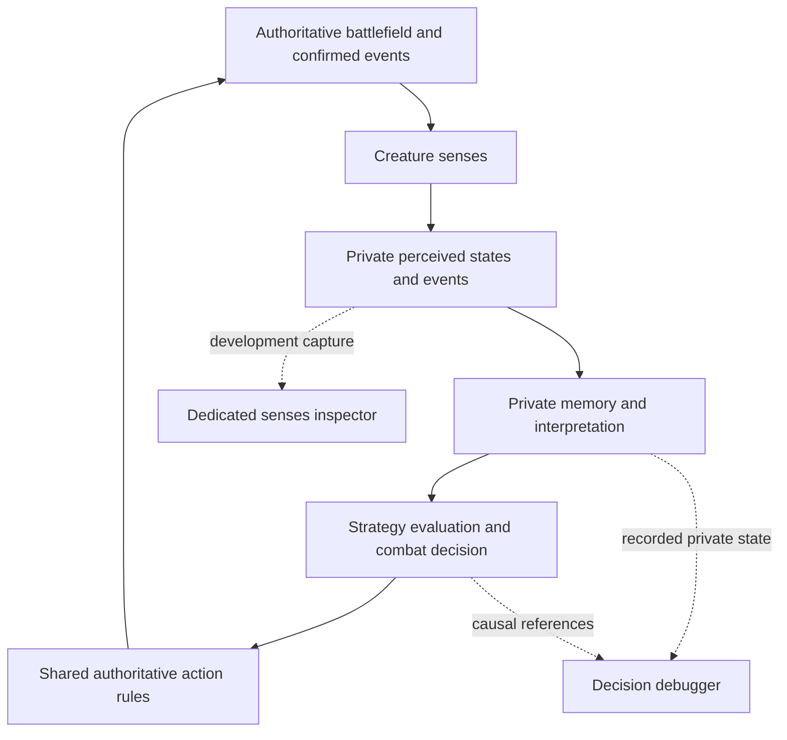

# Combat sensory system and dedicated senses inspectors

Updated **2026-09-11**. Status: **roadmap requirements, not an implementation
record**. The focused/peripheral vision foundation passed
[Team Lead technical re-review](06i-vision-team-lead-review.md); physical-input QA
remains outstanding. **6B.1.1 is implemented:**
[arena cones and separate sense filters](06k-arena-sense-overlay.md), plus
[two dedicated live senses windows](06l-live-senses-windows.md). See that record
for verification and limits; the remaining senses are still roadmap work.

This is the current design for the creatures we call **MoPocks** in conversation.
Use generic names in code: follow existing `character` terminology, with `creature`,
`agent`, `sense`, `observation` and `perception` where appropriate. Do not introduce
`MoPock`, `Mopock` or `MOPOCK` identifiers, modules, filenames, API/schema names or
diagnostic roles. Developer titles should describe their job, such as
**Character P1 · Senses**. This planning change does not rename runtime code.

## 1. Observations first, meaning later

Build a simplified, state-based perception system for autonomous battles. We are
not simulating limbs, balance, detailed anatomy or procedural body control.

Senses answer **what was detected**. Memory records **what was previously detected**.
Interpretation estimates **what that evidence might mean**. Strategy chooses
**what to try**, and the host decides whether the action is legal and what happens.
Neither an inspector nor a sensor chooses an attack or applies damage.

Two creatures may receive equivalent observations and choose differently because
of their traits, memories, personality, experience or perceived trainer advice.
Those differences must remain explainable through private inputs and decisions.

## 2. Five complementary senses

These quality ratings are relative gameplay design targets. Actual range, detail,
uncertainty and timing depend on the creature's capabilities and authored rules.
They are not biological measurements or implemented guarantees.

| Sense | Question answered | Accuracy / detail | Range | Persistence of the sensory signal | Line of sight |
| --- | --- | --- | --- | --- | --- |
| Vision | What can I see now? | High / high in focus; coarse in periphery | Medium to high | Low; a sighting stops being current when lost | Required |
| Hearing | What just happened nearby? | Medium / low to medium | High | Very low; discrete events | Not required; sound propagation still matters |
| Olfaction | What might be here, or have been here? | Low / low | High | High; scent can remain after its source leaves | Not required; scent propagation still matters |
| Tactile / terrain | What am I standing on or touching? | Very high / medium | Current surface or direct contact | None after contact ends | Not applicable |
| Pain / damage | Am I being hurt? | Reliable about own perceived hurt; no automatic source identity | Self | Brief event and any explicitly modelled hurt duration | Not applicable |

Signal persistence and memory lifetime are separate. Remembering a sound does not
make it a newly heard sound; remembering contact does not mean contact continues.

### Vision

Keep the existing distinction: **60° focused field inside a 160° total field,
8 gameplay units, sampled at 10 Hz** as the first profile. Supported configurations
must preserve the reviewed boundary and range guarantees.

- Focus supplies observed position, direction, distance and visible state of a
  subject. Re-identification requires enough visual detail; hostility is not an
  automatic property of every detected creature or trainer.
- Periphery supplies coarse presence, direction sector and range band. It does
  not supply an exact dot, species, identity or detailed action state.
- Idle and movement are current visual facts. Attacking, hurt, stunned, visible
  projectiles and hazards become observations when those gameplay features and
  their visible tells exist. Do not expose private action intent or hidden timers.
- Moving away can be observed. **Fleeing** is an interpretation unless an explicit
  visible signal establishes it. Likewise, invisible does not mean dead or absent.
- `enemy_not_visible` means a previously known subject is not in the current
  sightings. It cannot require a hidden enemy lookup. Last-seen direction and
  position belong to memory, with their original time.
- Range, focused/peripheral classification and occlusion all apply. Being inside
  the nominal cone alone does not make a subject visible through a wall.

Precise dodge/block, chase or attack preparation may later use focused evidence.
Losing focus removes current detail; old detail remains only as expiring memory.

### Hearing

Hearing detects events: movement, attack sounds, impacts, hurt sounds and
environmental sounds. A permitted observation can include sound category,
approximate direction, near/medium/far distance band, quiet/normal/loud intensity
and event time. Categories and precision depend on what the listener can recognize.

A sound behind the creature can motivate a turn or evasive decision without
revealing an emitter's identity or current position. Walls need not prevent
hearing, but attenuation and obstruction rules must be explicit. Source movement
after an event never moves the remembered sound. Re-reading the event is not
another sound. Later trainer advice must reach the creature through a permitted
communication/sensory path.

### Olfaction

Olfaction provides persistent but uncertain traces of creatures or previous
activity. Observations may include detectable scent class, approximate direction,
weak/medium/strong strength and old/recent/very-recent freshness.

Creature, blood, food and unknown are potential scent classes. Recognizing a
particular creature or an enemy scent requires an authored capability or learned
association; a hidden faction or entity ID is not free information. Blood and food
signals remain future concepts until their gameplay sources exist.

Scent can support tracking, finding hiding creatures, following a trail and
countering stealth. A strong scent does not prove its source is still present.
Propagation, decay, blockage and any directional uncertainty must be inspectable;
no exact hidden coordinates may be recovered from an otherwise coarse reading.

#### 6B.2 olfactory trails: corrections required

The owner approved this scope on **2026-09-11** and a coding-agent candidate now
implements it; see the [implementation record](06n-olfactory-trails.md) and the
[coding-agent report](06o-olfaction-coding-agent-report.md). The
[Team Lead review](06p-olfaction-team-lead-review.md) requires corrections to
crossed-tile deposition, freshness and sampled-coverage rendering. The
[active delegation](delegation.md) assigns these corrections. Technical and owner
acceptance remain pending. The scope below is preserved as the contract.

- Configured emitters leave scent on ground they occupy or traverse. Deposits
  persist after departure, spread locally and dissipate with simulation time.
  Stationary living sources continue bounded local emission. Terrain propagation
  rules must be explicit and independently testable from walking and vision.
- Archer, future Lancer/Warrior and human trainers share generic **human scent**.
  Orc emits **orc scent** and has greater olfactory reach than the human profiles.
  Lancer and Warrior are not admitted as playable characters by this slice.
  Emission and sensing are independent; a future robot can emit no scent.
- Same-class sources blend. Smell cannot identify an individual, owner, opponent,
  exact source position, source count or action. Human trainers and future
  bystanders can mislead a searcher. Self-scent handling must prevent permanent
  self-chasing without erasing all other same-class scent or granting recognition.
- Coarse presence can motivate intensive search; a supported approximate bearing
  can motivate investigation. Existing focused vision retains confirmed target
  acquisition and pursuit. Smell alone never triggers the target-found body hop
  or refreshes an exact last-seen visual position.
- Each existing Senses window gains an Olfaction page showing the creature's
  actual permitted local readings as a heatmap, with scent-class colors, range,
  strength, supported freshness and unknown areas. A separate labeled host-field
  heatmap in the arena supports deposit/decay QA. It is privileged diagnostic
  data and never becomes creature input or a more detailed creature-readings page.
- Generalize the common perception lifecycle across vision and olfaction:
  configuration, scheduled measurement, private delivery, diagnostic projection
  and recorded evidence. Keep each sense's measurement rules separate, with
  independent sample times and no shared mutable creature knowledge.
- New rounds and F7 reset clear scent and private olfactory state; teleporting
  to the reset positions does not paint a trail. Replacing one creature preserves
  the other mind and the existing environmental deposits, which decay naturally.

Acceptance includes private-input invariance, anonymous mixed human sources,
Orc-versus-human range, scentless configuration, self-scent, fading trails,
rendered heatmaps, actual smell-guided searching, reset/replay and bounded cost.
Wind, new NPC systems, individual scent learning and the other senses remain later
work. The coding agent chooses implementation details and returns evidence for
independent Team Lead review.

### Tactile / terrain

This sense stays extremely local: current ground and direct physical contact.
It may report material such as grass, mud, water, rock or sand; supported surface
properties such as slippery, slow, stable or hazardous; and contact with a
creature or obstacle when the physical rules actually establish it.

The sensor reports **water**, not **water is advantageous**. The brain may combine
that observation with its own water capability and previously observed opponent
behavior. An opponent being slow in water must come from observed experience,
not from reading its hidden movement modifiers.

Terrain ahead is not tactile input. Local contact never grants a full terrain map
or a globally informed route. Remote ground vibration, if added later, needs its
own limited signal rules rather than expanding touch silently.

### Pain / damage

Pain reports that the creature was hurt and approximately how severe it felt:
none/low/medium/high/critical, or a light/moderate/heavy damage event. Define the
duration of any current hurt state separately from the event and its memory.
Do not add detailed body-region or anatomical awareness to this design.

Directional pain is optional and only available if gameplay explicitly supports
it. Pain must not automatically reveal the attacker, attack name, the attacker's
damage stat or its hidden position. Heavy pain plus a heard attack from the west
supports a hypothesis about a western threat, not a confirmed attacker lookup.

Authoritative damage belongs to combat effects. The pain sensor consumes the
confirmed effect once; it does not apply a second hit. Disabling pain perception
does not disable damage. An unsupported or disabled receptor must not appear as
`hurt = false`. Pain becomes active with the first real damage milestone, **6C**.

## 3. Organize the data around evidence

`PerceptionState` is a useful conceptual umbrella, not a prescribed code type.
It should describe this observer's permitted evidence; avoid a single perfect
`enemy` record assembled from unrelated or hidden facts.

| Conceptual area | Contents | Ownership rule |
| --- | --- | --- |
| Vision | Bounded focused sightings and anonymous peripheral cues | Many subjects/cues, with each region's allowed precision |
| Hearing | Bounded recent audible events | Keep event time and uncertainty; never follow the hidden source |
| Olfaction | Bounded local scent readings | Strength/freshness describe a trace, not confirmed current occupancy |
| Tactile | Current surface and confirmed local contacts | Known only where the creature actually has contact |
| Pain | Recent perceived damage events and supported current hurt state | About self; attacker attribution requires other evidence |
| Memory | Bounded earlier observations | Preserve source, time, precision and expiry |
| Interpretation | Hypotheses and learned associations with evidence references | Uncertainty stays explicit; inference is not a fresh observation |

Every active sense needs observer/round identity, sample or event identity, source
time, delivery time, status and its permitted precision. Show the difference between
unimplemented, disabled, waiting, sampled-empty, current, retained and stale data.
The exact types and storage layout are implementation choices.

Each sense can update on its own schedule. Keep the source time of every reading;
combining fresh hearing with retained vision does not make both fresh. Preserve
the existing independent creature workers and their private inputs. Diagnostic
windows neither become decision workers nor set the simulation clock.

Do not collapse all senses to one target coordinate or one confidence number.
Conflicting sounds and sightings can coexist. Combining them may create a
hypothesis, but must not manufacture exact identity or refresh a last-seen position.
Future attack recognition and learning must refer back to the actual evidence.

## 4. Dedicated Godot senses windows

### Separate jobs, separate views

Provide **one native Godot senses window per creature**, separate from the playable
client and the existing decision debugger. With two creatures this means two senses
windows alongside the two decision windows. Each binds to one run, owner, round
and runtime entity, including same-definition creatures.

The owner's clarified purpose is **manual QA of what this creature detects right
now**. The senses window is a live sensor monitor with a spatial view and a readable
list of current detections. It never runs another brain.

Keep event logs, stack traces, decision trees, history timelines, interpretation
and replay controls in the existing decision debugger or QA replay window.
The later owner-requested **Exploration memory** tab is an explicit exception for
inspecting that creature's remembered visited regions. Preserve it. Vision and
Olfaction pages remain current-readings views; adding olfaction must not introduce
a trace browser or display a remembered detection as current sensory evidence.

The existing `make dev_vision P1=archer P2=orc` and
`make dev_arena P1=archer P2=orc ARENA=tiny_swords_village` development flows should
open these senses windows by default. Each supports independent selection and closure. Keep
explicit development gates, normal/release-mode absence, reload/relaunch identity,
readiness reporting and cleanup. No new command-line switches are prescribed here.

### Proposed layout

| Area | What the developer sees |
| --- | --- |
| Header | Creature identity, LIVE / STALE / DISCONNECTED, per-sense source time and age; an optional frozen snapshot must be clearly labelled |
| Main spatial view | Observer pose, focus/periphery coverage, focused subjects and coarse cue regions; unknown areas stay unknown |
| Sense selector | Vision, hearing, olfaction, tactile and pain, with honest capability/status labels |
| Current detections | Readable values for each currently available reading, including position or approximate bearing, visible state, precision and freshness; selecting a row highlights that reading |

Examples of the eventual readings, shown only when the relevant sense actually
provides them:

| Sense | Example live reading |
| --- | --- |
| Focused vision | `Trainer at (x, y)`; `Creature at (x, y), moving` |
| Focused projectile observation, after projectiles exist | `Projectile at (x, y), observed speed 100 world units/s, direction ...` |
| Peripheral vision | `Presence southeast, far band`; no exact identity or coordinates |
| Hearing, after hearing exists | `Movement sound, approximately northeast, near`; a direction vector is a bearing, not an exact source position |

Motion fields need supported observed data or a clearly labelled estimate from
permitted observations. If speed is not known, show unknown/unavailable; never
invent zero or read a hidden projectile trajectory. Sound events appear as brief
live detections for their defined sensory lifetime, not an accumulating event log.

Only vision produces live evidence in the next slice. Other sense panels say
**Not implemented**; they do not fabricate quiet, no scent, safe terrain or no pain.

### Live spatial evidence

Every supported subject in the latest delivered visual sample must appear in the
senses window. Focused subjects can use markers or permitted visible artwork at
their sampled position/facing/state. Peripheral detections use wedges/bands or
another visibly coarse representation, never exact enemy sprites or coordinates.
Occluded and out-of-range subjects leave the current detections at the next
delivered sample. Old sightings remain inspectable as memory in the decision
debugger; do not keep them as ghost subjects in this live senses view.

Show nominal cone boundaries and the occlusion-limited coverage clearly. Coverage
geometry is a diagnostic illustration of the sensor, not a claim that the brain
received a complete terrain map. A privileged reference map, hidden candidates and
visibility rejection reasons stay in the existing explicit **Host diagnostics**
view in the decision debugger/replay tooling, outside this live senses window.
Currently unsupported projectiles, hazards and terrain-detail observations must
not be invented just because the renderer has access to a world object.

Live means following actual sensor deliveries. Keep source time, delivery time and
display age visible. With 10 Hz eyes, the creature obtains a new sample every six
simulation ticks; smooth rendering must not refresh that sample or fill its gaps
with hidden live positions. Retained samples stay at their sampled pose. A stale
stream must be visibly stale. If a freeze/resume control is provided for manual
inspection, it freezes only the current display and never stops the battle; it
does not introduce trace stepping or a historical timeline into this window.

### Vision in the existing debug filters

The [arena-overlay slice](06k-arena-sense-overlay.md) now supplies a separate
**Senses** group in development **Filters**. Preserve the following requirements
as the live senses windows are added; current-detection markers remain future work:

| Filter | Expected behavior |
| --- | --- |
| Vision cones | Show/hide sensing geometry independently of collision drawing |
| Focused field | Distinct central boundary/fill; cyan is the current convention |
| Peripheral field | Distinct outer boundary/fill; amber is the current convention |
| Observer P1 / P2 | Independently choose whose coverage is shown |
| Current detections | Show/hide the live reading markers independently of cone geometry |

Remembered evidence and host diagnostics keep their controls in the existing
decision/replay views. They are not layers in the dedicated live senses window.

The game-window cone overlay and the senses inspector must agree on observer,
sample, profile, pose, range and occlusion. Filter changes only affect presentation:
they cannot change sensing, decisions or collisions. Do not label vision as a
collision shape. Preserve the existing collider controls and camera input.

The playable client's full battlefield presentation is not the creature's knowledge.
Its cone overlay must make its sampled timestamp clear if it differs from the
displayed/predicted world. Inside a delayed audience window, use evidence matching
that delayed frame or show it as unavailable; never overlay future live senses.
Keep private sensory data out of ordinary player/audience packets.

### Logging, replay and performance

- Record enough bounded evidence to reconstruct what each sense delivered and
  what memory/interpretation used it. Distinguish observed loss, expired memory,
  disabled sensing and dropped telemetry.
- The senses window follows live deliveries. Recorded inspection stays in the
  existing decision/replay tools: replay selects recorded world/evidence from
  one time; it does not resample today's world.
  Stepping cannot reveal later memory changes or outcomes. Missing old sense data
  stays unavailable, including recordings made before a sense existed.
- Keep logs, queues, lists and history bounded. Preserve Git ignores, daily purge,
  pinned recordings, truncation/drop counters and explicit recording-stop status.
  Avoid storing identical full decision trees again just to open another view.
- Opening extra windows must not add sensing work or rerun decisions. Slow readers,
  filtering, pause and closure must not block the simulation or alter its results.
- For the two-creature 10 Hz QA workload, target **p95 delivery-to-display delay
  at most 150 ms** in the live senses view. This is a new acceptance target, not a
  measured claim. Report sensing age separately, plus p50/p95/max publication and
  display delay, update gaps, writer cost and existing inspector browsing latency.
  Measure with both player, decision and senses windows plus recording enabled.
- The current candidate reports roughly 100 ms writer publishing per 250 ms cycle
  and a roughly 100-second recording limit. Re-measure with the extra windows;
  do not claim smooth live sensing or larger-battle capacity from serial AI timing.

## 5. Example: interpreting an unseen threat

| Layer | Information available |
| --- | --- |
| Current vision | No focused sighting of the previously observed opponent |
| Visual memory | Opponent last seen north at an earlier tick; its position is fixed and ageing |
| Hearing | A movement-like event from roughly northeast |
| Olfaction | Strong scent associated with a known opponent, if this creature can recognize it |
| Tactile | Current ground is mud |
| Pain | An active receptor reports no recent hurt event |
| Interpretation | The opponent may have moved northeast; this remains a hypothesis |
| Decision | Evaluate whether to search, wait or reposition using own capabilities and past experience |

The brain never receives the hidden opponent's exact coordinates or an internal
`hiding` action from this combination. Another creature can reasonably choose a
different response to the same evidence. This is a future multi-sense example,
not current implemented combat behavior.

## 6. Roadmap and acceptance

| Checkpoint | Scope and stopping point |
| --- | --- |
| 6B.1 technical re-review passed | Wall-boundary visibility, supported-range correctness and individual reset isolation are verified; retain the independent regressions |
| 6B.1.1 senses inspector | Two dedicated live senses windows, current visual readings, vision filters and lifecycle/latency proof; later owner-requested exploration memory has its own tab |
| 6B.2 olfaction, corrections required | Candidate provides trails, private noses/search and heatmaps; Team Lead R1–R3 cover missed deposits, false freshness and unknown-area rendering before acceptance |
| 6B.3 hearing | Audible event observations, explicit uncertainty and its inspector panel |
| 6B.4 tactile / terrain | Current ground and supported direct contacts, with its inspector panel |
| 6C combat and pain | First authoritative combat effect and private perceived hurt feedback; visible combat tells and pain panel become active as their sources exist |
| 6D–6F | Combined memory/interpretation, composable tactics, moods, trainer relationship and experience-based learning |

Accept 6B.1.1 separately from the vision correction. Do not implement all five
senses, a fusion engine, combat or neural learning while building the first senses
window. The four environmental senses precede combat; pain is the fifth sense in
the design and activates with real damage, avoiding a separate fake damage system.

Required proof for the senses-window checkpoint:

1. Two actual native senses windows coexist with both decision windows and clients;
   same-definition creatures remain independently bound through reset/relaunch.
2. The close-quarters QA arena shows focus acquisition, peripheral cues and loss
   behind cover in the live window. Confirm fixed last-seen memory separately in
   the decision debugger. Include the corrected wall-edge/corner cases.
3. Every current visual marker can be matched to delivered evidence. Filter toggles
   and replay preserve precision, sample age and the separation from host truth.
4. Live readings advance while the decision debugger is paused or closed. Closing
   a senses window does not close other windows. Any optional display freeze is
   visibly marked and does not stop production.
5. Recorded playback and event stepping in the existing QA tools show the evidence
   actually used; missing or stale data cannot borrow another creature's data or
   a later frame. The senses window contains no logs, stack traces, decision trees,
   interpretation or history/replay controls. Its later Exploration memory tab
   stays separate from current receptor readings.
6. Debug-enabled/disabled and slow-reader runs produce equal permitted observations
   and actions. Normal/release runs expose no inspector or private data export.
7. Report bounded resource use and measured live/browsing responsiveness. Include
   native-window captures, automation results and separately stated physical input
   coverage. Keep nearby labels readable, including host diagnostic overlays.

The [archived senses-window delegation](06l-completed-senses-delegation.md) preserves
that checkpoint's original acceptance baseline; the subsequent owner-requested
Exploration memory tab supersedes its prohibition on every memory panel.
The active [delegation](delegation.md) assigns the olfaction corrections from the
[Team Lead review](06p-olfaction-team-lead-review.md). The original candidate is
recorded in [6B.2 olfactory trails](06n-olfactory-trails.md).
Algorithms, internal APIs, file layout and refactoring technique remain the coding
agent's responsibility. The Team Lead reviews architecture, behavior and evidence.
