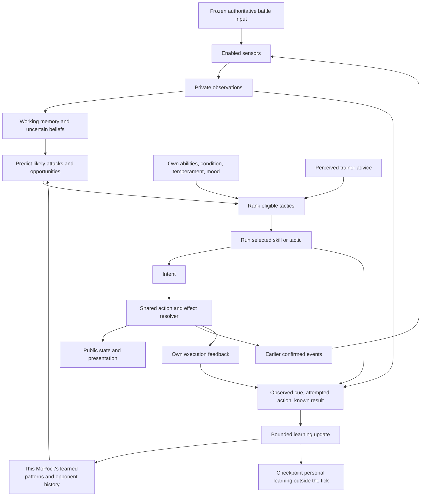

# MoPocks: learning from battle experience

Research and source review: **2026-09-10**. Status: **design proposal**.

Implementation sequence: [MoPock senses and separate AI debug windows](../06c-senses-and-ai-debug-windows-plan.md).
That plan records the live-code refactors and starts with vision; this document
retains the research rationale and longer-term algorithm options.
The preceding [dedicated-thread debugger harness](../06d-ai-debugger-harness.md) is
implemented for current idle/wander AI. It records real branches before senses,
learning and variable-duration deliberation are added.

MoPocks means “monsters in your pocket”: individual companions whose battle habits develop through their own encounters and their relationship with a player. This document proposes an implementation and connects its decisions to scientific papers. The examples, tuning values, and acceptance targets below are proposed game design, not measured results.

## 1. The experience we want

A young MoPock sees an enemy lower its head, retreats straight backward, and gets caught by a charge. In later exchanges it tries stepping sideways. It starts associating that visible preparation with a narrow forward attack, learns when a sidestep works, and remembers the lesson next match. When the enemy begins feinting, it becomes less certain and adjusts again.

Another player's MoPock has different experiences: it prefers blocking charges and punishing the recovery. Both can improve while keeping different habits.

**Recommended foundation: shared combat abilities + composable tactics + private sensory memory + an opponent model + small outcome-based learning updates.** Add neural networks when a measured limitation justifies them.

This recommendation has a close robotics precedent. D'Ambrosio et al. combine reusable low-level table-tennis controllers, skill descriptions, a high-level selector, and online preference learning against unfamiliar opponents. That is a useful architectural analogy for MoPocks; their experiments do not establish performance in our game. [Competitive robot table tennis, 2024][S2]

The player-facing promises should be concrete:

- **It remembers:** experience survives reconnects and future matches for that individual MoPock.
- **It learns:** observed outcomes change its estimates and future choices.
- **It adapts:** new evidence during a fight can change its current prediction or tactic.
- **It has character:** temperament, mood, abilities, and training history influence its choices.
- **It has limited senses:** it can act only on its own available evidence and declared public information.

### Four different meanings of “learning”

| Mechanism | What changes? | What we can honestly call it |
| --- | --- | --- |
| Encounter unlock | An authored rule grants a pattern entry after an encounter. | Discovery/progression. Useful, but does not demonstrate that a response was learned from outcomes. |
| Opponent learning | Estimates of cues, timings, combinations, and opponent tendencies change. | Learning what another creature is likely to do. |
| Response learning | Values or probabilities of usable responses change after attempted actions. | Learning what works for this creature in this context. |
| Skill acquisition | Execution parameters or the internal policy of a skill improve through practice. | Learning how to perform a behavior; a later and separate problem. |

Start with opponent learning and response learning over authored skills. A neural network is one possible representation of a learned function; it is not a requirement for learning. Adaptive rule selection already has a substantial game-AI precedent. [Dynamic scripting][S1]

## 2. Where this fits in the current repository

The live source currently supports autonomous idle/wander behavior. Combat sensing, attack-pattern learning, moods, and persistent creature cognition remain future work. `MoPock` is the design name here; retain the existing `character` names in implementation unless a separate naming change is chosen.

| Existing source | Verified foundation | Proposed extension |
| --- | --- | --- |
| [AI contracts](../../server/ai/types.odin) | `Idle_Wander` controller; `Hold`/`Move` intents; per-agent random state and a decision record. | Observations, private beliefs, skill state, and learned estimates. |
| [Orchestrator](../../server/ai/orchestrator.odin) | `agent_decide` requests an intent; `agent_record_result` receives the execution result. | Select tactics and update experience through the same separation. |
| [Battle runtime](../../server/battle.odin) | Builds all character contexts before executing either character's action; agents are bound to round/entity IDs. | Sense from one frozen battle input sample after the trainer update and attach a separately loaded persistent identity. |
| [Action resolver](../../server/character_actions.odin) | Validates movement and locks, applies collision, and reports outcomes. Ordinary walking has a 12-tick preparation period. | Shared ability phases, costs, hit resolution, and explicit dodge rules. |
| [Simulation](../../server/simulation.odin) | Owns public `Session` and private `Battle_Runtime` separately. | Keep private cognition in the battle runtime and a persistence adapter. |
| [Movement timing](../../server/movement.odin) | 60 simulation ticks per second; snapshots every three ticks, or 20 Hz. | Measure sensor/decision schedules against attack timing. |
| [Audience history](../../server/audience.odin) | Stores copied `Session` values for delayed viewing. | Keep mutable learning stores outside those historical frames. |

This expands the direction in the [AI orchestration proposal](../06-character-ai-orchestration-proposal.md). The [implementation roadmap](../06c-senses-and-ai-debug-windows-plan.md) now puts vision and separate AI debug windows first, followed by olfaction, hearing and terrain sensing before combat, tactics, moods and learning. This research document does not mean those later features are implemented or that every proposed module should be scaffolded now.

## 3. Choose an approach by what must improve

| Approach | What it buys us | Main limitation | Recommendation |
| --- | --- | --- | --- |
| Authored rules/utility scores with no updates | Understandable baseline and dependable starter behavior. | Never learns from experience. | Keep as the comparison baseline. |
| Learned tactic preferences and context-specific outcome estimates | Cheap personal learning over existing behaviors. | Cannot invent missing skills; local rewards can miss long-term consequences. | **First implementation.** |
| Small temporal-difference learner over tactics | Can value a setup move because it enables a later benefit. | State/context design and delayed credit become harder. | Add when a bandit baseline fails on measured multi-step cases. |
| Recurrent neural policy over skills | Uses observation history and can generalize beyond hand-selected context buckets. | Requires a training environment, diverse data, and careful evaluation. | Later experiment behind the same intent interface. |
| Meta-trained adaptation module | Learns how to adjust quickly from recent experience. | Fast deployment adaptation depends on substantial prior training across varied tasks/opponents. | Research extension after the ordinary learner works. |
| Separate neural network trained from scratch per pet | Directly personal weights. | Each pet has little experience; training, regression control, and storage become harder to manage. | Prefer a shared base plus personal memory or small personal parameters first. |

A **contextual bandit** chooses among available actions using the current context and learns from the chosen action's result. It is a reasonable starting model for a short “which response should I try?” exchange. It does not solve the long-term planning problem of deliberately sacrificing an exchange to win later. [Li et al., 2010][S6]

Use the dynamic-scripting and robotics papers as design precedents. The lightweight learner proposed here is not a reproduction of their algorithms or a claim to inherit their guarantees.

## 4. The architecture: senses, notebook, choice, result



The host needs the actual world to enforce gameplay. A MoPock's decision procedure receives a restricted context built from its observations, memory, and own condition. Give it no world pointer that can quietly reveal hidden enemy positions or planned actions.

All characters sense and decide from the same tick boundary. Resolve accepted intents using documented collision and simultaneous-hit rules. New effects and cues become sensory input at the next permitted sample; neither character gets to see the other's newly selected intent before deciding.

An AI “API” here initially means typed records and procedure contracts inside the server. HTTP calls, a separate service for each pet, and model requests over the network are unnecessary for this loop.

### Identity and memory ownership

| Record | Lifetime and ownership | Contents |
| --- | --- | --- |
| `CharacterDefinition` | Shared, immutable content. | Body/capabilities, sense profile, innate skills, default temperament ranges. |
| `MoPockProfile` | Persistent, keyed by a stable `mopock_id`. | `owner_player_id`, individual temperament, practice history, learned parameters, trainer relationship. |
| `BattleMind` | One active round, linked to `mopock_id` and runtime `entity_id`. | Working memory, current opponent tracks, active tactic, short-term adaptation, RNG, current mood. |
| `PatternKnowledge` | Personal and persistent, subject to versioning. | Learned cue associations, timing estimates, response outcomes, confidence, provenance. |
| `OpponentMemory` | Personal; an individual opponent key only after recognition. | Tendencies for that recognized opponent, with fallback to broader observed style/family knowledge. |
| `BattleExperience` | Bounded recent records plus chosen summaries. | Observation history, decision/action IDs, attempted parameters, outcomes and attribution quality. |

Two creatures can share species, art, and executable skills while having separate memories and learned preferences. A player ID alone is insufficient when a player owns multiple MoPocks. A round/entity ID is insufficient when the same MoPock returns tomorrow.

`owner_player_id` here means a stable owner/account identity, distinct from the current arena's temporary player slot. That durable identity and its profile-loading flow still need implementation.

## 5. Attack-pattern and skill APIs

### Separate mechanics, observations, and learned knowledge

The server's attack definition describes what an attack **actually does**. A sensory observation describes **what this MoPock noticed**. Its learned pattern model describes **what it currently expects**.

These are distinct data contracts. The following is conceptual pseudocode, not existing Odin types or compilable implementation.

```text
AbilityDefinition                         // authoritative content/execution
    ability_id, mechanics_version
    required_capabilities
    resource_cost, cooldown
    phases: windup -> active -> recovery
    geometry_by_phase                      // line, arc, area, projectile, etc.
    movement_and_aim_rules                 // when direction can track or lock
    interruption_rules
    emitted_cues                          // visual motion, sound, ground contact

CueObservation                            // private sensory evidence
    observation_id, event_group_id, sampled_tick, available_tick
    modality, confidence, expiry
    recognized_subject?                   // can be unknown
    payload: VisualCue | SoundBearing | ScentSample | GroundContact | Pain

LearnedAttackModel                        // personal knowledge, not a definition
    model_id, schema_version, compatible_content_version
    cue_features, possible_pattern_families
    estimated_windup_range, estimated_reach_range
    estimated_tracking_or_commit_behavior
    possible_followups_with_probabilities
    evidence_count, uncertainty, last_supported_tick
    response_estimates_by_context
```

Exact hitboxes and phase timers remain in the executor. The learner can estimate them from permitted evidence; it cannot fetch the definition through an enemy ability ID. A sensor may emit semantic cues to keep the first prototype tractable, but it must obey modality, visibility, sampling, and identification rules. “Head lowers” can be a visible cue. “Enemy has secretly chosen charge and will hit in exactly 17 ticks” is privileged information unless an explicit public tell provides it.

### A concrete attack family

An authored `linear_charge` might have a visible lowering posture, an audible scrape, a windup, a direction lock, a narrow active path, and recovery. Its phases and geometry use simulation ticks and gameplay units, independently of sprite frames.

The inexperienced defender has generic responses such as moving aside, creating distance, or guarding if its body supports guarding. Experience can teach it:

- Which cues tend to precede a straight charge.
- How much time usually remains after a cue becomes observable.
- Whether this opponent tracks movement during preparation.
- Whether stepping sideways works at the current distance and stamina.
- Whether a charge often follows a feint or ends in a punishable recovery.

Parameterize patterns by useful features: path shape, range band, tracking, commitment, timing, area persistence, and common follow-ups. This permits cautious transfer from one unfamiliar charge to another. Keep individual-opponent evidence separate from the broad family prior.

### What “more attack-pattern APIs become available” should mean

Interpret this as the MoPock gaining more usable **knowledge models**, plus optional training unlocks:

```text
Unfamiliar cue
    -> record an encounter
    -> form a tentative cue/attack association
    -> predict a likely attack family with uncertainty
    -> compare outcomes of eligible responses
    -> retain useful knowledge and revise it when contradicted
```

The progression labels describe supported knowledge; they are not a hardcoded guarantee that the fifth battle grants a perfect counter. One encounter can introduce a hypothesis. Repeated independent evidence can improve it. A creature should still try a generic dodge before it recognizes a named pattern.

Learning to recognize fire breath does not create the organs, resource, or ability required to breathe fire. Copying an attack is a separate game mechanic requiring capabilities, an unlock rule, and practice. Likewise, a slow creature may correctly predict an attack yet lack time or stamina to evade it.

### Reusable skills and composable tactics

Use three layers with one execution owner:

| Layer | Example | Responsibility |
| --- | --- | --- |
| Primitive intent/ability | Move, hold, guard, use bite. | Request a legal action; the resolver owns its effects. |
| Skill/tactic module | Sidestep a predicted line, keep distance, bait a charge, punish recovery. | Run a bounded sequence with progress and completion. |
| Strategy | Patient counterattacker, ranged pressure, close-range disruption. | Choose and parameterize eligible modules toward a battle objective. |

The research term **option** describes a behavior with a rule for when it can start, an internal policy while running, and a termination condition. That fits a reusable tactic much better than a bare function that returns a movement direction. [Sutton, Precup and Singh, 1999][S3]

```text
SkillDefinition
    skill_id, version, required_capabilities
    parameter_ranges
    can_start(context, parameters) -> eligibility + reason
    begin(context, parameters) -> private_skill_state
    step(context, private_skill_state) -> intent + status
    can_interrupt(context, private_skill_state) -> bool
    finish_or_cancel(...) -> outcome_record

status = Running | Succeeded | Failed | Cancelled

PatternKnowledgeAPI
    observe(private_observation_batch)
    predict_attack(beliefs, personal_knowledge) -> bounded_hypothesis_list
    estimate_response(context, skill, parameters) -> value + uncertainty
    record_experience(observed_episode)
    consolidate(match_summary) -> versioned_profile_delta
```

For example, `bait_then_punish` composes `enter_threat_range`, `wait_for_observed_commit`, `sidestep`, and `attack_during_estimated_recovery`. Each transition has a timeout and failure branch. If the enemy never commits or the cue becomes uncertain, the sequence can exit to guarding or spacing.

The composer combines registered modules and bounded parameters. An authored graph or sequence is enough initially. Automatic invention of new sequences is a separate extension that would require its own search/training and evaluation.

### Arbitration and commitment

First filter by own capabilities, resources, locks, and available evidence. Rank only eligible tactics:

```text
score(tactic) = authored_context_value
              + confidence_weighted_learned_adjustment
              + bounded_temperament_bias
              + bounded_mood_bias
              + bounded_trainer_preference
              - estimated_cost_and_risk
```

Keep terms on compatible scales and avoid counting the same predicted benefit twice. Commit for a bounded interval and require a switch margin to prevent constant indecision. New threats can interrupt only where the current action permits it. Use seeded tie-breaking or bounded stochastic choice among reasonable alternatives.

Start with one voluntary action slot. Later skills may declare compatible movement/attack channels explicitly. A high score never bypasses death, stun, cooldown, terrain, or an irreversible attack phase.

## 6. How experience actually changes behavior

### Two clocks of adaptation

| Timescale | Changes | Example |
| --- | --- | --- |
| During the fight | Working beliefs, recent opponent frequencies, temporary response estimates. | “This opponent has switched from straight charges to delayed sweeps.” |
| Between fights | Consolidated personal knowledge, retained response statistics, practice parameters, trainer relationship. | “Charges of this family often punish straight retreat; I have experience stepping aside.” |

The first implementation can update small tables online and consolidate them after the match. A later neural implementation can adapt through hidden state or a history encoder during a match while keeping network weights fixed. Those are different mechanisms; changing an RNN's temporary state is not itself a persistent update to its weights. [RL²][S9], [RMA][S10]

### Build an opponent model from evidence

An **opponent model** predicts what another agent may do from its observed behavior. Begin with counts conditioned on a small set of useful contexts rather than trying to infer the opponent's complete brain. [Albrecht and Stone, 2018][S4]

Useful context fields include distance band, observed cue family, recent observed attack sequence, own stamina, known escape space, and estimated opponent commitment. Keep the feature set small enough to get repeated examples.

For a discrete follow-up prediction, use smoothed counts:

```text
P(next_pattern = j | context)
    = (prior_mass[j] + observed_count[context, j])
      / sum_k(prior_mass[k] + observed_count[context, k])
```

Count a completed observed attack once, not once per animation frame. Partial or ambiguous observations provide weaker evidence or stay unclassified. Keep “no observation” separate from “the opponent did nothing.” A first version can recognize authored visible cue categories while learning their consequences; learning the recognizer itself is later work.

Use a capped recent window or decay the counts consistently over elapsed simulation time to track changing behavior. Preserve a slower family-level store so one opponent's new habit does not erase all old experience. Repeated prediction errors should reduce trust in the current model and increase consideration of alternatives, including “unknown pattern.”

Back off from recognized individual → learned style/family → authored generic prior when evidence is scarce. Never use a server-only opponent identity to join memories the MoPock could not associate through an explicit recognition or public-roster rule.

### Learn the value of attempted responses

Start with context-specific values for a few responses:

```text
V[context, chosen_response] += learning_rate
                              * (observed_exchange_score - V[context, chosen_response])
```

This is a recency-weighted estimate of a local result. Update it when the outcome window closes, and only for the attempted response. Retain counts and outcome uncertainty alongside the value. Do not award every unused alternative an invented failure.

In a controlled drill with a clearly observed threat, a separate binary outcome model can track whether the creature stayed unharmed through the exchange. A simple Beta(1,1) prior gives the estimate `(unharmed_trials + 1) / (completed_trials + 2)`. Exclude rejected actions and unknown outcomes from these binary trial counts.

| Response in the same drill context | Illustrative completed trials | Smoothed estimate |
| --- | --- | --- |
| Step backward | Unharmed in 2 of 10 trials. | 3/12 = 0.25 |
| Step sideways | Unharmed in 7 of 10 trials. | 8/12 ≈ 0.67 |

These numbers only illustrate the update, with substantial remaining uncertainty. They are not benchmark results. Being unharmed is an observed association, not proof that the action caused a successful dodge; the enemy may have missed anyway. Use controlled comparisons when evaluating causality.

A creature must sometimes try eligible alternatives to discover what works. Permit broader exploration in player-selected practice and bounded exploration among acceptable options in real battles. Never force exploration through an action lock or impossible maneuver. Log the actual selection probability if later evaluating policies from historical action logs.

### Attribute outcomes correctly

Each episode should connect:

```text
mopock_id, match_id, decision_id, action_id, content/model versions
observations available at decision time and their ages
context, eligible responses, chosen response and parameters
selection probability, mood, trainer input
accepted/rejected execution, start/end ticks
permitted outcome observations and attribution confidence
```

Distinguish rejected requests, interrupted actions, contact, damage, apparent misses, and unknown results. Do not treat “selected dodge” or “played dodge animation” as a success. A rejected action is useful execution feedback, but is not a completed test of that dodge's combat effectiveness.

Deduplicate correlated cues from one attack using an event group. Close the result after a defined exchange horizon. If unrelated attacks overlap, mark attribution as ambiguous instead of assigning every later injury to the earlier decision.

The learner receives only outcomes it is allowed to know. It can know its own injury and resource consumption; it cannot learn exact unseen enemy health or cooldown through a reward/debug field. Full authoritative traces may be used separately to evaluate the system.

### Reward design and longer sequences

For a first exchange learner, score observed injury, confirmed useful effects, resource use, and the drill objective. Keep match wins/draws/losses as separate evaluation outcomes. Do not give an unconditional bonus for pressing dodge: that can teach endless dodging. A pure survival bonus can teach avoiding the fight indefinitely.

Store outcome components separately from their weighted score. This lets us change training objectives without pretending that old scalar scores are still comparable. Keep mood and trainer preference as bounded decision inputs initially, with a stable outcome scoring rule for measuring learning.

If baiting, temporary retreats, or combo setup need delayed credit, move to a small temporal-difference learner over completed options. For an option lasting `k` simulation steps, its target includes accumulated discounted reward and a `gamma^k` continuation value; a terminal match has no continuation term. The option framework provides the relevant temporal abstraction. [Options][S3]

Reward shaping can also change which behavior is optimal. Potential-based shaping has a policy-invariance result under its specified MDP assumptions; that does not automatically apply to arbitrary bonuses, approximate beliefs, and changing opponents here. Treat our reward design as something to test. [Ng, Harada and Russell, 1999][S17]

## 7. Senses define what the MoPock can learn

Treat the world as **partially observable**: the actual state contains facts the creature cannot currently know. A **belief** is its uncertain estimate based on history. We can borrow that POMDP framing without implementing an exact POMDP solver. Start with explicit tracks, timestamps, uncertainty, and a few hypotheses. [Kaelbling, Littman and Cassandra, 1998][S5]

| Sense | Initial simulation model | Useful evidence | Natural limitation/counterplay |
| --- | --- | --- | --- |
| Vision | Range, facing cone, line of sight, sampling interval. | Visible motion, posture, locations, obstacles, projectiles. | Blind spots, occlusion, limited range, ambiguous tells. |
| Olfaction | Local samples of a decaying scent field or bounded scent deposits. Add diffusion/wind later if useful. | Strength, change over time, recognized scent class, a coarse gradient when supported. | Old trails, mixed sources, wind, weak signals; no automatic exact target position. |
| Hearing | Sound events with distance/material attenuation and localization error. | Footsteps, charging noises, impacts, heard trainer cues. | Masking noise, silent movement, uncertain source and age. |
| Touch | Actual contact events and attempted movement feedback. | Contact normal/material, a wall, footing or sliding. | Usually local; does not reveal an entire unseen map. |
| Terrain vibration | Ground-coupled events propagated through a simplified material/range model. | Coarse bearing/timing of heavy grounded movement. | Airborne or light creatures, weak coupling, disconnected/damping surfaces. This is an additional sense, not ordinary touch. |
| Proprioception and internal state | Own position/motion as permitted by game rules, resource state, strain and damage receptors. | Whether an action moved the body, stamina, pain, disrupted footing. | Does not reveal the enemy's internal state. |

Disabling a pain receptor changes perceived pain, not authoritative damage. Emotional confidence and statistical confidence in an observation/model are also different quantities.

### Fuse evidence without inventing certainty

Preserve modality-specific payloads. A sound bearing is not a visual position; a scent sample is not an attack windup. Store when each fact was sampled, when it became available, its reliability, and when it expires.

If vision loses a target behind cover, its last-seen position gets older. Hearing from another direction can add a new hypothesis; it must not refresh that old visual position as if it had just been seen. Correlated sound/vision cues from one event do not count as independent repeated encounters.

A future neural encoder can combine modalities, but it needs missing-sensor masks and training with the actual sensory limitations. Work on learning visual/tactile representations for robot manipulation supports investigating learned fusion; it does not establish the correct fusion model for smell or arena combat. [Lee et al., 2019][S12]

### Sensing itself can be a tactic

Give the creature actions such as `turn_to_listen`, `scan_blind_side`, `investigate_scent`, and `test_footing`. These spend time or expose it to danger to obtain better information. A hearing-focused creature may pause and listen; a visually focused creature may circle to restore sight.

For smell, begin with tracking recent local evidence and searching when the trail is lost. Infotaxis studies movement chosen to reduce uncertainty about an odor source, while later work trains recurrent agents to navigate simulated odor plumes. These motivate optional information-seeking or learned scent-search behavior; neither requires us to simulate full fluid dynamics in the first arena. [Infotaxis][S19], [Singh et al., 2023][S11]

### Perception and reaction time must agree with combat

Define the whole latency chain: cue emitted → sensor sample → observation available → decision → action preparation → movement/effect. Fast threat checks may need to run more frequently than slow scent updates.

The existing ordinary walk starts with 12 ticks of preparation, or 200 ms at 60 Hz. A sidestep implemented only as ordinary walking must account for that. If we want a faster dodge, author a distinct movement ability with explicit preparation, distance, resource, collision, and interruption rules. Invulnerability is a separate gameplay choice; it is not implied by the name `dodge`.

Give an unfamiliar attack enough observable warning for at least one physically possible response in the first drill. Learning should improve recognition and choice within those limits. It cannot compensate for an attack that resolves before sensing and actuation can finish.

## 8. Moods that affect decisions and behavior

Model mood as a small state with causes and recovery. Keep four concepts separate:

| Concept | Typical lifetime | Example |
| --- | --- | --- |
| Temperament | Persistent, slowly changing. | Naturally cautious, curious, patient, or confrontational. |
| Physical condition/drives | Changes with simulation and recovery. | Stamina, injury, hunger if the broader game includes it. |
| Mood | Temporary, with a baseline and decay. | Fear, frustration, excitement, or confidence after recent events. |
| Trainer relationship | Persistent and specific to the relationship. | Trust and receptivity to that player's advice. |

Computational emotion research explores effects on motivation, state, action selection, and learning. It supports several possible designs rather than one scientifically established “correct mood formula.” Our initial mood model is a controllable game-design choice. [Moerland, Broekens and Jonker, 2018][S13]

Start with normalized `fear`, `frustration`, and `arousal` values and a temperament-specific baseline. Derive readable labels from them. An illustrative update for each component is:

```text
mood_next = clamp(
    baseline + (mood - baseline) * exp(-elapsed_seconds / recovery_time)
    + appraised_event_impacts,
    0, 1)
```

**Appraisal** means interpreting an event relative to the creature's expectations and goals. An unexpected painful hit can raise fear; a repeatedly blocked preferred action can raise frustration; safe recovery can move mood toward baseline. Process each event once and bound changes so one exchange cannot permanently rewrite the creature's personality.

| State | Proposed effect on combat | Proposed effect outside an exchange |
| --- | --- | --- |
| High fear | Prefer more escape space, penalize uncertain commitments, consider guarding. | Stay closer to the trainer or investigate cautiously. |
| High frustration | Increase pressure or switch away from a repeatedly unsuccessful approach. | Restlessness or a reluctance to repeat the same drill. |
| High arousal | Change willingness to commit and attention allocation within authored limits. | More alert scanning or animated movement. |
| Calm with trusted advice | Give a small extra preference to the advised eligible tactic. | More willingness to practice or inspect unfamiliar cues. |

Mood biases choice; action rules still decide what is physically possible. If mood changes reaction delay, stamina, or sensor attention, make that an explicit bounded mechanic. It cannot silently reveal hidden information or erase cooldowns.

Initially keep battle-outcome scoring fixed while mood affects selection. Otherwise “became angry and changed its reward definition” can be mistaken for improved combat learning. Log mood with each experience so later analysis can distinguish “this response fails” from “this response was usually attempted while exhausted or panicking.”

## 9. The player learns with the MoPock

Give the player influence through practice, preferred style, and feedback tied to observable actions:

1. **Choose a drill:** practice against a charge, a projectile, an ambiguous tell, or an opponent that changes habits.
2. **Express an intention:** prefer distance, conserve stamina, or punish recovery. This adjusts preferences within the creature's capabilities.
3. **Give feedback on a specific exchange:** approve a sidestep or ask for more patient timing. Attach feedback to an action/episode ID, not whichever action happens to be running when a delayed message arrives.
4. **See the lesson:** show a short notebook entry with evidence and uncertainty, followed by an opportunity to practice it again.

TAMER studies agents learning from human evaluative feedback. It motivates a training interaction here; its learned human-evaluation model is distinct from our battle reward, and neither praise nor criticism should be treated as a verified combat outcome. [Knox and Stone, 2009][S14]

Example notebook text, to be generated from recorded facts:

> “I tried stepping backward against that charge four times and was hit three times. I want to try moving sideways when there is space.”

Later, a player might learn from the MoPock that it needs room to evade, change the drill or strategy, and see the creature's choices improve. That is the shared learning loop.

Keep commands bounded and host-validated for ownership, delivery, timing, and rate. If commands are spoken in-world, they must be heard. They convey their permitted message rather than granting hidden enemy coordinates. Trust may affect whether advice is followed; it is not permission to execute an illegal action.

Let recognition improve through encounters, and execution improve through suitable practice. Repeated practice is legitimate evidence, but repeated copies of the same logged event must not create extra learning. Any progression rewards for novelty or opponent variety should be separate from the statistical evidence used to learn.

## 10. A neural-network path that preserves individuality

### First neural experiment: predict, then compare

A small supervised predictor can be a narrower first neural experiment than replacing the entire controller. Input permitted cue history and predict an attack family, timing interval, or likely next observed action. Compare it with the explicit count/table predictor on held-out opponents and cue variants.

Train on labels that are actually supported by observations for personal learning. Offline tooling can have separate diagnostic labels, but those labels and hidden simulator state must never become accidental policy inputs. Keep uncertainty and an unknown-pattern fallback.

### Next experiment: a recurrent policy over existing skills

```text
Inputs:
    sensory features + missing-modality masks + observation ages
    private belief/track summaries
    own condition and usable skills
    temperament, mood, trainer preferences
    personal learned-knowledge summaries
    previous action and permitted observed result

History encoder / small recurrent network
    -> skill scores
    -> bounded skill parameters
    -> optional attack prediction

Eligibility filter + existing skill runner + shared resolver
    -> actual gameplay
```

A recurrent network carries a compact internal state between decisions. DRQN demonstrates a neural approach to integrating partial observations over time; it does not show that every recurrent policy outperforms a simpler controller. [Hausknecht and Stone, 2015][S7]

An initial candidate is a small recurrent skill selector trained with an appropriate policy-learning algorithm. PPO is one established candidate for training in simulation outside live matches, not a guarantee of sample efficiency in this environment. Compare it against the hybrid baseline using the same observation and action interface. [Schulman et al., 2017][S8]

Mask ineligible skills before sampling, using the creature's own condition and permitted context. Log selection probabilities after masking. The shared resolver validates the resulting request again before execution.

Use a shared base model with personal explicit memory and, only if useful, a small personal parameter vector or adapter. Each MoPock also has its own temporary recurrent state. A unique player/creature ID is a storage key; it is not meaningful sensory evidence about an opponent.

Do not accidentally erase the discovery mechanic through pretraining. A shared network trained to recognize every attack perfectly may already know counters that a new pet's notebook calls “unknown.” Either declare that knowledge innate, or design training and knowledge access so the new-pet evaluation really starts without the encounter-specific knowledge being tested.

### Fast adaptation is a trained capability

RL² trains a recurrent system across tasks so its state can support adaptation on a new task. RMA combines a base controller with an adaptation module that estimates relevant environmental factors from recent history. Their deployment adaptation is useful inspiration for a MoPock that adjusts to an opponent or unfamiliar footing. [RL²][S9], [RMA][S10]

For our proposed version, train across varied opponents and conditions, and make the history encoder infer a compact context such as “tracks early dodges,” “often feints,” or “footing is slippery.” This is our application of those ideas; locomotion adaptation is not itself evidence of strategic opponent learning.

Reset temporary battle state intentionally. Persist explicit personal knowledge through its own schema. Saving an opaque recurrent hidden state forever is not a substitute for a versioned memory system and can become incompatible when the model changes.

### Training and deployment contract

- Run the production combat simulation headlessly, without Godot rendering or network traffic, to generate experience. Use its actual mechanics and observation boundary.
- Train in a separate process. A Python training tool is a possible adapter; do not put gradient updates or database waits inside the simulation tick.
- Randomize opponents, spawn geometry, attack timings within allowed ranges, sensory limitations, and feasible body capabilities. Retain a separate evaluation set.
- Train recurrent models on sequences with defined reset/memory boundaries. Random isolated transitions alone lose the temporal context we are trying to learn.
- Export a versioned model and feature specification; verify the training implementation and Odin-side inference produce matching outputs on saved cases. Choose the inference runtime only after a small integration proof.
- Keep model weights fixed during a match initially. Perform rapid adaptation through memory and bounded tables, then consider personal parameter updates between matches.
- Preserve the same legal action filter and a known fallback if inference fails or exceeds its budget.

For PPO, collect suitable fresh policy rollouts. Do not silently mix arbitrarily old experience into its ordinary update as though it were fresh on-policy data. Old episodes remain useful for evaluation, supervised prediction, distillation, or a deliberately chosen replay-compatible training method.

Learning from a diverse opponent population is a useful later direction. AlphaStar is a precedent for league-based training with varied strategies and counter-strategies. It is not a practical training-cost estimate for this project or an example of a persistent player-owned pet. [Vinyals et al., 2019][S18]

## 11. Persistence, forgetting, and runtime cost

### Save personal learning without blocking combat

Use a host-owned profile store keyed by stable `mopock_id`. Load a coherent profile before the round, mutate its bounded battle copy, and save a copied delta/checkpoint outside the tick. SQLite is a plausible first local store; a database is not needed to prove the initial in-memory learner.

Include schema version, model/feature version, gameplay content version, profile revision, and processed match/event IDs. Writes must be atomic and idempotent so retries do not learn a battle twice. Conflicting updates to one profile need serialization or an explicit merge rule.

When attack mechanics change, invalidate or migrate affected timing/response knowledge. Do not silently carry old exact estimates into a new ruleset. Missing or incompatible data should fall back visibly to the appropriate prior while preserving recoverable identity/history.

### Remember useful lessons while adapting to new ones

Keep recent opponent tendencies separate from long-term family knowledge. Cap evidence strength so months of old data do not make revision impossible. Retain representative successes, failures, rare threats, and surprising outcomes in a bounded archive.

If neural training becomes continual, two problems need separate checks:

- **Catastrophic forgetting:** improvement on new opponents damages old skills. CLEAR studies replay and behavioral preservation in continual reinforcement learning. A bounded representative replay store is a candidate mitigation, not a universal cure. [Rolnick et al., 2019][S15]
- **Loss of plasticity:** the network becomes worse at learning new tasks after extended training. This differs from forgetting old tasks. Dohare et al. study this failure and methods for maintaining learning ability. Do not assume a pet can improve indefinitely just because gradient updates continue. [Dohare et al., 2024][S16]

Version shared model updates and test how they affect existing personal profiles. A new global model should not silently overwrite a pet's practiced preferences or invalidate the meaning of saved features.

### Keep costs bounded and measure them

The current roster has two player/character slots. Begin on the existing CPU simulation. If future scale needs GPU batching, shared immutable models and separate per-creature state remain useful, but throughput needs its own benchmark.

Cap observation tracks, remembered pattern models, candidate tactics, episode history, and per-decision work. Select the actual limits from measurements and game needs. Sample slow senses less often than urgent combat cues, while preserving their documented latency. Expensive planning, persistence, and neural training stay outside the time-critical action path.

Record simulation time per step, decision-time distribution, memory per pet, queue depth, and missed deadlines at the target concurrency. Same-build seeded replay is the initial reproducibility goal; cross-platform bit-identical floating-point behavior is a separate requirement.

## 12. Build the first proof in visible milestones

These are research deliverables within the existing sensing/combat/learning direction, not a replacement for its checkpoint ordering.

| Milestone | Concrete result | Acceptance evidence |
| --- | --- | --- |
| **A. Observable combat foundation** | Vision/contact observations; one enemy charge with a tell, real collision/damage, and at least two feasible defender responses. | The defender responds only after evidence is available. Show cue, decision, preparation, collision, and outcome ticks in one trace. |
| **B. Fixed strategy baseline** | Utility selection over authored responses, including a fallback; no learning. | Seeded drills are reproducible and every response can be inspected through the shared resolver. |
| **C. Learn during a fight** | Observe cue/charge associations; update response estimates after exchanges; use a recent opponent model. | Learning changes future choices and improves the predeclared outcome measure against a fixed opponent. |
| **D. Remember as an individual** | Persist two otherwise comparable MoPocks after different practice histories. | Their learned behavior survives save/load and reconnect; one creature's experience never updates the other's profile. |
| **E. Broaden the test** | Add a feint or sweep, a change of opponent habit, alternate sensory profiles, and bounded mood/advice effects. | Revise incorrect predictions, recover after habit changes, and show sensible sensory/mood differences. |
| **F. Learn multi-step tactics** | Bait, evade, then punish with explicit termination and interruption. | Demonstrate delayed value beyond the immediate-exchange baseline. |
| **G. Neural experiment, if justified** | Replace one predictor or selector behind the existing contracts. | Beat a relevant baseline or reduce authoring burden under the same latency, information, and evaluation constraints. |

For the first learning demonstration, keep abilities, movement speed, attack damage, and available response modules constant. Otherwise a level-up or new skill unlock could explain improvement without any learned decision-making.

Suggested arena: a small open duel space with enough room to step aside. Begin with a straight-charge opponent; later add a delayed sweep that punishes premature sidesteps. Introduce an occluder only once the open-arena behavior can be explained.

The first satisfying result is a replay where the same MoPock stops repeatedly retreating into the charge path, selects a better response from experience, retains it next match, and revises it when the opponent changes.

## 13. How we prove learning and adaptation

### Compare the right baselines

Run the same bodies, abilities, starting conditions, and sensory rules with:

| Variant | What updates? | What it isolates |
| --- | --- | --- |
| Frozen baseline | Ordinary sensory/working memory only; fixed opponent priors and response values. | What authored behavior already achieves. |
| Opponent learning only | Attack/tendency estimates; response values remain fixed. | Benefit from better prediction. |
| Response learning only | Response values; opponent prediction remains fixed. | Benefit from choosing better responses. |
| Combined learner | Both components. | Benefit and interaction of the proposed system. |
| Saved experienced profile | Loaded learned parameters, with further persistent updates disabled for the evaluation. | Whether previous experience transfers and survives persistence. |

State explicitly whether temporary within-match adaptation is enabled in each evaluation. Freezing long-term training does not mean preventing the creature from receiving fresh observations or updating ordinary working memory.

An initial experiment design could use **20 independent paired seed groups**, each with **100 training exchanges** and **100 held-out evaluation exchanges per variant**. These are starting study sizes, not a claim that they are sufficient. Run a pilot to estimate variability, then fix sample size, success margin, and scoring before the acceptance run. Analyze paired differences across independent groups; frames from one fight are not independent samples.

### Required scenarios and measurements

| Test | Measure or expected property |
| --- | --- |
| Repeated, learnable charge | Learning curve versus completed encounters; injury per exchange, stamina cost, and match outcomes where applicable. |
| Opponent changes from charge to feint/sweep | Exchanges needed to revise predictions and regain performance; confidence should respond to contradictions. |
| Same tell, different hidden intention | Calibrated uncertainty. If observations are indistinguishable, the creature cannot guarantee the correct response before a later distinguishing cue. |
| Unseen timing, range, or creature variant | Transfer to held-out conditions and the rate of confidently wrong predictions. |
| Return to earlier opponents | Retention of useful older responses after intervening training. |
| Two pets, different histories | Reproducible differences attributable to saved experience, with own random state and no shared mutable memory. Control temperament and evaluation seeds to isolate the effect of history. |
| Vision disabled / hidden target moves | No tracking through a forbidden information channel. Identical permitted observation histories and seeds must produce identical decisions even if hidden world details differ. |
| Sound or scent without vision | Localized uncertainty and investigation rather than exact hidden targeting. |
| Mood and advice toggled | Measurable choice differences within legal limits; learning claims remain assessable with these effects controlled. |
| Save/load, retry, content change | Compatible round-trip behavior, deduplicated learning, defined invalidation/migration. |
| Reversed character slot order | No systematic advantage from sensing/execution iteration order. Resolve ties/simultaneous effects with explicit rules. |
| Larger scenario batches | Decision latency, memory, and simulation deadlines remain within the selected budget. |

Report effect sizes and uncertainty across seeds, plus failure cases. For prediction, report Brier score (squared probability error) and a calibration plot comparing predicted probabilities with observed frequencies. A rising win rate alone cannot distinguish better prediction, stronger stats, easier opponents, or leaked information.

Use a dev inspector that reads recorded observations and decisions: sensed cues, model hypotheses, candidate scores, selected tactic, legal-action rejection reason, mood, and subsequent update. Ordinary clients receive only intended public gameplay information. Any audience-facing diagnostics must respect the audience delay.

**Acceptance:** the learner exceeds a predeclared practical improvement margin with uncertainty reported, retains useful knowledge after reload, and revises behavior after a controlled opponent change, while passing the information-boundary checks. No such result has been measured for this proposal yet.

## 14. Research papers and how to use them

This is a selected research map, based on original papers, author-hosted copies, and publisher/author records. Some sources are surveys; they organize existing research rather than experimentally proving the whole proposed architecture. Applications in the right column are our engineering suggestions. The papers' experiments have not been reproduced in this repository.

### Start here: adaptive skill selection and opponent knowledge

| Source | What it contributes | Application and limit for MoPocks |
| --- | --- | --- |
| **S1. Spronck, Ponsen, Sprinkhuizen-Kuyper and Postma (2006). [Adaptive game AI with dynamic scripting][S1]. Machine Learning.** | Adapts selection from a rule base using gameplay performance; evaluated in role-playing combat settings. | Read first for practical adaptive game AI. Our contextual value updates are a proposed variant, and authored rules still bound its behavior. |
| **S2. D'Ambrosio et al. (2024). [Achieving Human Level Competitive Robot Table Tennis][S2]. arXiv paper.** | Modular skill controllers and descriptors, high-level selection, and online gradient-bandit preferences. Preferences adapt during play and persist across games against the same opponent in the study. | The closest practical robotics analogy here. Read sections II-D5/II-D6. It does not demonstrate lifelong knowledge for every opponent or personal pet progression. |
| **S3. Sutton, Precup and Singh (1999). [Between MDPs and semi-MDPs: A framework for temporal abstraction in reinforcement learning][S3]. Artificial Intelligence.** | Formalizes options and learning/planning over actions of different durations. | Foundation for composable tactics. Formal results have assumptions; our partially observed, changing-opponent setting needs independent validation. |
| **S4. Albrecht and Stone (2018). [Autonomous Agents Modelling Other Agents: A Comprehensive Survey and Open Problems][S4]. Artificial Intelligence.** | Organizes ways to predict another agent's actions, type, goals, or plans, and the assumptions they require. | Start with conditional frequencies and conservative model selection. This survey is a map of approaches, not a drop-in algorithm. |
| **S5. Kaelbling, Littman and Cassandra (1998). [Planning and acting in partially observable stochastic domains][S5]. Artificial Intelligence.** | Establishes decision-making with hidden state and belief-based planning. | Basis for sensory limits and uncertain memory. Exact solving is not required for our first belief representation. |
| **S6. Li, Chu, Langford and Schapire (2010). [A Contextual-Bandit Approach to Personalized News Article Recommendation][S6]. WWW.** | Contextual action selection and feedback-driven learning with efficient models. | Useful for local response selection. Recommendation is a different domain, and bandits do not assign credit across long combat sequences. |

### Neural networks, robotics, and sensory learning

| Source | What it contributes | Application and limit for MoPocks |
| --- | --- | --- |
| **S7. Hausknecht and Stone (2015). [Deep Recurrent Q-Learning for Partially Observable MDPs][S7].** | Studies adding recurrent memory to a deep action-value network under partial observation. | Candidate history-based predictor/controller. Its experiments do not guarantee gains over our explicit memory baseline. |
| **S8. Schulman et al. (2017). [Proximal Policy Optimization Algorithms][S8]. arXiv paper.** | A practical family of policy-gradient training methods evaluated on game and control tasks. | Candidate simulator-training algorithm for a skill selector. It supplies neither personal persistence nor good rewards automatically. |
| **S9. Duan et al. (2016). [RL²: Fast Reinforcement Learning via Slow Reinforcement Learning][S9]. arXiv paper.** | Learns a recurrent adaptation process across a distribution of tasks. | Inspiration for rapid learning from recent encounters. Meta-training effort and task coverage come before fast adaptation. |
| **S10. Kumar, Fu, Pathak and Malik (2021). [RMA: Rapid Motor Adaptation for Legged Robots][S10]. Robotics: Science and Systems.** | A trained base policy and adaptation module handle changing locomotion conditions using recent history. | Relevant to unknown footing/body response. Extending it to opponent tactics is an inference, not a result from the paper. |
| **S11. Singh, van Breugel, Rao and Brunton (2023). [Emergent behaviour and neural dynamics in artificial agents tracking odour plumes][S11]. Nature Machine Intelligence.** | Trains recurrent agents with deep RL to locate sources in simulated odor plumes. | Directly relevant to a smell-guided creature and memory for intermittent signals. Study a dedicated scent task before combining it with combat. |
| **S12. Lee et al. (2019; preprint 2018). [Making Sense of Vision and Touch: Self-Supervised Learning of Multimodal Representations for Contact-Rich Tasks][S12]. ICRA.** | Learns a compact visual/haptic representation for manipulation policy learning. | Candidate later sensory encoder. Peg insertion is not combat, and structured virtual sensors may already be sufficient. |

### Mood, player teaching, and learning over a lifetime

| Source | What it contributes | Application and limit for MoPocks |
| --- | --- | --- |
| **S13. Moerland, Broekens and Jonker (2018; online 2017). [Emotion in reinforcement learning agents and robots: a survey][S13]. Machine Learning.** | Reviews computational emotion models and their roles in decisions and learning. | Read for mood mechanisms and terminology. Our particular mood variables/effects are design choices, not validated animal psychology. |
| **S14. Knox and Stone (2009). [Interactively Shaping Agents via Human Reinforcement: The TAMER Framework][S14]. K-CAP.** | Learns a model of human evaluative feedback to shape behavior. | Supports the player-as-trainer interaction. Keep subjective approval distinct from observed combat effectiveness. |
| **S15. Rolnick et al. (2019; preprint 2018). [Experience Replay for Continual Learning][S15]. NeurIPS.** | CLEAR combines replay, learning, and behavioral preservation to reduce forgetting. | Candidate for retaining older skills during later neural updates. Replay needs compatible objectives and a representative bounded store. |
| **S16. Dohare et al. (2024). [Loss of plasticity in deep continual learning][S16]. Nature.** | Studies declining ability to learn new tasks and approaches that preserve plasticity. | Test continued learning over long sequences. It motivates monitoring and experimentation rather than adding its algorithm immediately. |

### Training objectives, opponent variety, and active search

| Source | What it contributes | Application and limit for MoPocks |
| --- | --- | --- |
| **S17. Ng, Harada and Russell (1999). [Policy invariance under reward transformations: Theory and application to reward shaping][S17]. ICML.** | Conditions under which reward transformations preserve optimal policies. | Read before adding convenient dodge/spacing bonuses. Its theorem does not validate an arbitrary reward function in our game. |
| **S18. Vinyals et al. (2019). [Grandmaster level in StarCraft II using multi-agent reinforcement learning][S18]. Nature.** | Competitive neural agents trained with a league of strategies and counter-strategies. | Inspiration for varied opponents and avoiding a narrow training population. Large-scale research infrastructure is not our first milestone. |
| **S19. Vergassola, Villermaux and Shraiman (2007). [“Infotaxis” as a strategy for searching without gradients][S19]. Nature.** | Uses information-seeking search under intermittent odor evidence. | Inspiration for investigation when a simple scent gradient is unavailable. A simplified arena field may need only a much cheaper search behavior. |

**Suggested reading order:** S2 for the closest working architecture; S1 for adaptive game behavior; S3 for composable skills; S4/S5 for knowledge and sensing; then S13/S14 for mood and player interaction. Use the neural and continual-learning papers when those specific implementation questions arise.

[S1]: https://link.springer.com/article/10.1007/s10994-006-6205-6
[S2]: https://arxiv.org/html/2408.03906v1
[S3]: https://ics.uci.edu/~dechter/courses/ics-295/winter-2018/papers/Sutton-Precup-Singh-AIJ99.pdf
[S4]: https://www.cs.utexas.edu/~pstone/Papers/bib2html-links/AIJ18-Albrecht.pdf
[S5]: https://www.sciencedirect.com/science/article/pii/S000437029800023X
[S6]: https://arxiv.org/abs/1003.0146
[S7]: https://arxiv.org/abs/1507.06527
[S8]: https://arxiv.org/abs/1707.06347
[S9]: https://arxiv.org/abs/1611.02779
[S10]: https://arxiv.org/abs/2107.04034
[S11]: https://www.nature.com/articles/s42256-022-00599-w
[S12]: https://arxiv.org/abs/1810.10191
[S13]: https://link.springer.com/article/10.1007/s10994-017-5666-0
[S14]: https://www.cs.utexas.edu/~pstone/Papers/bib2html/b2hd-KCAP09-knox.html
[S15]: https://arxiv.org/abs/1811.11682
[S16]: https://www.nature.com/articles/s41586-024-07711-7
[S17]: https://ai.stanford.edu/~ang/papers/shaping-icml99.pdf
[S18]: https://www.nature.com/articles/s41586-019-1724-z
[S19]: https://www.nature.com/articles/nature05464
